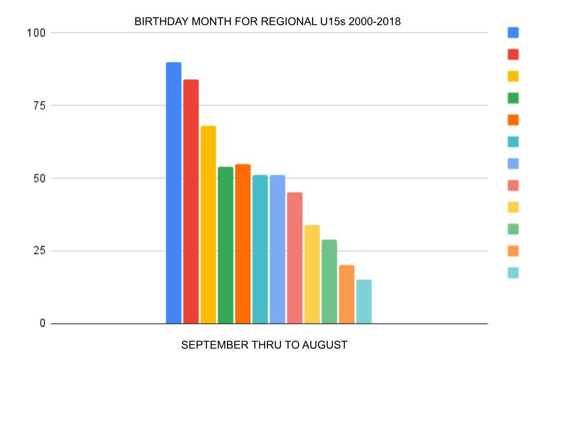
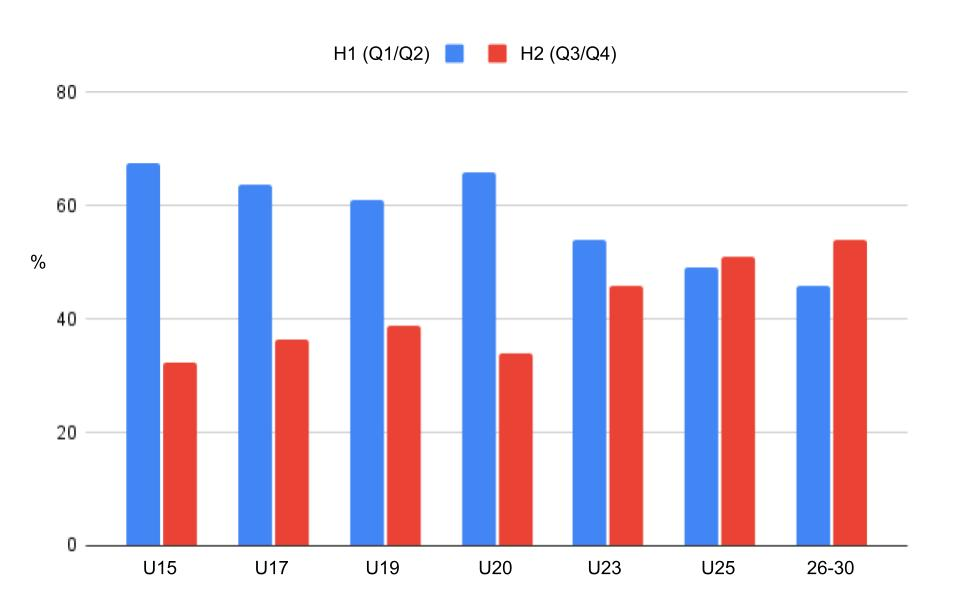
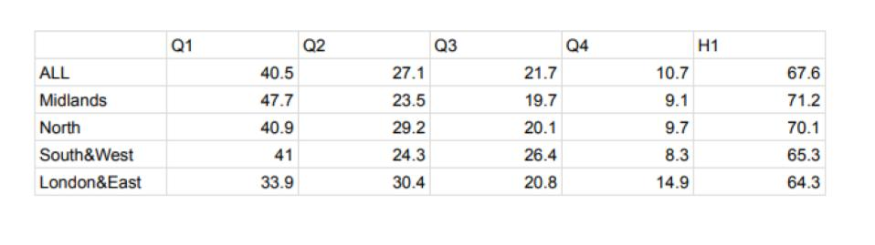

Background: [What is Relative Age Effect?](https://onemoresummer.co.uk/post/what-is-relative-age-effect/) [What are Birth Quarters?](https://onemoresummer.co.uk/post/what-is-birth-quarter/)

## 1. This is just about Q1s and Q4s

Q2 and Q3 are important too! In cricket there tends to be a difference between Q1/Q2 and Q3/Q4 (also known as H1 and H2 for Half-Year). For example the Birth Quarter percentages for the last 4 England U19 World Cups are 34.5, 36.2, 15.5 & 13.8 (H1 70.7, H2 29.3). Or at a younger age group the values are 37.8, 25.9, 21.2 & 15.1 (H1 63.7, H2 36.3) for the Regional U17s (Super 4s).

There is also a linear effect by month, i.e. in the Bunbury (Regional U15s) competition over the last 19 years.

  

## 2. At 18+ RAE is no longer an issue

As you can see from the graph below, for players on a national pathway that continue into professional county, cricket RAE declines very slowly! It is not until players are 24/25 that RAE disappears. Interestingly for the age band 25-30, when players are typically ‘at their best’ there is a genuine RAE Reversal.

## 3. RAE is the biggest bias in Player Identification

RAE can cause an inter-player of up to 1 year whereas Maturation variation can be up to 5 years. In addition it is when a player goes through the growth spurt that differences in strength, power, endurance and speed can really come to the fore. The impact from Maturation over RAE has been estimated as being 10x more influential on selections. 

[Is Maturation currently the biggest unaddressed issue in Player ID & Development in English Cricket?](https://onemoresummer.co.uk/post/is-maturation-currently-the-biggest-unaddressed-issue-in-player-id-development-in-english-cricket/)

## 4. Maturation evens RAE out

a. As we can see from the graph above RAE doesn’t ‘even out’ until age 24/25 for county professionals.

b. Maturation effects and RAEs are two completely different constructs! A Q4 can be an early maturer. A Q1 can be a late maturer. Equally a Q1 can be an early maturer (most advantage for continued selection in the current system) and a Q4 can be a late maturer (most disadvantage for continued selection in the current system).

## 5. RAE due to strength/power advantages

Older players have been around longer. More growing time, more cognitive, emotional and social development. They will have had more training, more game time and hence more experience. Research has shown that physical strength, power, endurance and speed are more likely to be influential only once the growth spurt starts.

## 6. RAE is getting better

Data from 19 seasons of Regional U15s (Bunbury), 7 years of Regional U17s (Super 4s), 22 years of England U19 World Cup squads shows that RAE is NOT getting better and in some recent years has got worse.

## 7. Our region is better than other regions at RAE

From the table below we can see that for Regional U15s (Bunbury) there is some regional deviation but ALL have significant RAE.

## 8. Addressing RAE would cause the loss of the Underdog Effect

Background: [What is the Underdog Effect?](https://onemoresummer.co.uk/post/what-is-the-underdog-effect/)

Really? Even if there were a 25%x4 representation of all 4 Birth Quarters there would still be a ‘Q4 effect’. Every Q4 would be up against 3 older players. If it is necessary to increase this ratio to 4 or 5:1, as now, then you kinda wonder what the coaches are doing in this environment. Also maybe Q4 conversion rates are higher is due to other factors than just the constant underdog challenge? Perhaps there is a Selection Concentration Effect too and/or Q4s are often Early Maturers anyway? 

## 9. Education alone will fix this

Even when coaches were aware of RAE and had the BQ data in front of them while conducting a trial, there was still RAE. Only when the players wore numbered bib in age order did selections remove RAE, in U11 football in Holland (Mann & Ginneken, 2017).

Education can help especially if it is targeted at ALL coaches. Most club coaches are L1 or 2. ECB coach education should include RAE education on these courses or at least make a separate module/online video resource.

## 10. ‘Just a function of the calendar’ - there are no solutions

One solution would be the use of [Age Ordered Bibs for all trials](https://onemoresummer.co.uk/post/age-ordered-shirt-numbering-fixes-relative-age-effect-during-trials/). This would be cheap and easy to implement. Often numbered bibs are used already. A number of potential other solutions exist too.

This IS ‘merely’ a function of the calendar. It IS an ‘administrative’ problem. It IS possible to adopt different or at least amended ‘administrative’ solutions. For example, New Zealand are implementing ‘weight categorizations’ and French Rugby are researching this too to avoid the obvious failings of simple chronological age grouping.