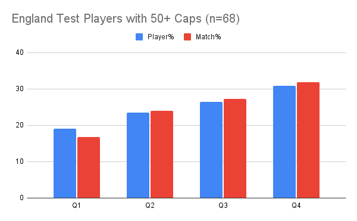
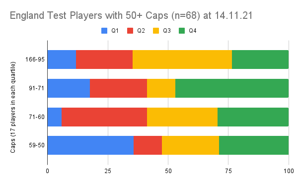
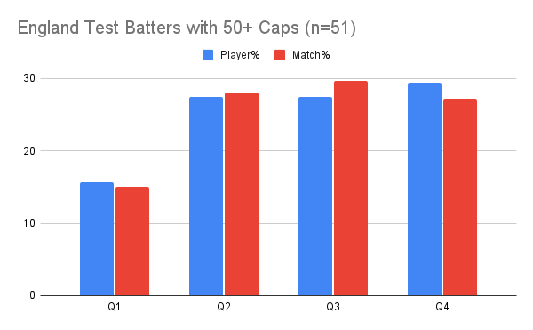

Highlights:

Q1 Batters under-represented at only 16% (n=51) 

Q4 Bowlers over-represented at 41% (n=22), equally split between Fast and Spin

Later borns are over-represented at 57% (n=68).

The more caps the higher the later borns representation (65% for caps 166-95, n=17)

\* These 68 players represent the top 9.7% of England Test players by caps (at 14.11.21).

\*\* All rounders included in both batting and bowling cohorts.

