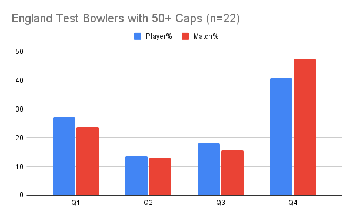

<meta name="twitter:card" content="summary_large_image" />
<meta name="twitter:site" content="@nothirdman" />
<meta name="twitter:title" content="68 Guns: No not The Alarm but male England Test Players with 50+ Caps" />
<meta name="twitter:description" content="Q1 Batters (16%), Q4 Bowlers (41%), Later born over-represented (57%). Later born representation highest for top 17 players (65%) " />
<meta name="twitter:image" content="onemoresummer.co.uk/post/68-guns-no-not-the-alarm-but-england-test-players-with-50-caps/england-test-players-with-50-caps-n-68-at-14.11.21.png" />

Highlights:

Q1 Batters under-represented at only 16% (n=51) 

Q4 Bowlers over-represented at 41% (n=22), equally split between Fast and Spin

Later borns are over-represented at 57% (n=68).

The more caps the higher the later borns representation (65% for caps 166-95, n=17)

\* These 68 players represent the top 9.7% of male England Test players by caps (at 14.11.21).

\*\* All rounders included in both batting and bowling cohorts.

Background: [Relative Age Effect](https://onemoresummer.co.uk/post/what-is-relative-age-effect/), [Underdog Effect](https://onemoresummer.co.uk/post/what-is-the-underdog-effect/), [Birth Quarters](https://onemoresummer.co.uk/post/what-is-birth-quarter/).

Q4 Bowlers have an extra weighting by match% (47%).

Q2 & Q3 Bowlers are under-represented (Q2 13.64%, Q3 18.18%).

**Conclusions**

Within the top 10% of male English Test cricketers (by caps) there appears to be a linear relationship by Birth Quarter with representation increasing Q1-> Q4.

This is emphasised within the top 5% of players by caps and within the batter and bowler cohorts. Q2, Q3 & Q4 batters perform well. Q4 and to a lesser extent Q1 bowlers perform well. 

\* This article uses caps as an indicator of 'high performance'. While this may be appropriate in Test cricket [it does have some issues](https://onemoresummer.co.uk/post/how-to-compare-birth-quarter-data-caps-or-runs-wickets/) for bowlers. It may not be as appropriate for shorter formats.

[68 Guns by The Alarm (1983)](https://youtu.be/KZp11vks_Ws?t=42)