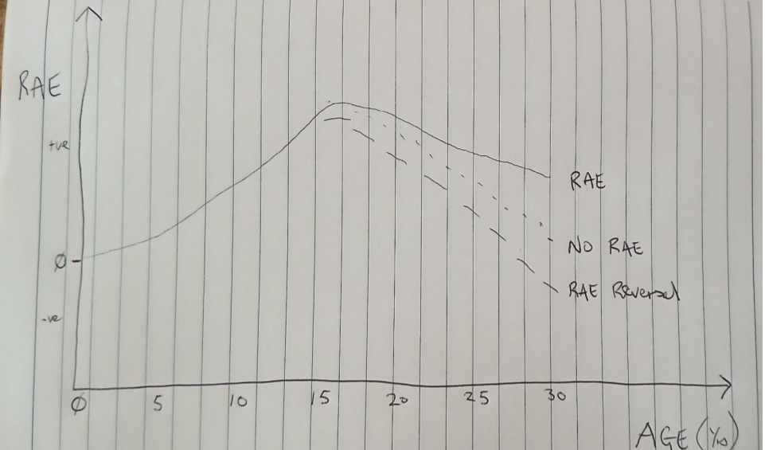
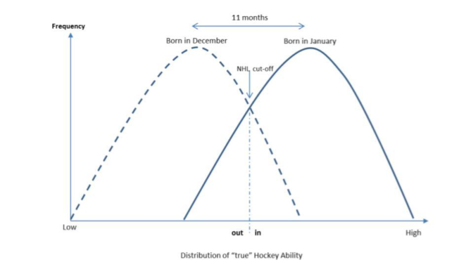

Relative Age Effects (RAE) are affected by context (e.g. country, sport, gender etc) but a generic RAE timeline in sports with team/squad selection would be:

A steady increase from age 5

A peak around age 15

A slow decline until age 25-30 when either:

1. A weak RAE continues
2. No RAE
3. A RAE reversal (i.e.more later born than early born)

At around age 15 early born are over selected based on a temporary advantage & later born are under selected also based on a temporary disadvantage.

From around age 15 onwards RAE advantage slowly becomes increasingly less relevant & players with low potential start to be deselected.

Because relatively more low potential early born players have been selected than low potential late born players, the rate of deselection of early born players is higher than later born. 

THIS IS A NATURAL ‘REGRESSION TO THE MEAN’ EFFECT.

**So what’s the problem?**

The problem is this ‘regression to the mean’ reason is virtually IGNORED in the literature and instead most studies attribute ‘mechanisms’ relating to late born only, citing the ‘Underdog Hypothesis’.

Hundreds of studies, using Odds Ratios and Conversion/Transition Rate %s, show more later born reach senior and/or international levels than early born. But this shouldn’t be a surprise, right? We are comparing the highest point of RAE with a point much later on the timeline. **RAE declines as it becomes less relevant and more early born than late born are deselected.** Also it is likely that more late born, previously ignored, are selected for the first time at later stages in the pathway, sometimes not until the senior level.

Within these many studies of Odds Ratios & Transition %s the ‘unexpected’ effect they find seems to appropriate a MYSTCIAL meaning. How is this thing happening? Weirdly they say it MUST be that something is happening to the LATER BORN only!

But what is happening to the EARLY born is ignored even though an Odds Ratio or Transition Rate comparison can be affected by either cohort (early as well as late), or both!

Consequently a mechanism is assigned based on the theoretically relatively higher levels of challenge LATER BORN experience during development. A number exist:

Increased skill development (tech/tact)

The evening out of physical advantage (which is mixed up with maturation selection bias effects?!?)

Increased psychological development (better self-regulation)

Some/all of these mechanisms MAY exist. BUT:

1. It seems unlikely that they are more important than ‘regression to the mean’
2. We have no idea as to their magnitude and if they are actually real.

Further, no or very little account is taken of other contextual factors in these studies. True underdogs are not necessarily identified. Late born may be early maturers, may be more experienced, may have genetic advantages or are simply ‘better’ players. Are ALL late born underdogs?

**Why is this dangerous?**

Apart from a lot of very clever academic people wasting their time on endless reporting of RAE decline and attributing it to the ‘Underdog Hypothesis’, the dangerous part is the effect on policy of National Governing Bodies. They become ‘scared’ to address RAE bias because of ‘unintended consequences’ that may affect the development of supposed late born super-athletes. While there is some evidence for this phenomenon in the literature there is a lot (probably at least equal amounts) of evidence of its non-occurrence.

Also, please remember that, actual RAE often persists into senior sport especially in football/soccer for example. Because of all the talk around ‘RAE Reversals’ people assume a level of parity and fairness has been restored, but that is usually far from correct.

**What papers have caused this?**

Gibbs et al (2012) ‘The rise of the underdog? The relative age effect reversal among Canadian-born NHL hockey players: A reply to Nolan and Howell’ cited in 241 papers (as at 23/6/2024).

McCarthy, Collins, Court (2016) ‘Start hard, finish better: further evidence for the reversal of RAE advantage cited in 161 papers (as at 23/6/2024). This paper introduces the term ‘The Reversal of RAE Advantage’, which as far as I understand, is basically the Underdog Hypothesis with a psychological only mechanism attached.

I have a critique of the Gibbs paper here & I am writing one for the McCarthy paper to follow shortly.

PLEASE think twice about the Underdog Hypothesis and the Reversal of RAE Advantage. Too many studies are trotting out these references. I would argue that the UH is a bit of a myth. At the very least it needs a serious re-appraisal.