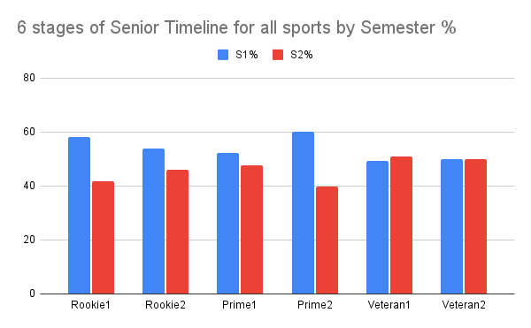
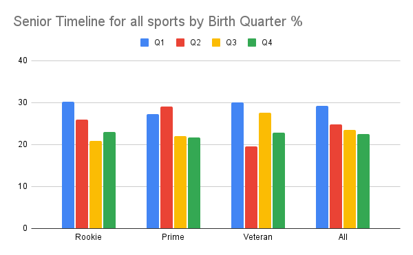

HYPOTHESIS

That RAEs will knock-on from junior levels into the early years of senior sports and continue to decline, possibly to a point where RAEs reverse.

METHOD

A snapshot of the 2021/2022 season was taken for male English **football, cricket, rugby union (RU) and rugby league (RL)**, (n=1120, avg Age=26.2, SD=4.44). Only players who experienced an English junior development environment were included. Birth Quarter and Semester (Half Year) analyses were undertaken. Data sources were premierleague.com, cricketarchive.com and itsrugby.co.uk. 

RESULTS

Significant RAEs were found for the first two tertile stages of the timeline, by semester, for the combined sports (n=1120) as well as for all tertile stages combined; Rookie stage (age 17-23; χ2=6.16, p=0.01), Prime stage (age 24-28; χ2=6.70, p=0.01), All stages (age 29-45; χ2=8.58, p<0.01). No RAEs were found for the Veteran stage by semester (S1=185 & S2=188, xS1=185, xS2=188).

Significant RAEs were found for the Rookie & Veteran tertile stages of the timeline, by birth quarter, for the combined sports as well as for all tertile stages combined; Rookie stage (χ2=7.88, p=0.05), Veteran stage (χ2=9.65, p=0.02), All stages (χ2=12.73, p<0.01). RAEs were found, but non-significant, for the Prime stage by birth quarter (χ2=6.98, p=0.07). 

Birth quarter analysis for all sports combined showed more variability for Q2 and Q3 with a particular effect at the Veteran stage showing a decline in Q2 and a rise in Q3. Both Q1 and Q4 remained fairly consistent across age tertiles.

Rookie Q1 30%, Q2 26%, Q3 21%, Q4 23% (S1 56% S2 44%) Age 17-24

Prime Q1 27%, Q2 29%, Q3 22%, Q4 22% (S1 56% S2 44%) Age 24-28

Veteran Q1 30%, Q2 20%, Q3 28%, Q4 23% (S1 49.6% S2 50.4%) Age 28-45

All Q1 29%, Q2 25%, Q3 23%, Q4 23% (S1 54% S2 46%) Age 17-45 (Avg 26.2)

Within the sports, cricket almost had significant RAEs at the Rookie stage (χ2=3.59, p=0.06), by semester, but none at either Prime or Veteran as well as declining Cramers V values by birth quarter as players aged (Rookie=0.134, Prime=0.088, Veteran=0.075).

RU had significant RAEs at the Veteran stage (χ2=7.86, p=0.05) by birth quarter as well as overall (χ2=9.06, p=0.03) due to particularly low numbers of Q2s.  Almost significant RAEs were observed at the Rookie stage (χ2=6.70, p=0.08). Semester effects were not significant but a decline was observed at the Veteran stage.

RL had significant RAEs overall (χ2=4.48, p=0.03) by semester and a decrease in χ2 from Rookie (1.6) to Prime (0.6), but an increase at the Veteran stage (2.6).

Football had significant RAEs at the Prime (χ2=3.99, p=0.05) and All (χ2=4.11, p=0.04) stages by semester and an almost significant RAE at the Rookie (χ2=3.52, p=0.06) stage.

% no of players in each age band all four sports combined:

17-20 12.2

21-25 32.2

26-30 24.6

31-35 9.7

36+ 1.9

DISCUSSION

For all sports combined, the tertile analysis found a decline over time of RAEs by semester, but with the Rookie and Prime stages fairly similar and only at the Veteran stage do the semesters even out.

By looking with more granularity at early and late halves of each tertile stage we benefit from additional visibility of effect but equally run the risk of spikes of variability with lower numbers. The six level timeline perhaps suggests a steady decline but with a late Prime spike in early born, mainly due to football and RU.

Looking at birth quarter ‘journeys’, both Q1 & Q4 remain fairly static whereas Q2 trend down and Q3 up over the timeline.

Almost 90% of players are below age 30. Cricket and RL have a larger percentage of players at 17-20 than either football or RU. Cricket and RL % peak around 20 years of age whereas for Football & RU the peak is at 24 and 22 respectively. Cricket & RL also show a more rapid decline during these early stages in terms of Semester RAE% than either football or RU possibly because the latter two sports seem to delay entry into senior competition. 

The large decline in Q2 at the Veteran stage makes RAEs by birth quarter significant whereas S1 & S2 are exactly as expected leading to no RAEs by semester.

All 4 sports show a decline from early Rookie stage to the Prime stage. All, except rugby league, continue this decline to a no RAE at the Veteran stage. Cricket reaches no RAE at the Prime stage.

These findings may have an impact on research into the underdog hypothesis, much of which has compared elite (international level) players with their source cohort as a whole. International players may be drawn more so from the Prime and/or Veteran stages of the source cohort. These stages are shown to ‘naturally’ have, relatively, higher levels of later born.

LIMITATIONS

This is a snapshot of a single season whereas a longitudinal study would offer more validity. This study does not compare for levels of performance. For example, it counts squad players equally, whereas regardless of how many matches have been played.

CONCLUSION

Further investigation is required but these findings indicate that RAEs do knock-on from junior to senior sport, where they continue to decline. Inter sport differences can affect the rate and exit point, but for football, cricket and RU RAEs only disappear by around 30 years of age. Both cricket and RL have a steeper initial decline than football or RU. Both of the latter sports seem to delay entry into the professional environment relatively more.