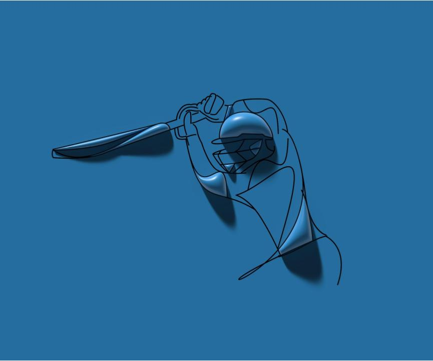

<meta name="twitter:card" content="summary_large_image" />
<meta name="twitter:site" content="@nothirdman" />
<meta name="twitter:title" content="  Andrew Strauss, HPR & a reinstated England U17s?" />
<meta name="twitter:description" content="Is it a good idea to reinstate the England U17s cricket programme? Will problems of Relative Age effects and maturation bias mean a lot of resources will be wasted on players who are less likely to play for the full international side and are in fact more likely to drop out of professional cricket." />
<meta name="twitter:image" content="https://onemoresummer.co.uk/post/andrew-strauss-hpr-a-reinstated-england-u17s/england-cricket-u17.jpg" />

One proposal in Andrew Strauss’s High Performance Review is to reinstate the England U17 programme to provide ‘early international benchmarking’. While this will provide increased opportunities to experience overseas conditions, selecting and investing resources into players at this age does come with some drawbacks. Early player identification/selection is problematic due to Relative Age Effects (RAE), maturation bias and differences in training age (experience) for example.

(<a href="https://www.freepik.com/free-photo/3d-render-batsman-playing-cricket-design_23550231.htm#query=cricket%20sport&position=7&from_view=search">Image by Rochak Shukla</a> on Freepik)

**Background:**

Currently the men’s England Development Pathway consists of annual regional tournaments at U15 (Bunbury) and at U18 (Super 4s) which precede selection for the Young Lions (U19s) and England Lions. England have previously played internationals at U17 as recently as 2017 and used to have an U15 team as well as a development programme for players as young as U12. These elements have been removed either due to RAE concerns and/or to make cost savings. 

**\
Relative Age Effect Issues:**

The latest England U19 squad against Sri Lanka this summer (2022) has a strong Relative Age Effect bias. 70% of the squad were born in the first half of the year. Only one player is born in Birth Quarter 4 (Jun-Aug) while 4 players are born in September alone. These RAE levels are a bit higher than the average level for all Eng U19 World Cup squads since 1998 (1).

We know that RAE levels are higher at earlier developmental ages. In the English development pathway, U17* (Super 4s) are higher than U19 and U15 (Bunbury) are higher than U17 (1). Therefore it is likely that a reinstated England U17 team will have higher levels of RAE than currently found in U19 cricket.

RAE bias in senior England teams however is not significant (1). Therefore the development phase ‘over’ selects, and invests time into, early born players who proportionately are less likely to progress to senior level.

Is there also a danger that investing in valuable international experience, for a relatively small number of players at early ages, is a self-fulfilling prophecy for those players to be more likely to be selected for higher honours? Perhaps the best players in senior cricket are not the earliest born? There is evidence, for example, that [Q1 (Sep-Nov) born Test batters perform significantly worse than all other birth quarters](https://onemoresummer.co.uk/post/what-format-do-q1-english-male-batters-excel-at-the-shorter-the-better/). 

Perhaps a better use of limited resources would be to:

1. Expand the England Lions programme
2. Address RAE & maturation bias at County Age Groups, regional U15s & U18s, and Young Lions (U19s).

\* Since its inception the Super 4s was an U17 competition until a recent change to fully extend it to U18.

**References:**

1. [Relative Age Effects in Male Cricket: A Personal Assets Approach to Explain Immediate, Short-Term, and Long-Term Developmental Outcomes (Kelly et al, 2022)](https://www.mdpi.com/2075-4663/10/3/39)