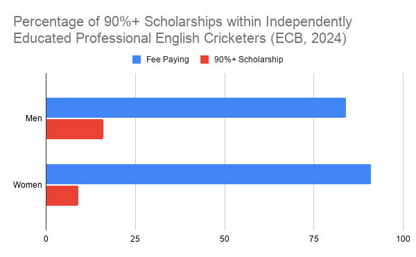
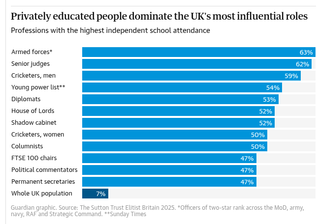

When England lined up at Brisbane in the last Ashes only one player had been state educated. Cue a spike on social media. Previously the Sutton Trust revealed both England cricket men & women were the only sport to be in the top ten sectors with the highest levels of independent schooling (1). Within many of the angry comments that follow are the ‘yeah but… most had scholarships so it’s OK’ (2) & a month later we go around again.

So is this true? Are lots of English professional players just state school kids who were ‘talented’ enough to receive independent school scholarships? Or is that a tired ‘argument’ & cricket’s biggest red herring?

**What is a scholarship?**

Independent schools don’t charge their full fees for a small number of ‘talented’ kids. Most scholarship parents are expected to pay part of the annual fee but as some top cricketing schools charge around £50K per year even an 80% scholarship can be a significant burden. The ECB uses 90%+ as a threshold for judging if a scholarship was given where parental ability to pay was not a factor.

**The Facts**

The ECB ICEC Progress Update (Sept 2024) states that only 16% of men & 9% of women independently educated professional English cricketers received scholarships.

So around 80-90% of independently educated professional players come from relatively wealthy families who don’t necessarily have any extra ‘talent’ above the rest of the population.

**Lies, Damned Lies & Statistics**

Are there confounders within the data? Yes. For example data visibility. One important factor is how much parents of scholarship players paid (or didn’t pay) is a private matter and generally not disclosed.

Also, counties don’t publish very much demographic data. A requirement to do so doesn’t seem to be part of the County Partnership Agreement. Nor do there appear to be any ECB standards as to how schooling is measured. Perhaps each county should publish the data annually showing 3, 5, 10 year trends?

Should a scholarship player be counted as independently educated if they only attend for years 12 & 13 (Sixth Form)? Yes, probably. Even one year of this level of resource is often a game changer especially at the later stages of junior development.

Is the percentage of scholarship players who go on to play for England higher than the rest? Harry Brook & Joe Root are offered as examples of this but equally the rest of the team that lined up at Brisbane 2025, barring Ben Stokes & possibly Jofra Archer, probably didn’t receive significant (any?) financial assistance for their schooling.

How should we count selective Grammar Schools? Should they be highlighted? They are by the Sutton Trust & interestingly are now providing fewer male England players than in 2014 and fewer female players since 2019.

Photo by [Andrés Gómez](https://unsplash.com/@andresloquesea?utm_source=unsplash&utm_medium=referral&utm_content=creditCopyText) on [Unsplash](https://unsplash.com/photos/a-pile-of-fish-sitting-on-top-of-each-other-WpQdzwp1hLE?utm_source=unsplash&utm_medium=referral&utm_content=creditCopyText)

This article isn’t written in order to slight independent schools. Far from it. The top cricketing independent schools are truly world class and often parents/players will value what happens in those environments over what happens in a professional county Academy. For the few on a  scholarship it can provide a genuinely life changing opportunity.

But should a kid have to leave their friends and possibly move from home to give themselves a chance of reaching the professional game? Are there psychosocial factors that are detrimental to their development in such a situation? Are we selecting professional & international players from an ever decreasing ‘talent’ pool?

And for the future? What is currently baked into the system, i.e. the professionals of the next 5 years are already within the system? State school percentages at Academy level are lower than the current professional cohort and U19 teams are packed with independently educated players. So perhaps the trend will continue.

We only need to increase the male independently schooled percentage of England players by 5% to be the highest sector in this country… more than the shadow cabinet, the House of Lords and senior judges. What do we actually mean when we say we want cricket to be the most inclusive sport?

**Appendix**

1. Sutton Trust Elitist Britain Report 2025

<https://elitistbritain.suttontrust.com/#sport>

2. Examples from social media.

‘What I would like to know is whether this means 59% attended private school at some stage, by being offered a 100% scholarship once their talent had emerged…?’

‘Purely because private schools offer scholarships for gifted cricketers.’

‘Can we break the independent school stat down further? As in scholarship/bursary funded,  academic year of entry?’

‘This is because counties and schools are offering scholarships to the best young cricketers in the country.  It is basically cricket coaching with education tacked on the side.’

‘Be more interested to know how many players started at state schools and then got scholarships to private schools due to talent.’

‘We should be grateful to Private schools for offering scholarships and providing great pathway programmes and facilities.’