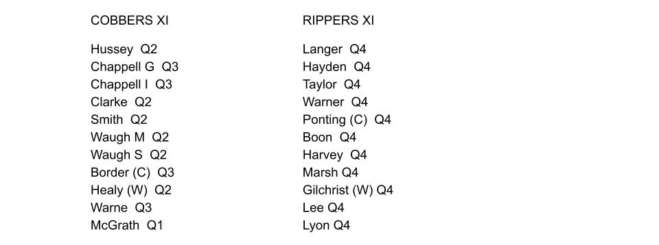
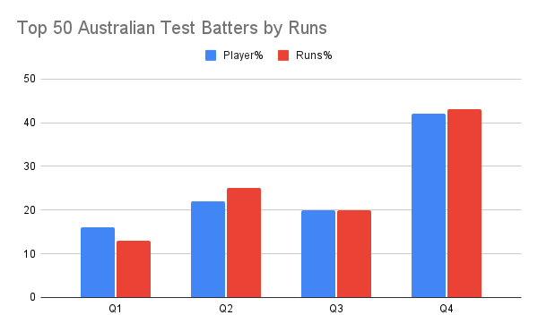
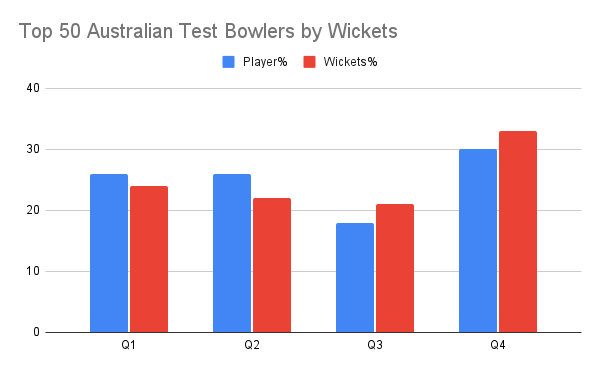

<meta name="twitter:card" content="summary_large_image" />
<meta name="twitter:site" content="@nothirdman" />
<meta name="twitter:title" content="Aussie Test Best v Best: How many Q1s? How many Q4s?" />
<meta name="twitter:description" content="Spoiler Alert: Lots of Q4s and only 1 Q1." />
<meta name="twitter:image" content="https://onemoresummer.co.uk/post/aussie-test-best-v-best-how-many-q1s-how-many-q4s/aussie-test-best-v-best-1-.jpg" />
After eating too much cheese I had a bad dream, where the 22 most capped Aussie Test players played a match. Here were the teams:

What is surprising is that **the (Little) Rippers XI are ALL Q4s**. That is to say 11 of the 22 were all born in the last 3 months of the academic year. Also within the Cobbers only 1 player (McGrath) is a Q1, i.e. born in the first 3 months of the academic year. He is a bowler so no Q1 batters are in the top 22 Aussie Test players by caps. This lack of Q1s aligns with previous articles finding that [Q1s perform relatively poorly in English Test](https://onemoresummer.co.uk/post/individual-thinking-v-systems-thinking/) cricket. <links>

Looking further, using the Top 50 Aussie Test Batters and Bowlers by runs and wickets respectively, we find a similar but more nuanced story.

In blue we show the % of players from each Birth Quarter out of the 50. In red we show the total number of matches played by players from each quarter. This gives each player a relative weighting.

We see a similar Q4 bias within the top 50 Australian Test Batters (by runs) but not an H2 bias. All other Birth Quarters (BQs) are under-represented, especially Q1s. This Q1 under-representation of batters aligns with findings in English Test cricket. Q4 bias for Australian batters doesn’t align for English Test batters however, where Q2s and Q3s are slightly more frequent.  

Within the bowling cohort there is again a Q4 bias within the top 50 Australian Test Bowlers (by wickets) but again not an H2 effect (Q3 have the lowest representation). The Q4 bias is lower for bowlers than for Australian batters. This Q4 bowler bias aligns well with the findings within the top 50 English Test Bowlers too.

This article is part of a series of articles ([Part 1](https://onemoresummer.co.uk/post/do-late-born-players-really-excel-in-elite-cricket/) & [Part 2](https://onemoresummer.co.uk/post/do-late-born-players-really-excel-in-elite-cricket-part-2-is-format-relevant/)) looking at how Relative Age Effect (RAE) plays out at the very highest levels of cricket and is contrary to the (popular) belief that RAE is only relevant to the first half of development pathways.

**Conclusions**

A significant Q4 bias is found for batters (especially) and bowlers based on analysis by caps (matches played) and performance (most runs and wickets), in Australian Test cricket.

The Q4 bias for bowlers aligns with that found for their English counterparts.

A similar [under-representation of Q1 Test batters](https://onemoresummer.co.uk/post/individual-thinking-v-systems-thinking/) was found in Australian cricket as that found in English cricket, at the highest levels.