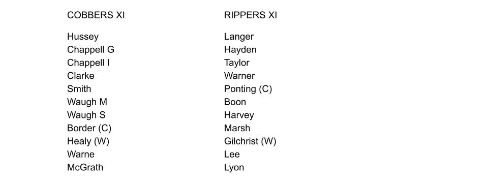
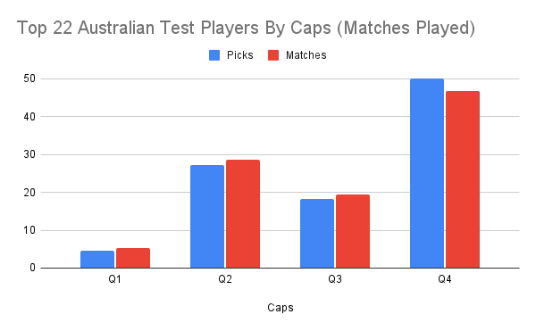
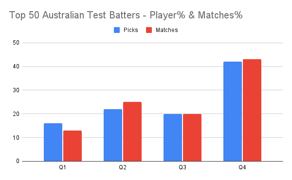
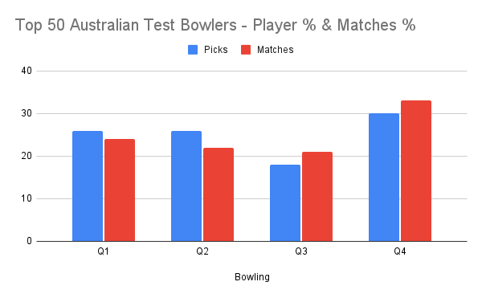

Background: [Relative Age Effect](https://onemoresummer.co.uk/post/what-is-relative-age-effect/), [Underdog Effect](https://onemoresummer.co.uk/post/what-is-the-underdog-effect/), [Birth Quarters](https://onemoresummer.co.uk/post/what-is-birth-quarter/).

After eating too much cheese I had a bad dream, where the 22 best Aussie Test players played a match. Here were the teams:

This article is part of a series of articles ([Part 1](https://onemoresummer.co.uk/post/do-late-born-players-really-excel-in-elite-cricket/) & [Part 2](https://onemoresummer.co.uk/post/do-late-born-players-really-excel-in-elite-cricket-part-2-is-format-relevant/)) looking at how RAE plays out at the very highest levels of cricket and is contrary to the (popular) belief that RAE is only relevant to the first half of development pathways.

What do we notice about the teams? Unsurprisingly, because of the relative physical demands of Test cricket, there are many more batters (18) than bowlers (4) . Of the small number of bowlers there is an equal no of spinners (2) to fast bowlers (2).  What else?

What might be more surprising is the (Little) Rippers are ALL Q4s. That is to say 11 of the 22 were all born in the last 3 months of the academic year. Also within the Cobbers only 1 player (McGrath) is a Q1, i.e. born in the first 3 months of the academic year. He is a bowler so no Q1 batters are in the top 22 Aussie Test players by caps. This lack of Q1s aligns with previous articles finding that Q1s perform relatively poorly in Test cricket. <links>

Also the Cobbers are struggling for opening batters whereas there is a surfeit of openers in the Rippers.

Looking further, using the Top 50 Aussie Test Batters and Bowlers by runs and wickets respectively, we find a similar but more nuanced story.

We see a similar Q4 bias within the top 50 Australian Test Batters (by runs) but not an H2 bias. All other BQs are under-represented, especially Q1s. This Q1 under-representation of batters aligns with findings in English Test cricket. It doesn’t align for Q4s however, where Q2s and Q3s are slightly more frequent.  

Within the bowling cohort there is again a Q4 bias within the top 50 Australian Test Bowlers (by wickets) but again not an H2 effect (Q3 have the lowest representation). The Q4 bias is lower for bowlers than for Australian batters. This Q4 bowler bias aligns well with the findings within the top 50 English Test Bowlers too.

**Conclusions**

A significant Q4 bias is found for batters (especially) and bowlers based on analysis by caps (matches played) and performance (most runs and wickets). 

The Q4 bias for bowlers aligns with that found for their English counterparts.

A similar [under-representation of Q1 Test batters](https://onemoresummer.co.uk/post/individual-thinking-v-systems-thinking/) was found in Australian cricket as that found in English cricket, at the highest levels.