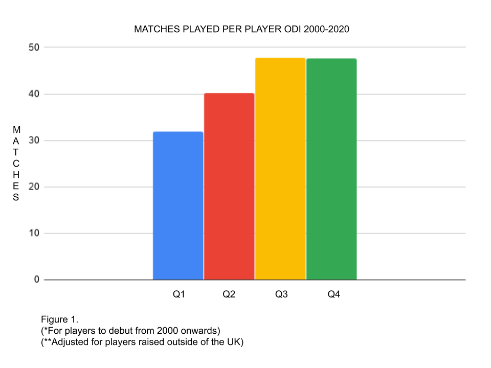

**England One Day International (ODI) players born between September and February play fewer matches over a career than those born between March and August, but are selected more often.**

A little background ...

#### What is RAE?

The academic and sporting year runs from 1st September in the UK and is often split into quarters:

Q1 September-October

Q2 December-February

Q3 March-May

Q4 June-August

Research has shown that those born in Q1/Q2 are physically stronger, fitter and faster than their peers born in Q3/Q4. This considerable advantage can impact on performance and hence selection, even though perhaps it shouldn’t. This is known as the Relative Age Effect (RAE).

#### Do we have RAE in cricket?

Yes. Research in the UK and Australia has shown that RAE exists throughout the development pathway to various extents. (1,2,3)

#### Does RAE continue past U19 cricket and into senior and international cricket?

Research has shown significant RAE up to and including U17 cricket but has generally found less or no RAE at U19s and senior cricket. This is often due to the limited numbers of players involved. This analysis looks at the number of matches played as well as the player pool and shows significant RAE at senior ODI level.

\* It should be noted that this analysis only looks at RAE. The effects of Maturation (Biological Age) can have up to 10x the effect RAE can have on selection bias for Late Maturers (4). RAE can provide up to 1 year difference but the timing of the adolescent growth spurt can be up to 5 years apart. This analysis had no access to Biological Age data.

#### ODI Selections 2000-2020

How do you compare the output of players who provide a range of performance metrics? How do you compare the value of batsmen against bowlers, keepers and fielders? It’s difficult. Here we have used how many matches a player is selected for to provide a good indicator of their value over a career.

#### What do we find?

**Q1/Q2 players play fewer matches over their careers than Q3/Q4.** (Figure1).

**Q1/Q2 players have a higher combined total number of matches played than Q3/Q4.** (Figure 2) Q1/Q2 total matches are 10% higher than Q3/Q4.

**Q1/Q2 players are 50% more likely to be selected than Q3/Q4 players.** 60:40 split. (Figure 3).

**On average a Q3/Q4 player will have a career of 48 matches whereas a Q1/Q2 player will only play 36.** A Q3/Q4 player will have a longer career (+30%) than Q1/Q2. This selection disparity is another example of RAE and one that applies to international cricket.

Figure 2.

Figure 3.

#### But we’ve just won a thrilling World Cup!

Yes, it may seem counterintuitive to question systemic bias after World Cup success.

Also RAE is not the only issue. Team sport is extremely complex and multifactorial.

But RAE is one factor that will always be part of the bigger picture. This longitudinal analysis suggests that continuing to select more Q1/Q2 than Q3/Q4 seems a poor return on investment and the loss of a potential international advantage.

Q1/Q2 represent 9 of the last 12 picks for the ODI team of which none are Q4.

Next article:

Q3/Q4 Late Maturers. ‘Extinction of the unluckiest’?

REFERENCES

1. Jones (2019) <https://www.researchgate.net/publication/317666419_New_evidence_of_relative_age_effects_in_super-elite_sportsmen_a_case_for_the_survival_and_evolution_of_the_fittest>
2. Barney (2015)  <https://research.bangor.ac.uk/portal/files/20579939/null>
3. O'Connor (2019) <https://www.ncbi.nlm.nih.gov/pmc/articles/PMC6526896/>
4. Whiteley (2017) <https://www.jsams.org/article/S1440-2440(17)30047-6/fulltext>