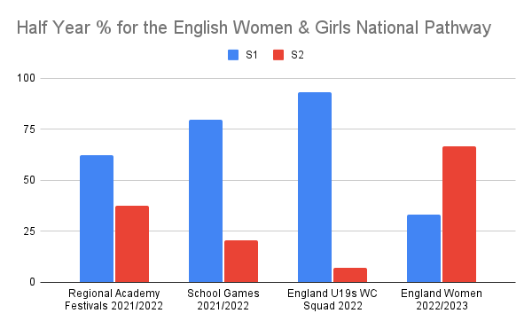
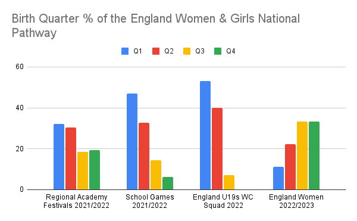

**Highlights**

Extraordinary levels of RAEs within the women’s national pathway

RAEs increase with every stage of the women’s national pathway

RAE Reversal in current national senior squad 

Perhaps, shorter formats (T20) favour early born.

Professionalisation, player pool concentration, early selection, double age groups may also contribute.

Is it more important to win an U19 World Cup or develop players for the senior national team? Figures 1 and 2 below show how the national player pathway is developing far more early born players, yet the current England Women’s squad of contracted players has a completely different RAE profile.

Figure 1

Figure 2

**Mechanisms**

How does this happen? Do later born players receive fewer opportunities?

During the School Games of 2022 (n=32) later born players played fewer matches and had fewer innings (Q1 2.72, Q2 2.67, Q3 2.33, Q4 2).

Of the 5 players from 32, born in the second half of the year, two are bowlers who batted once and another player is Scottish. So only 1 Q3 and 1 Q4 had the opportunity as English batters to impress. Of the 7 players to bat all 4 times 5 were Q1 and 2 were Q2.

In the Regional Festival matches of 2022 (n=79), later born players played fewer matches (Q1 5.35, Q2 5.08, Q3 4.62, Q4 4.93) and fewer innings (Q1 4.19, Q2 3.46, Q3 2.85, Q4 3.36).

Do later born players regularly struggle to get the same level of opportunities batting in the top 4 and/or bowling a maximum of 4 overs?

**Discussion**

[‘Women’s cricket - a game for me?’](https://onemoresummer.co.uk/post/womens-cricket-a-game-for-me/) discusses how the new structures and levels of professionalism may be impacting RAEs, such as early selection and the concentration of a relatively small number of player ‘talent’ pools.

Women’s cricket is almost all white ball. The School Games are T20 only and the Regional Festivals a mix of T20, Hundred ball and some 50 over cricket. Batting in shorter form cricket will favour batters who are naturally more aggressive and perhaps who have more power.  

In English male cricket Q1 players appear more suited to shorter formats. We have seen the dominance of [Q1s in T10 cricket](https://onemoresummer.co.uk/post/what-format-do-q1-english-male-batters-excel-at-the-shorter-the-better/). When analysing the top 50 IT20 batters by runs, Q1s only make up 20% of selected players but a massive 36% of all runs scored. Within the top 50 run scorers in Test cricket however, Q1s perform significantly worse than all other Birth Quarters.

The current England Women senior squad of contracted players (n=18) has 66% of players born in the second half of the year. This is not typical. From 2004-2021 the split was in favour of early born (56% for first half of year) in IT20s. These selection rates are not reflected in [career length (# of matches)](https://onemoresummer.co.uk/post/why-do-later-born-players-have-longer-careers-for-england-women-in-t20-cricket/), to a surprising degree (Q1 14.7, Q2 30.2, Q3 47.7, Q4 45.7).

So, much as the men’s pathway does, the women’s pathway is providing too many early born players who will inevitably be lost from the game at the highest levels. In conjunction not enough later born are being given enough opportunities to develop. These systemic issues, all too familiar in the men’s game, are being replicated with short-term thinking, as the women’s game expands.

**\
Limitations**

\* Some dates of birth were unavailable when collected from cricketarchive.com

School Games 7 from 39 (20%)

Regional Festivals 60 from 169 (36%)

Alice Capsey and Freya Kemp, who are contracted players for England Women 2022/2023, are qualified and could have played in the U19 WC had they not been injured. But even then the Half Year split would only be 12:3.