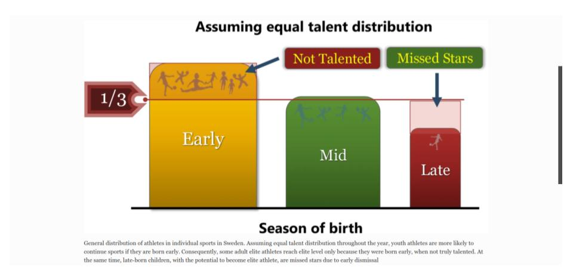

What has Darwin got to do with X-Country Skiing, Alpine Skiing, Call of Duty, Chess and almost 250,000 Swedes?

A recent paper from researchers at Umea University in Sweden looked at how younger athletes fare in both individual & team sports, physical and non-physical sports and across most age groups and both sexes.

**Darwinian Selection Discriminates Young Athletes: the Relative Age Effect in Relation to Sporting Performance**

<https://sportsmedicine-open.springeropen.com/articles/10.1186/s40798-021-00300-2>

**Key Points:**

Massive study across many sports (n=244,560)

It contrasted physical sports with cognitive ‘sports’ e-sports & chess

RAE found in all sports in children and for both sexes.

Some evidence that the more physical a sport then the more RAE.

RAE highest in younger age groups. Declines till 20.

RAE reversal in adults in e-sports.

No correlation between Birthdate and Performance at Elite or Recreational levels.

Discusses the impact on elite teams - skewed player ID to early borns

Discusses the potential negative impact on participation and public health

WARNING: Those wacky Swedes deal in Tertiles (3x 4 monthly) divisions and not Quartiles.

The authors state ‘*Age-group division benefits relatively older athletes, while increasing the risk of injury and early dropout from sports among children born later in the season.*’

\[more to follow, Darwin & Fittest of the Selected]