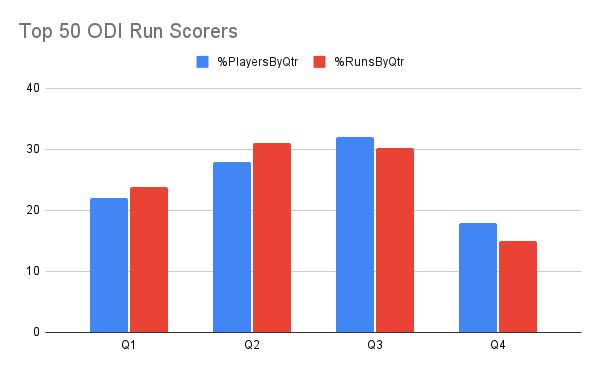
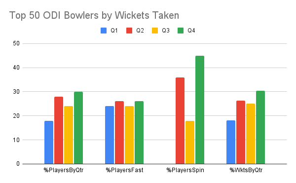
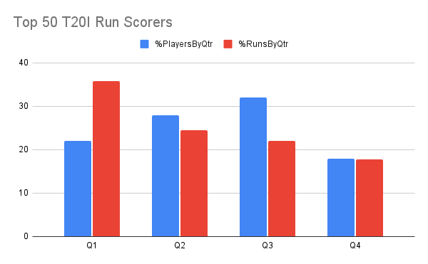
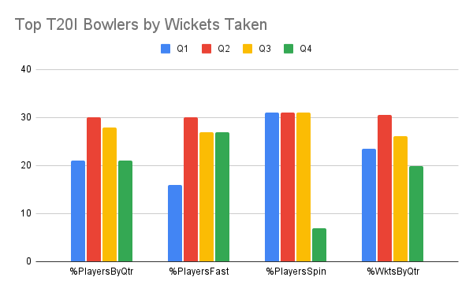

In [Part 1](https://onemoresummer.co.uk/post/do-late-born-players-really-excel-in-elite-cricket/), in covered Test cricket only, we found mixed evidence for the notion that late born cricket players excel at super-elite levels. In fact the ECBs own research Jones, Lawrence, Hardy (2018) (Ref 1) found Q1s to be over-represented for all disciplines combined in super-elite cricketers, spanning 9 International Test teams over a 20 year period.

Both Jones et al and the data from Part 1 found differences by discipline, namely batters, spinners and fast bowlers. As well as differences by discipline is there any evidence of differences within format, i.e. within white ball cricket (ODI & T20I) rather than red/pink ball cricket (Test)?

As in Part 1 we used a criterion of the top 50 English players both for batters and bowlers for each additional format, ODI (50 over) & T20I (20 over).

**ODI Batting** 

From the chart it is clear that the worst performing BQ is Q4, both in terms of % players at % runs scored within the Top 50 run scorers. Q3 however is the highest for % players and a close 2nd for % runs, with both values over 30%. Q2 is similar to Q3 and Q1 is midway between those two and Q4.

So these results do NOT show an H1:H2 effect. They do not show an advantage for H2 over H1 (lates over earlies). What is shown is perhaps a ‘Goldilocks Effect’ where Q2 & Q3 are ‘just right’, just enough Q4 type challenge and just enough Q1 type early opportunity bias.

**ODI Bowling**

Q4 is the highest BQ for both measures (% players and % wickets) but Q3 is near an ‘average’ value for both measures. Q2 is better than Q3 but below Q4 for both measures and Q1 is well behind all the other BQs.

All BQs are well represented within the fast bowlers but for spinners there is a dominance from Q2 & Q4.

So, again, no H1:H2 effect. In fact the most striking takeaway is how Q2 and Q4 dominate the spinners and this reflects in the overall wickets taken.  

**T20I Batting**

Q4 has the lowest BQ representation for both % players and runs scored. Q3 has the highest % players but the second lowest runs scored. Q1 excels in T20 in terms of runs scored, with only 22% of players reaching this level, at the expense of all other BQs.

So, again no H1:H2 effect in terms of % players at this level but an H1:H2 effect (60:40) in favour of H1 in terms of runs scored.

**T20I Bowling** 

The charts shows clearly that there is no H1:H2 effect for T20I bowlers. Perhaps there is again a ‘Goldilocks Effect’ where Q2 & Q3 are overrepresented both for % players and wickets taken.

Q4 were more relatively represented in the fast bowler contingent and Q1 amongst the spinners.

**Conclusions**

There is no conclusive evidence, based on an analysis of the Top 50 English male players in each format, that later borns reach higher elite levels than early borns. No clear H1:H2 bias is evident either way.

There is evidence to suggest that there are BQ influences on a. Discipline (Batters & Bowlers) and b. Format. There is some mixed evidence on BQ effects on Fast bowlers and Spinners within the Bowler contingent.

There is evidence that:

Q4 bowlers excel in Tests and ODIs.

Q2 & Q3 batters in Tests & ODI

Q1 excel in T20I

Q2 Bowlers in T20I

NOT Q1 Batters in Tests & ODI

NOT Q1 Bowlers in Tests

NOT Q4 batters in ODI & T20I

Based solely on these findings it would perhaps be useful to incorporate some of these weightings when creating an holistic decision matrix for selection processes.

**References**

1. Jones, Lawrence,Hardy (2018) (1) JSS. <https://www.tandfonline.com/doi/abs/10.1080/02640414.2017.1332420>