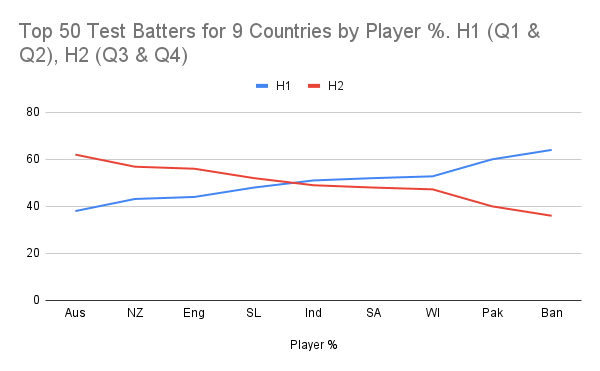
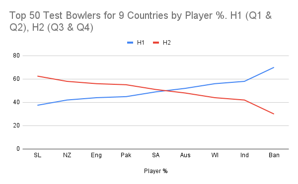

**Is there a later born bias in Test cricket all around the world? Quick answer, No.**

Background: [Relative Age Effect](https://onemoresummer.co.uk/post/what-is-relative-age-effect/), [Underdog Effect](https://onemoresummer.co.uk/post/what-is-the-underdog-effect/), [Birth Quarters](https://onemoresummer.co.uk/post/what-is-birth-quarter/).

For batters only Australia, New Zealand & England have a later born (Birth Quarters Q3 & Q4) bias. Pakistan & Bangladesh have an early born (Q1 & Q2) bias. Sri Lanka has a small later born bias while India, South Africa & West Indies have a small early born bias.

For bowlers Sri Lanka, New Zealand, England & Pakistan have a later born bias whereas West Indies, India, Bangladesh & Australia have an early bias. South Africa is neutral. 

This is based on the percentage of players in the Top 50 Test batters and bowlers by total runs.

**Conclusions**

The Underdog Effect, whereby later born players benefit more from a higher inherent challenge during the development phase, does not perhaps apply to all countries. We would need to know the level of Relative Age Effect for all 9 countries development pathways to understand this fully.