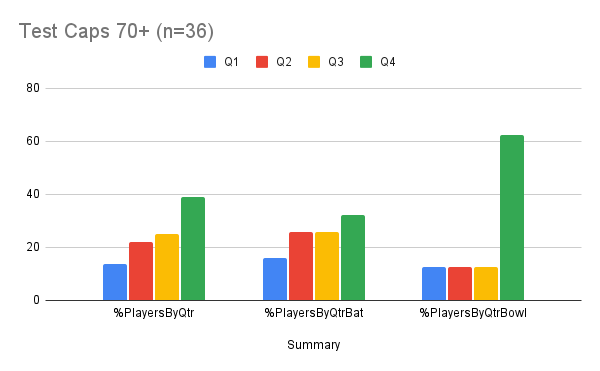
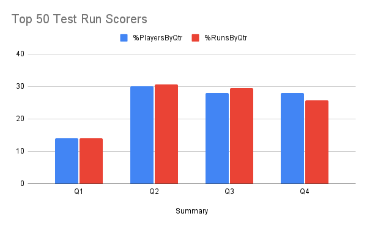
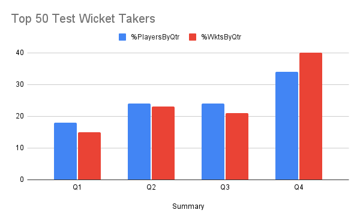
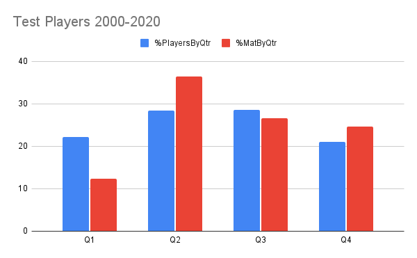

Background: [Relative Age Effect](https://onemoresummer.co.uk/post/what-is-relative-age-effect/), [Maturation Bias](https://onemoresummer.co.uk/post/is-maturation-currently-the-biggest-unaddressed-issue-in-player-id-development-in-english-cricket/), [Underdog Effect](https://onemoresummer.co.uk/post/what-is-the-underdog-effect/), [Birth Quarters](https://onemoresummer.co.uk/post/what-is-birth-quarter/).

It seems to be widely accepted that late born and/or late maturers reach higher levels of elite performance in cricket. For example, Tim Wigmore, in his 2020 book ‘The Best: How Elite Athlete Are Made’, states 64% of male Test players with over 50 caps are born between March and August (Q3 30%, Q4 34%). But is this just an isolated statistic? In this article we look at further data and at research in this area to find out more.

**Why is this important?**

Because we don’t want to lose the next Jimmy Anderson or Ben Stokes. Anderson, with the highest number of Test wickets for England and Stokes, our best ever batting all rounder, are certainly elite. They are also late born Q4s.

One of the reasons given for not addressing the Relative Age Effect (RAE) in development pathways is that we may lose the Q3/Q4 super-elites that they create. The [Underdog Effect](https://onemoresummer.co.uk/post/what-is-the-underdog-effect/) hypothesises that the smaller numbers of late born (& late maturers) develop better because they are constantly challenged by being outnumbered by their older or more mature peers. While it is highly likely that this level of higher inherent challenge is beneficial, what long term effect does it have in terms of super-elite performance?

**England Test Players with 70+ Caps**

(England Test Cricketers: src: cricketarchive.com)

The chart above shows that there is indeed an effect of Birth Quarter (BQ) on super-elite England Test cricketers. But perhaps it is not a simple H1/H2 split. H1 represents those born in the first half of the year Q1 & Q2 and H2 those born in the second half of the year Q3 & Q4.

We find Q4 are over represented, Q2 & Q3 are similar and Q1 are under represented.

Player role (batters v bowlers) also has a significant effect. Q4 were highly over represented with 62.5% of the 8* bowlers. Q1, Q2 & Q3 all had a single player.

\* For out and out bowlers 4 of the 5 were Q4 and 1 was a Q3. The other bowlers were all rounders (1 Q1, 1 Q2 and 1 Q4). Please note that within the 36 players there were 3 all rounders who were included as both batters and bowlers.

For batters Q4s are over represented but by a smaller margin. Q2 & Q3 are similar and Q1 under-represented (% Q1 16.1, Q2 25.8, Q3 25.8, Q4 32.3).

**\
Top 50 Test Batters by Career Runs**

(src: espncricinfo.com) 

From the chart above we can see that H2 perform better in both measures than H1. However this is due to the under representation & performance of Q1s. Q2 is the highest performer both in percentage of players within the top 50 and the percentage of runs scored. Q3 and then Q4 are closely behind. Interestingly Q4 are near a normal 25% representation in terms of runs scored. Q4 also has the lowest career matches per player and average runs per innings.

**\
Top 50 Test Bowlers by Career Wickets**

(src: espncricinfo.com) 

Q4 Test Bowlers are streets ahead of all other BQs, both in the percentage of players in the top 50 (34%) but also the number of all wickets taken! (40%). Q3s are similar to Q2s and actually slightly worse performers in terms of wickets taken. Q1s, as with the batting, lag behind in both measurements.

Interestingly, within the bowler cohort, there is a difference between spinners and seamers. Spinners have an H2 effect (%s Q1 25, Q2 15, Q3 30, Q4 30) but with seamers Q4 is markedly higher than Q3 (%s Q1 13, Q2 30, Q3 20, Q4 37).

**The Last 20 Years**

As you can see from the chart above, over the last 20 years, England has selected slightly more Q2 & Q3 (% Q1 22.11, Q2 28.42, Q3 28.52, Q4 21.05). In terms of the matches played by these players Q2 is the best with Q3 & Q4 average and Q1 well below par.

So over the last 20 years Q3 & Q4 have not been selected more often than Q2 and also make up fewer matches played than Q2.

**\
Relevant Research**

Jones, Lawrence, Hardy (2018) (Ref 1), when analysing super-elite Test players from across the world, found a Q1 bias for Batsmen and Spinners. They found no RAE for Fast Bowlers however. Included in the paper was a study of elite Rugby players which found a Q1 bias for Backs and a Q4 bias for Forwards. What does this tell us and how does it ‘fit’ with the analysis above?

Interestingly, it doesn't match the quote from 'The Best: How Elite Athletes are made' mentioned at the start of this article which suggests Q3/Q4 are more likely to be super-elite.

Within the top Test wicket takers a significant Q4 bias was found. This matches with the Q4 bias found in Rugby Forwards. Both disciplines, as argued by Jones et al, are more physical than other disciplines within the game. This study also found that that the Q4 bias was larger amongst fast bowlers (seamers) rather than spinners. Fast bowling is a much more physical discipline that spin bowling.

This study did find evidence of an H2 (later born) effect for spinners whereas Jones et al found a Q1 bias for spinners. Only 1 spinner has played more than 70 times for England's Test team.

Jones et al found Q1 bias in the world’s best batters. This is where the findings above differ radically. Q1 have consistently been relatively poorer performers from a system point of view both in terms of Top 50 run scorers or wicket takers and players reaching 70 caps. In addition they have played fewer matches over the last 20 years than the other BQs despite being picked 22% of the time. 

**Conclusions**

This analysis suggests that there is mixed evidence that later borns (H2) reach higher levels in Test cricket. It was found that Q4s, not H2, do better at super-elite levels. Further this was only found when using a) a matches played marker and b) in fast bowling using a career wickets marker.

A Q4 effect is greater in bowling rather than batting with fast bowlers more affected than spinners. There appears to be some evidence of an H2 effect for spinners.

In addition, performance over the last 20 years, using a more mixed group of players from super-elites through to one test wonders, shows no evidence of either Q3 or Q4 performing better than Q2.

Q1s have been shown to do particularly poorly. When selecting Q1s for Test cricket perhaps their other metrics need to be significantly higher? Should a BQ weighting against Q1s players be included in a holistic decision matrix? Should it also have a favourable weighting for Q4 fast bowlers and H2 spinners?

[Continue with Part 2: Is Format relevant? - which looks at super-elites in ODI & T20I.](https://onemoresummer.co.uk/post/do-late-born-players-really-excel-in-elite-cricket-part-2-is-format-relevant/)

**References**

1. Jones, Lawrence,Hardy (2018) (1) JSS. <https://www.tandfonline.com/doi/abs/10.1080/02640414.2017.1332420>