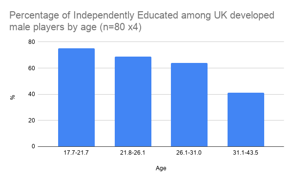
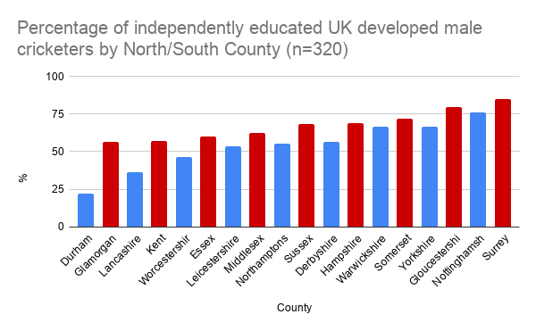

**What is the national average?**

**52%** independently schooled is what the ECB State of Equity Report from 2025 published. This is higher than the **50%** value published in the ECB Talent Pathway Action Plan of 2024.

Using a list of all players on county websites on the 1st Jan 2026 and removing all overseas players, players developed overseas and two subsequent retirees the figure is **62.2%** of UK developed male players had fee paying independent/grammar schooling (n=320). 

**Is there a trend?**

According to the Sutton Trust the number of male England players independently schooled in 2025 was 59%. This was compared to 43% in 2019 and just 33% in 2014. This trend is also replicated in the women’s game too with 35% in 2019 & 50% in 2025. Is this reflected in the county ranks?

**75%** of the **youngest** quarter of players were independently educated whereas only **41.3%** were for the **oldest** quarter. There is a steady relative decline in the number of independently schooled players by age.

Why? Maybe 1. there is latency in the system and the independently educated percentage will inevitably rise, or 2. as players leave the game, over selected independently educated players leave at a quicker rate because they are less likely to improve as much as state school players (i.e. on average they have a lower potential ceiling of ability), or 3. a bit of both.

**What about my County & is there a North South divide?**

**15 of the 18** professional counties are above **50%** independently educated with **Durham** an obvious exception at just **22.2%**, far below the highest, **Surrey**, at **85.2%**. The most southern 9 counties average **67.8%** in comparison to ‘only’ **53.4%** in the North. 

**So why is Durham so different from virtually everyone else?**

Durham & Northumberland have very few local independent schools so the professional county is faced with developing state school players themselves. Only **18%** of Durham’s homegrown players were independently educated.

**\
7 of the 18** players listed have come from elsewhere yet they still maintain a low independently educated percentage. Do they mainly sign players who will fit in with the club culture?  

Is the North East Premier League environment better? Does it benefit from better club coaching?

**Summary**

The level of independently schooled professional cricketers is not going down. If anything it is increasing and there may well be a latency effect over the next few years. This, I believe, is also happening in the women’s game. Are we already beginning to see a disconnect between fans and England teams?

Scholarships are the number one argument from defenders of the status quo but we know scholarships are negligible in the women’s game and [surprisingly low in the men’s and that this is a red herring](https://onemoresummer.co.uk/post/are-scholarships-crickets-biggest-red-herring/).

Around 45% of all male professional players have had a cricketing education paid for by mum and dad which is just 0.5% of the general population*. Where will we be in 2030?

This is not the fault of the independent schools. They do an amazing job. The pathway ecosystem seems to have changed over the last 15 years and these schools have become more aligned with counties. This has saved counties money and they have a regular stream of ‘oven ready’ cricketers at age 18. But at what cost? Radically reducing the potential ‘talent pool’? Changing the culture of cricket? Disconnecting from fans?

The ECB could fund a number of state school hubs, possibly linked to multi-school Academies/Trusts, to a level that could genuinely compete with the top independent cricketing schools. Exemplars exist such as the Canterbury Academy. We can do better! 

\-

Notes.

Based on website listings of county squads on 1/1/2026.

2 players removed who have now retired.

Overseas players & those English qualified players who developed overseas not included.

12 of original 332 player list had unknown schooling.

Fee paying Grammar schools included as independent schools.

n=320

\*The 45% from 0.5% figure is based on 52% independently educated male professionals (ECB, State of Equity report 2025), 16% of those had a 90+% scholarship (ECB, 2024), most professionals come from the top 100 cricketing independent schools (to be verified), 1500 independent senior schools, between 6-7% of pupils attend an independent school.