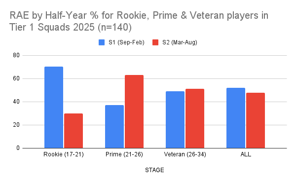
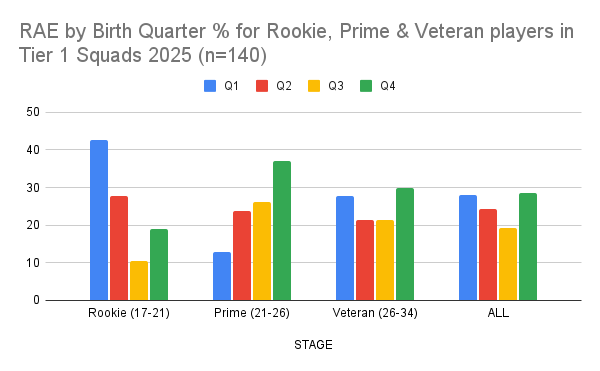

Project Darwin has created eight Tier 1 teams for 2025 playing the top level of domestic women's cricket in England. This analysis looked at the birth dates of all players as well as how the RAE profile of squads potentially changes during a professional career.

140 players were split into three tertiles, Rookie (17-21), Prime (21-26) & Veteran (26-34).

Rookies had significant RAE (X2=10.4 p=0.02). Prime had non-significant RAE Reversal (X2=5.3 p=0.15) There was no RAE for Veterans or for All players.

Large variability for Q1, Q3 & Q4 between Rookie & Prime stages. High levels of RAE introduced at the professional stage then decline over time as found in [male professional sport in England](https://onemoresummer.co.uk/post/an-investigation-of-the-senior-raes-timeline-of-four-male-professional-english-sports/).

These results are a reflection of how development environments in [England women & girls cricket over select early born](https://onemoresummer.co.uk/post/competition-level-effects-in-english-women-girls-national-cricket-pathways/).