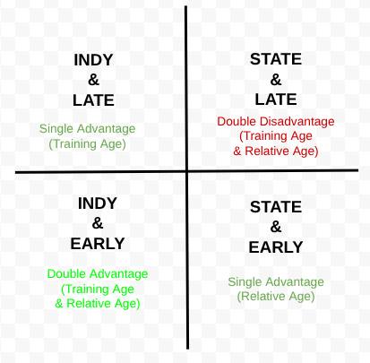
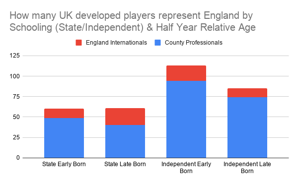
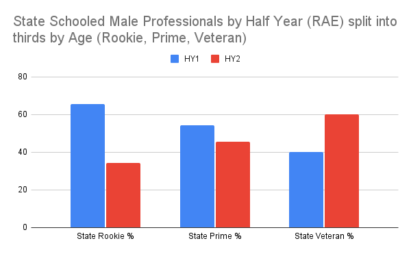
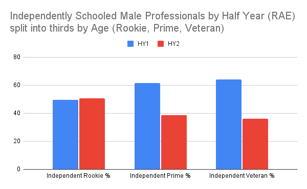
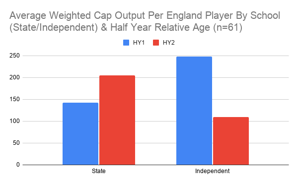
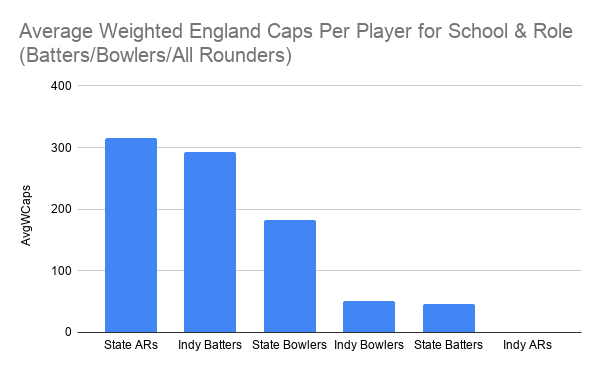

**1 in 3 state schooled male professional cricketers, developed in the UK, who were born between March & August have played for England. For everyone else (state schooled born Sep-Feb, or independently schooled) this drops to around at least 1 in 6.**

Research has shown that advanced training and relative age are recognised as factors offering a selection advantage in junior development. This study attempts to look at the simultaneous influence of training age and relative age on the selection of both professional and international English male cricketers. Schooling, be it state or independent, is used as a proxy for training age/experience. The aim is to establish the influence of more than one (dis)advantage, i.e. how is selection and performance affected by a double (dis)advantage as well as either single (dis)advantage.

**Method**

A list of players was gathered from county websites on 1/1/2026 and dates of birth and schooling were extracted from [cricketarchive.com](http://cricketarchive.com). Overseas players and English players who mostly grew up overseas were not included. 12 players had unknown schooling and were not included leaving 314 players within the study.

Relative age groupings are split into early (born September-February) and late (born March-August).

\*Please note that some charts show early born as HY1 (1st half of year, born Sept-Feb) and late born as HY2 (2nd half of year, born Mar-Aug).

**Effects of RAE & schooling on selection**\
There are more independently schooled (62%) professionals than state schooled (38%).

Equal numbers of England players come from state (30) and independent (31) schools so relatively more state educated (25%) go on to play for England than independently educated (15.7%).

So **1 in 3** state schooled male professional cricketers, developed in the UK, who were born between March & August will play for England. For everyone else (state schooled born Sep-Feb, or independently schooled) this drops to around at least **1 in 6**. So this would suggest a player with a double development disadvantage (Training Age & Relative Age) is more likely to have a higher ceiling of ability than a player with either a double or single advantage.

This doesn’t appear to be a simple ‘sample effect’ where there are just fewer double disadvantage players as there are around the same number for both single advantage cohorts (59 State/Late as well as 59 State/Early & 84 Indy/Late).

Equal numbers of early born & late born exist for all state school professionals. However the RAE profile by age for state school professionals is very different with early born at 66% for Rookies (<22.9yrs) but only 40% for Veterans (>28.0yrs), i.e. RAE decreases into a RAE Reversal as players age. This suggests it is harder to be signed at age 18 for State & Late than State & Early but that they are more likely to be retained in their 20s & beyond.

In contrast, for independent school professionals it is equally likely to be signed at 18 regardless of relative age with early born at 49% for Rookies. Subsequently however, instead of later born increasing over a career as for state schooled, for independently schooled players the opposite effect occurs with RAE increasing over a career.

**Are there performance effects too?**

Perhaps selection effects can be misleading as a player who wins one T20 cap is counted the same as someone who plays 100 Tests. Clearly the latter player offers more return on investment to English cricket.

The following data uses a Weighted Caps per player system (Tests 5, ODI 2, T20 1) to provide a best attempt at qualifying ‘value’ rather than other performance stats that may be influenced by role for example.  

Now we find that a double development advantage as well as a double development disadvantage outperform players with a single advantage.

**Is the role of the player (batter/bowler) a confounder?**

Are batters largely from independent schools & bowlers largely from state schools? Are batters overweighted because there are usually more batters in teams than bowlers. Do bowlers have shorter careers? 

\* ARs All Rounders

So yes, independent batters (19) offer more career value at England level than state bowlers (16) with independent bowlers (12) & state schooled batters (7) recording relatively low values. State all rounders (7) outperform all others. 

**Conclusion**

This data could be confounded by other factors such as maturation bias or heritable/genetic factors such as height. These factors need to be studied further multifactorially rather than single factor studies (e.g. just relative age) which don’t reveal as much.

But based on this snapshot data then county players that succeed best at the highest level are independent school batters born early and state school bowlers & all rounders born late.

This is important in relation to the ‘[Underdog Hypothesis](https://onemoresummer.co.uk/post/all-you-ever-need-to-know-about-the-underdog-hypothesis-in-2-minutes/)’ for RAE. This states that a player born late that survives the development system will achieve more, on average, than a player born early. It is hypothesised that later born, through having had higher development challenges, have developed better skills (technical, tactical, psychological).

Clearly though this data shows that for independently schooled later born, outputs are low. Equally for independently schooled early born players, outputs are high. This casts doubt on the underdog hypothesis, in a RAE context. It perhaps also suggests that in identifying ‘underdogs’ many attributes are at play, relative, biological & training age, genetic, as well as other factors. Perhaps a factor can act as a disadvantage with other factors being counter-balancing advantages.

In the 2005 Ashes only 3 of the 10 UK developed England players went to independent school. Fast forward to the 2025 Ashes and Ben Stokes was the only state school player to line up in Brisbane. The ecosystem has changed and is continuing to change with the women’s game equally going the way of the men’s. We know relative age bias exists in the English development system both in the men’s & women’s game.

Currently the percentage of independently schooled professional players is trending up as is relative age. It is also likely the system over-selects early maturers too. Each of these factors individually reduces the pool of high potential players let alone in combination. An [ECB funded PhD into the selection bias of growth & maturation](https://onemoresummer.co.uk/post/ecb-to-fund-a-phd-to-investigate-addressing-selection-bias-and-injury-risk-in-english-youth-cricket-finally/) will start in September. I would hope this also includes looking at training age/schooling as it clearly influences development. Is the ecosystem likely to change soon? PhDs take at least 3 years…