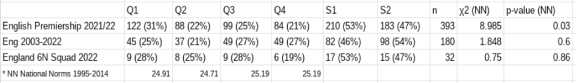
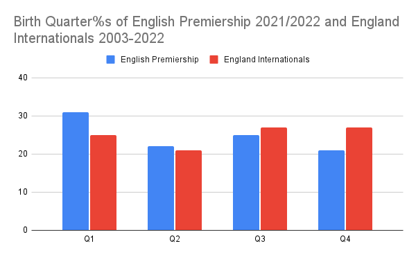
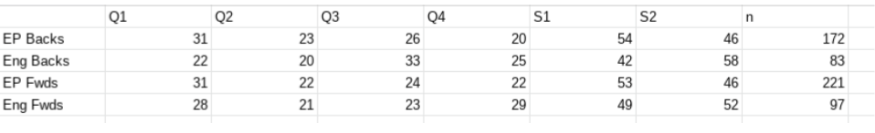
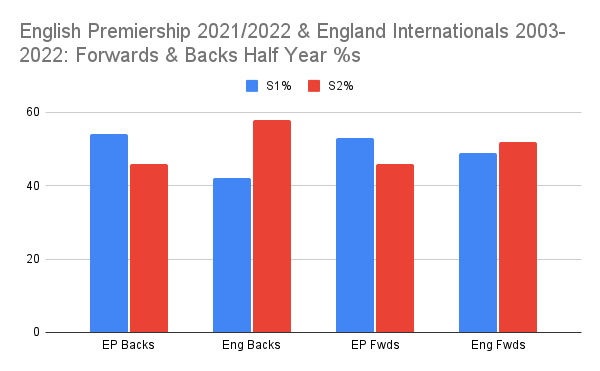
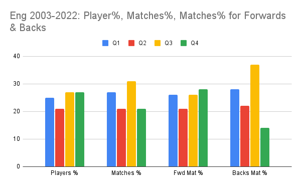
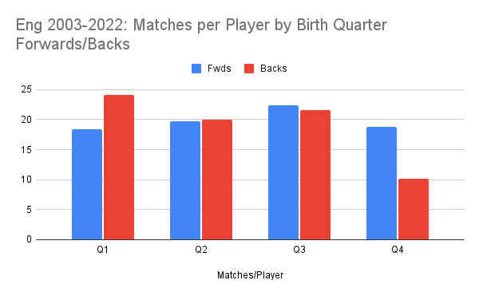
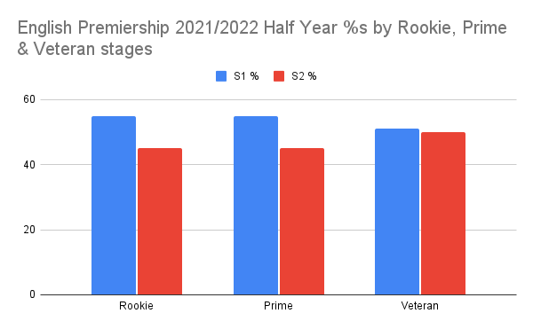
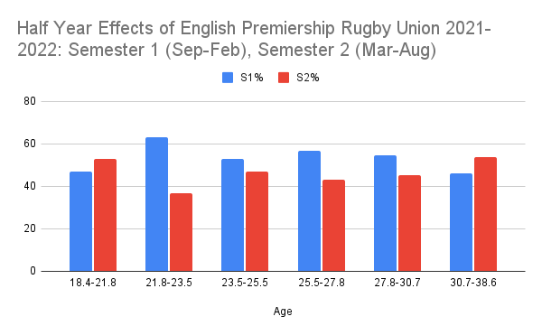

**Highlights**

Junior RAE knocks on to the English Premiership (EP) in Rugby Union

No RAE in England Internationals (2003-2022)

RAE continues its decline in senior Rugby Union (EP) until age 30

No significant difference in Forwards & Backs for RAE in EP & England Internationals

Higher later born in England internationals than EP principally in the Backs 

Q4 Backs (10) play far less career internationals than all other Backs (20-24)

[Image by Freepik](https://www.freepik.com/free-photo/front-view-male-rugby-player-holding-ball-hip-with-copy-space_11619958.htm#query=rugby&from_query=rugby%20union&position=35&from_view=search&track=sph)

**RAE in the English Premiership but no RAE for English Internationals**

In rugby union in the English Premiership (EP) the Relative Age Effect (RAE) profile is **Q1 31%, Q2 22%, Q3 25%, Q4 21%** (χ2=8.883 p=0.03, n=393*). This is similar to the profile found by Kelly et al 2021 (1) in junior rugby union for U18s (Q1 29%, Q2 26%, Q3 24%, Q4 21%).

Whereas no RAE exists for England internationals 2003-2022, **Q1 25%, Q2 21%, Q3 27%, Q4 27%** (χ2=1.848 p=0.60, n=180). This is similar to the profile found by Kelly, Till et al (2021) (2) in England internationals (Q1 25%, Q2 12.5%, Q3 35%, Q4 27%, n=48).

For a comparison, the England 6 Nations squad for 2022 was also examined as they were directly selected from the EP cohort. Birth Quarter %s were similar to the EP cohort **Q1 28%, Q2 25%, Q3 28%, Q4 19%** (χ2=0.75 p=0.86, n=32).

Table 1

A change from significant RAE in the EP to no RAE at the England international level appears to be from a fall in Q1 (31%->25%) and a rise in Q4 (21%-27%).

**Positional Effects**

This study found no significant RAE in Forwards or Backs (Table 2). Kearney, 2014 (3) in his study of the top 3 tiers of French rugby union found RAE in the Forwards but no RAE in the Backs. This is in contrast to Jones et al, 2018 (4) who found a Q1 bias in Backs and a Q4 bias in Forwards from the top 10 internationally ranked teams.

Table 2

Similar half-year levels were found for EP Backs, EP Forwards and England Forwards. However a difference was found for England Backs with a 42:58 split in favour of later born.

However, this difference in numbers of players selected isn’t reflected in the number of international matches played.

Matches per player for Forwards is relatively even whereas there is a lower level for Q4 Backs. This is reflected in the average number of matches played where there is little difference in the Forwards and the first three birth quarters for the backs but a marked difference in the Q4 backs (Q1 24, Q4 10).

**The Senior RAE Timeline**

The RAE profile of professional team sports is often assumed to be even (i.e. all 4 Birth Quarters are more or less level) and that RAE is only found in youth development. But in many sports, especially those with high levels of junior RAE, it ‘knocks on’ into senior levels.

The age range of EP players as at 26.12.2021 was 18-38 years with an average age of 26. A tertile analysis shows how the RAE profile looks different for Rookie (18-23 yrs), Prime (23-27 yrs) and Veteran (27-38 yrs) English EP players, with higher levels of RAE at the Rookie & Prime stages with RAE only appearing to ‘even out’ at the Veteran stage. The England 6 Nations squad for 2022 had an even distribution across these three age profiles with Rookie (10), Prime (11) & Veteran (11).

By splitting the data into six groups a decline is further visible until age 30 where those born in the later half of the year are higher.

**Conclusion**

This analysis shows no significant evidence that later born players reach higher levels (Underdog Hypothesis) in Rugby Union. However RAE was found in the source cohort of professionals (EP) but not in a level above (England internationals). This was mainly due to an increase of Q4 players and a decrease in Q1 specifically.

However this is not reflected in the 6 Nations squad of 2022 which had a similar RAE profile to the EP of 2021/2022. Further, when looking at actual matches played by England internationals over the 20 year period, Q4 Backs were found to play far fewer career matches than any other Birth Quarter. 

Knock on effects of RAE from junior into senior professional rugby union were found and a slow decline continued until age 30.

No differences were found in RAE between Forwards and Backs within EP players and Forwards for England international but a RAE reversal (non-significant) was found for England Backs.

**References**

[(1) Adam L. Kelly, Daniel T. Jackson, Donald Barrell, Kate Burke & Kevin Till (2021): The relative age effect in male and female English age-grade rugby union: Exploring the gender-specific mechanisms that underpin participation, Science and Medicine in Football.](https://doi.org/10.1080/24733938.2021.1955145)

[(2) Adam L. Kelly, Kevin Till, Daniel Jackson, Donald Barrell, Kate Burke and Jennifer Turnnidge (2021): Talent Identification and Relative Age Effects in English Male Rugby Union Pathways: From Entry to Expertise, Frontiers in Sports and Active Living.](https://doi.org/10.3389/fspor.2021.64060)

[(3) P. E. Kearney (2017) Playing position influences the relative age effect in senior rugby union, Science & Sports (2017) 32, 114—116](https://www.sciencedirect.com/science/article/pii/S0765159717300230)

[(4) Benjamin D. Jones, Gavin P. Lawrence & Lew Hardy (2018) New evidence of relative age effects in “super-elite” sportsmen: a case for the survival and evolution of the fittest, Journal of Sports Sciences, 36:6, 697-703, DOI: 10.1080/02640414.2017.1332420](https://doi.org/10.1080/02640414.2017.1332420)

**\
Data**

\* Dates of birth were collected from the itsrugby.com website for a. all English players who were part of an English Premiership rugby union club squad on 26.12.2021. Players not in the first list or who did not go through the English development system were excluded.