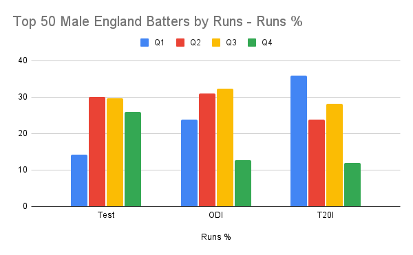
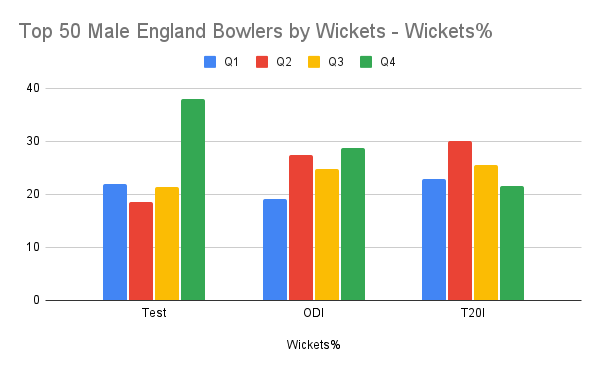

In international cricket male English later borns DO NOT do better than early borns.

In general middle born (Q2 & Q3) do better with the following exceptions:

Q4 best for Test bowling

Q1 best for T20 batting

Q4 equal to Q2/Q3 for ODI bowling

Q4 equal to Q2/Q3 for Test batting

**Introduction**

In progress...

Gibbs, Jarvis, and Dufur (2012) describe an ‘Underdog Effect’ when offering a possible explanation for low levels of Q1 players found in Canadian Hockey All Star and Olympic teams i.e. the very highest levels of the sport. McCarthy, Collins & Court (2015)   

**\
What data have you used?**

An analysis of the Birth Quarters of the Top 50 batters by runs and bowlers by wickets for each of the formats (Test, ODI & T20I) was undertaken.

This data is derived from all male England players (Test n=699, ODI n=263, T20I n=91). 

**Results**

**Limitations**

This only applies to English cricket. Differences in Relative Age Effect profiles have been found across the world and further investigation is required to see if normal RAE exists, or if a Goldilocks or Underdog Effect is dominant. 

T20I bowlers were only n=44. The first match of this format for the England men’s team was only in 2005 and only 91 players have ever played.

Analysis for ODI & T20I effectiveness could be carried out by Strike Rates for batters and Economy rates for bowlers but for a comparison between all three formats, then runs and wickets were chosen.

**Conclusions**

Contrary to popular belief Q4s are under-represented in English national cricket teams for ODI batting & T20 batting and bowling. Q4s are equally represented in Test match batting and ODI bowling to Q2 & Q3 and only excel in Test match bowling.

Two linear relationships appear. Q4s appear to be best at Test cricket and worst at T20I for both batting nad bowling. In contrst, Q1s appear to be best at T20I and worst at Test batting.

Q2 & Q3 are the most consistent BQs. For batting they are the best for Tests & ODI. For bowling they are consistent performers while there seems to be a linear relationship whereby Q2 & Q3 are more appropriate for shorter formats.

It is difficult to argue that there is a Q4 Underdog Effect in male English batting and bowling in ODI & T20Is. Only in Test bowling do Q4s dominate at this level.

For batting it could be argued that there is an Overdog Effect for Q1s. They significantly under-perform at Test level, are second to Q2/Q3s in ODIs and only excel in T20I.

In David v Goliath, David is represented by the less developed/under represented Q4s in development pathways. Goliath is represented by the more developed and over represented Q1s. But perhaps the real winners, in most instances, are the Q2 & Q3 players. They have had a 'just right' development journey with a balance between challenge and opportunity, a Goldilocks Effect.