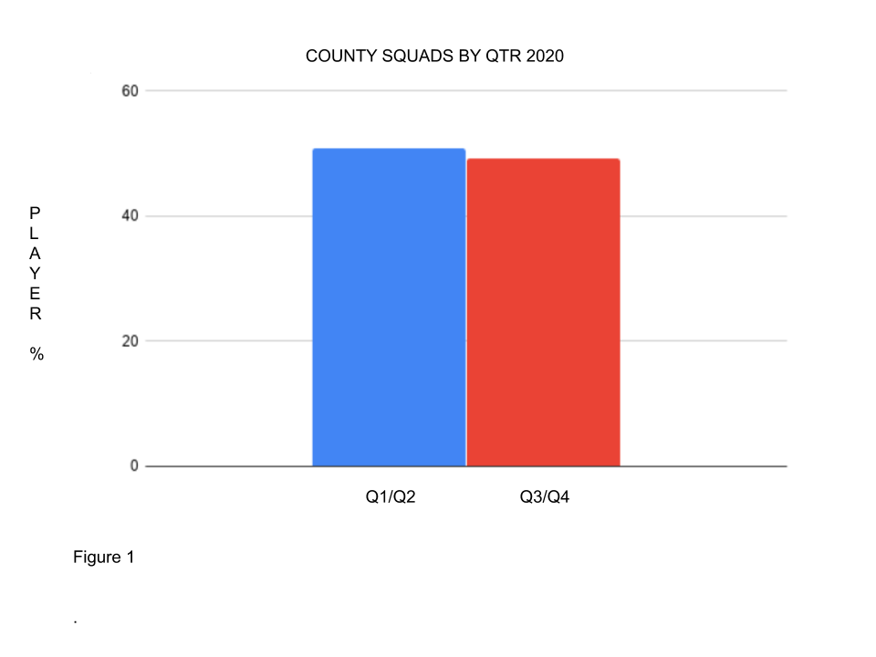
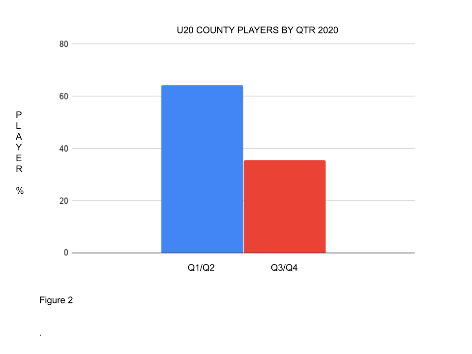
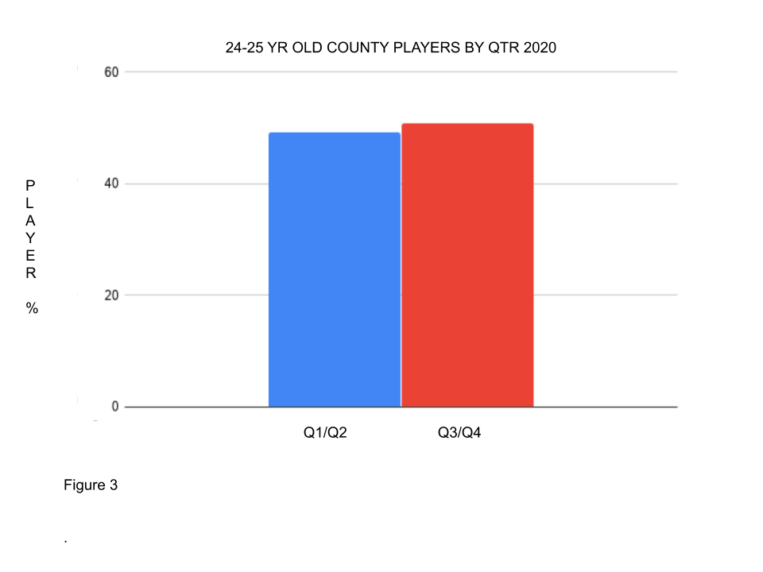
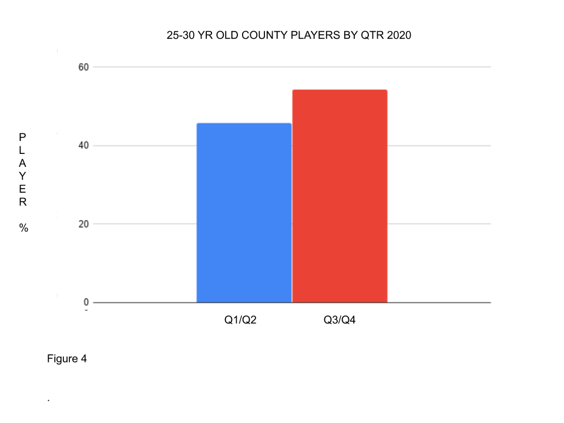
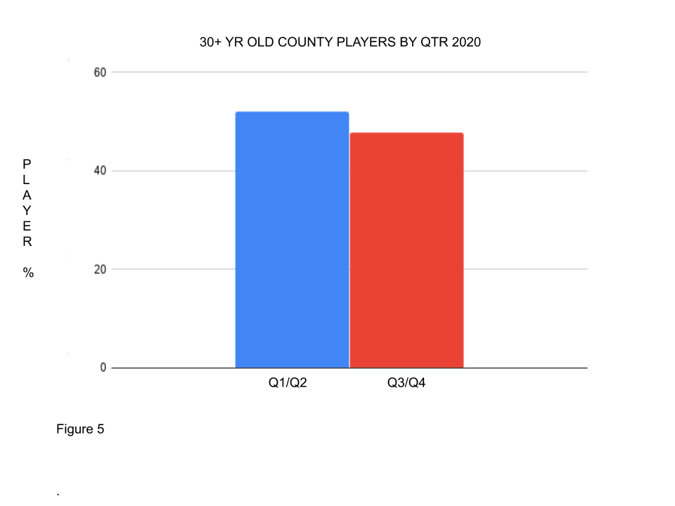

**There is no significant Q1/Q2 bias in County Squads.**

**But there is significant Q1/Q2 bias as players start their careers which is then REVERSED from the age of 25. No significant impact from Overseas players.**

(* from County Squads as listed on their websites in June 2020).

There is no significant Q1/Q2 bias in County Squads (Figure 1)

66% of all County players under the age of 20 (28) have played for the Young Lions (England U19s). [Significant Q1/Q2 bias (RAE) was found in the last four U19 World Cup squads](https://onemoresummer.co.uk/post/rae-increasing-in-england-u19-world-cup-squads/). Therefore it is not surprising to find a 64:36 split between Q1/Q2 and Q3/Q4 in this age group (Figure 2).

This bias is reduced over the next 3 years to 54:46 (78 players) and disappears by the age of 25 to 49:51 (65 players) (Figure 3).

For the 25-30 year olds (129) there is RAE Reversal, ie. a bias for Q3/Q4 players of 46:54 (Figure 4).

Over 30 year olds (119) show some Q1/Q2 bias 52:48. This is not impacted by the Overseas players within this group (Figure 5). Those who play on past 35 have a higher Q1/Q2 bias 55:45.

**Conclusions**

It would appear that Counties, in conjunction with the Young Lions (U19s) programme are producing too many Q1/Q2 players from Academies. These players appear to be released at a higher rate than Q3/Q4 players in the early years of their careers.

As a result Q3/Q4 players go on to make up a higher proportion of players during their peak years.

Q1/Q2 players however seem to have some longevity with an uptick in 30+ year old players.

Relative Age Effect is generally thought to dissipate before U19s (1) and Senior cricket. This analysis seems to question this idea and that the knock on affects of CAG, EPP, Academy & Young Lions over representation of Q1/Q2 lasts for quite a number of years.

REFERENCES

1. Barney (2015)  <https://research.bangor.ac.uk/portal/en/theses/preliminary-stages-in-the-validation-of-a-talent-identification-model-in-cricket(a1e7f8cd-2966-4f33-bcad-a65fede16997).html>