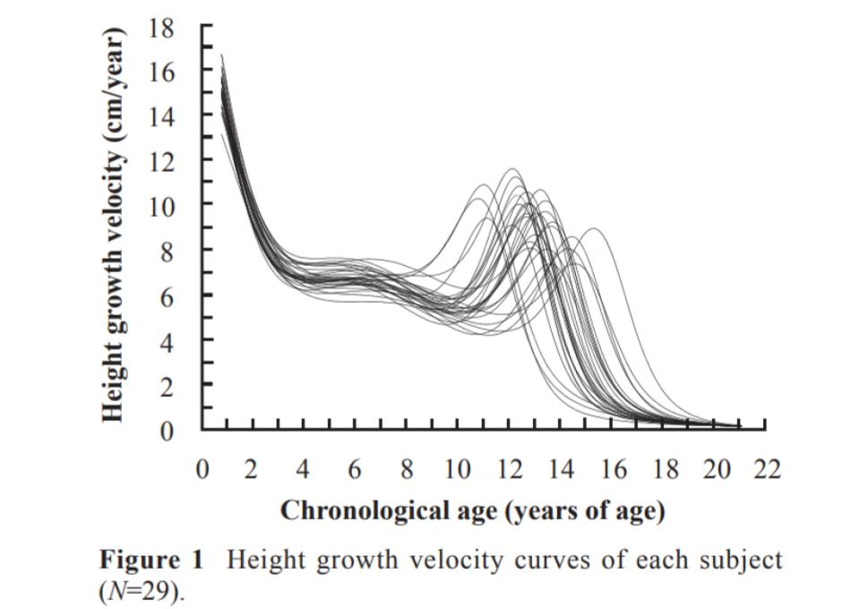

Inter player differences in maturation can be at least 5 years (Figure 1) whereas Relative Age Effects are only up to 1 year (1). In development environments the magnitude of these differences can be up to approximately 10-fold (2).   

For example at Man Utd they found that skeletal age (maturity status) has a greater influence than Birth Quarter on the selection and retention of players in football academies (2).

Also unlike RAE which decreases slightly at higher age groups, the influence of maturity status increases through the age groups. For late maturers at Man Utd the Odds Ratio for retention was 2.2 for U12, 4.9 for U15 and 10.4 for U16 and 20 for U17 (2).

**So what has this got to do with cricket?**

The ECB (cricket’s National Governing Body in England & Wales) seem to be basing their policy on addressing maturation effects in cricket on two PhD studies they funded in 2015 and 2019. The first looked at ‘Relative Age Effects throughout a Talent Development Pathway: A Chronological and Biological Analysis of English Cricket’ (3).

It found no significant difference in maturity status across U12 (n=119) and U14 (n=118) male cricketers. Maturity status was calculated as Skeletal Age (SA) - Chronological Age (CA). SA was found using the TW3 method.

Finding a lack of maturation effect the following PhD in 2019 didn’t look any further at the issue of maturation in the pathway (4).

Consequently it seems that maturation is very low on the radar and very few counties are monitoring Maturity Status for their players. There appears to be no research underway or planned. There appears to be no coordination of national statistics, analyses of trends or the dissemination of best practice or advice to the counties S&C/Medical departments from the ECB.

This is in contrast to New Zealand cricket who recently completed a study where they found  ALL U17s at a national regional competition and the NZ U17 squad were either early maturers or trending towards being early maturer on-times (i.e. there were no late-maturers). (5)

Subsequently, NZ Cricket, Auckland Cricket and Auckland University of Technology developed an intervention, using bio-banding, to address this bias. This intervention was delivered in the setting of a 3-day Skill Development Camp delivered by Auckland Cricket.    

**The ECB 2015 data**

The ECB sponsored research was done in 2015. At the time the method used to analyse the player’s skeletal age was the Tanner-Whitehouse (TW3) method. Subsequent research has called into question it’s accuracy. TW3 is found to underestimate skeletal age by 0.5 years (6).

Also the pathway players studied were U12 and U14. Whereas it would be expected to find maturation effects in the later age group then perhaps it is unsurprising not to find significant maturation effects in 11 year olds. The average age of circa-Peak Height Velocity (PHV), the middle of the growth spurt, is 14 for caucasian males. As we saw earlier PHV can range from approx 11 until 15 (1). Perhaps a U16 group should also have been included.

**RAE but no Maturation Effects?**

It has been identified that there is a significant Relative Age Effect (RAE) throughout the English cricket development pathway. The preference for and over selection of earlier born players based on performance derived from longer time to grow, physical and psychosocial advantages, more time on task, more coaching and opportunities, is provable using RAE data. 

Both NZ Cricket and the English Premier League have found significant Maturation bias in the development pathway. 

It would seem unbelievable to assume that a similar effect is not in play for maturation in the English Cricket development pathway. 

**What needs to be done?**

This isn’t a difficult issue to address. In fact many county academies are probably doing most of what is required. Regular measurements of height and weight are being taken already. But these are often only used for red flagging circa-Peak Height Velocity (PHV), i.e. the growth spurt, in order to prevent injury through reducing time playing/training.

With the addition of parental heights a calculation of percentage of Peak Adult Height (%PAH) can be made using the Khamis-Roche (KR) method (8). This percentage then represents where the player is on their journey through growth and maturation. 

It is the only method to include heritage factors (parental height) in its calculation. We often see small players and expect them to keep growing but often they are 95+% maturity status because their parents are below average height. 60-70% of height is inherited (9).

**Future Policy?**

Careful decisions and plans are being made about players without the most basic information. Knowing a player’s Maturity Status can help inform those decisions. Whether it is judging where they are in specific S&C metrics (sprint, jump, endurance), where their optimum challenge point is, whether they should play up or indeed down, or even if  they should be retained or released. It’s too easy and too important not to do this. 

REFERENCES

1. Chuman et al (2014) Maturation and Intermittent Endurance in Male Soccer Players during the Adolescent Growth Spurt: A Longitudinal Study. Football Science, Vol 11, 39-47.
2. Amanda Johnson et al (2017) Skeletal maturation status is more strongly associated with academy selection than birth quarter. Science and Medicine in Football. Volume 1, 2017 - Issue 2.
3. Barney (2015) Chapter 5 Relative Age Effects throughout a Talent Development Pathway: A Chronological and Biological Analysis of English Cricket. PhD Preliminary stages in the validation of a talent identification model in cricket.
4. Jones (2019) PhD. ‘Game Changers’: Discriminating Features within the Microstructure of Practice and Developmental Histories of Super-Elite Cricketers - a Pattern Recognition Approach.
5. Innovative strategies to maximise youth skill development: Lessons from NZ Cricket, Auckland Cricket and AUT. Balance is Better. The Home of Youth Sport in New Zealand.

<https://balanceisbetter.org.nz/innovative-strategies-to-maximise-youth-skill-development-lessons-from-nz-cricket-auckland-cricket-and-aut>

6. Malina, R. M., Coelho-e-Silva, M. J., Figueiredo, A. J., Philippaerts, R. M., Hirose, N., Reyes, M. E. P., ... & Buranarugsa, R. (2018). Tanner–Whitehouse skeletal ages in male youth soccer players: TW2 or TW3?. Sports Medicine, 48(4), 991-1008.
7. Figueiredo, A. J., Coelho-E-Silva, M. J., Sarmento, H., Moya, J., & Malina, R. M. (2020). Adolescent characteristics of youth soccer players: do they vary with playing status in young adulthood?. Research in Sports Medicine, 28(1), 72-83.
8. Harry J. Khamis and Alex F. Roche (1994). Predicting Adult Stature Without Using Skeletal Age: The Khamis-Roche Method. Pediatrics October 1994, 94 (4) 504-507.
9. Zhong Cheng Luo, Kerstin Albertsson-Wikland & Johan Karlberg (1998) Target Height as Predicted by Parental Heights in a Population-Based Study. Pediatric Research volume 44, pages 563–571.
10. ?