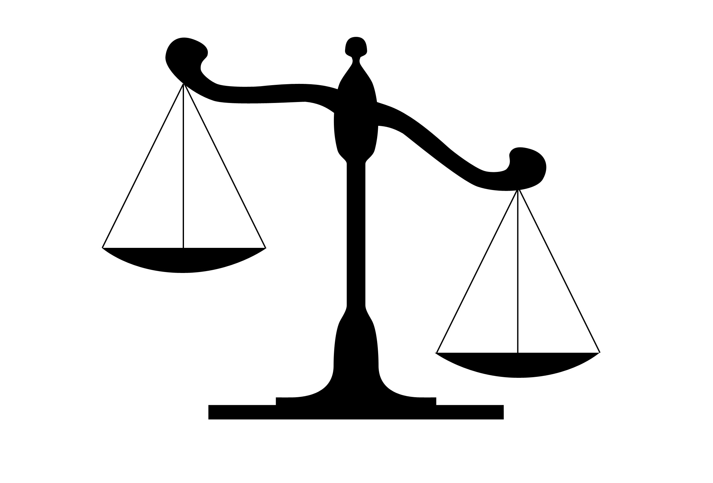

Discrimination is defined as the unjust or prejudicial treatment of different categories of people, especially on the grounds of race, age, sex, or disability.

So to treat someone prejudicially on the basis of their age is discrimination.

Recently the England & Wales Cricket Board (ECB) [announced a new Anti-Discrimination Code](https://www.ecb.co.uk/england/men/news/2096452/ecb-reaffirms-its-commitment-to-stamp-out-discrimination-and-make-cricket-more-inclusive-and-diverse). The main driver for this was in relation to recent issues over racial discrimination and to attempt to address a recognised racial inequality in cricket in England & Wales. This is welcomed.

As well as race though, age is also included in the list of ‘Protected Characteristics’ in the code. 

The code states:

***1. It will be a breach of this Code for any Participant to:***

*1.1. act in any manner, make any omission, or engage in any conduct, which does, or is likely to, offend, insult, humiliate, intimidate, threaten, disparage and/or vilify any reasonable person, or group of people, based on, or by reference to, any Protected Characteristic; and/or*

***1.2. make any decision or any omission or do anything which might reasonably be deemed to discriminate against any person, or group of people, or to disadvantage that individual or group based on any Protected Characteristic unless permitted by law;***

So it will be a breach if any group is disadvantaged based on their age.

Can it be argued that the systemic Relative Age Effect found throughout the cricket development pathway is a breach of this new code? Are those born later in the academic year treated prejudicially in terms of selection? It’s difficult to say no to this question. For example, on average over the last 20 years Birth Quarter (BQ) 1 (Sept-Nov) players are 4x as likely to be selected at the Regional U15 (Bunbury) level than BQ 4s (June-Aug).

Participants include all County Cricket Boards, First Class Counties, the National Counties, leagues, clubs and other organisations under the jurisdiction of the ECB.

Could an individual use the code as well as current legislation such as the Equality Act 2010 to take a club, county, or the ECB itself to court?

[ECB Anti-Discrimination Code](https://resources.ecb.co.uk/ecb/document/2022/03/17/36918e2a-b649-489a-9295-ea3bb6b5d433/ECB_Anti-Discrimination_Code_2022_v5-1-.pdf) (2022)

[ECB Anti-Discrimination Code](https://resources.ecb.co.uk/ecb/document/2021/03/16/f0036503-deaa-4b81-874d-7e027d7d4617/24.ECB-Anti-Discrimination-Code-2021-vF.pdf)