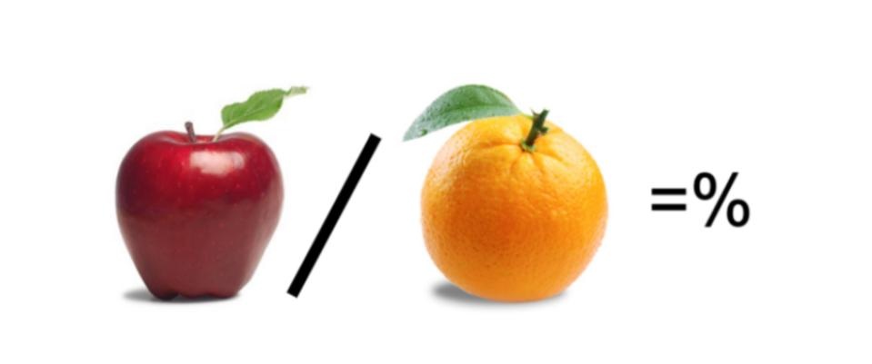
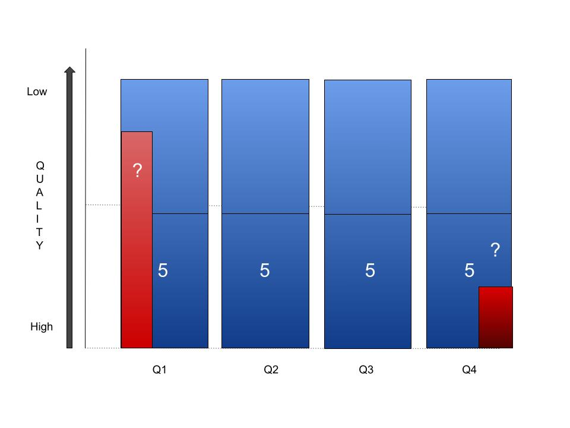

A number of studies have shown how later born and/or later maturing players do better out of the development process. This can be shown through higher percentages of these players reaching international levels for example (1).  This has been hypothesized as the Underdog Effect. Weaker, smaller, slower players responding to a higher challenge level than their stronger, larger, faster yet older peers.

This intuitive idea is similar to the Younger Sibling Effect where players with older siblings, who often play the same sport, are more likely to reach higher levels of that sport. It is presumed through the effect of the constantly higher challenge. This is a commonly held view and highly likely.

But are we attributing too much to the Underdog Effect and forgetting about how the systemic effect of multiple biased selections along a player’s journey can, just through a purely mathematical function, contribute to this same outcome? Are we comparing apples and oranges? For more on this...  [Why Most Conversion Rates Are Wrong and How You Can Do Better](medium.com/swlh/why-most-conversion-rates-are-wrong-and-how-you-can-do-better-d199d7edb852).

These ‘Effects’ influence both Relative Age Effects and Maturation Effects. In the following example we are just looking at RAE.

If at the start of the journey we have an equal distribution of players from the four Birth Quarters. Let’s say 40 players at an U10 trial to select a 20 player squad. I think it is safe to assume that there is an equal distribution of long term player potential across all BQs, so a ‘best’ 5 in each. Although it is virtually impossible to predict who of these 40 players will succeed in the long term, let’s assume that there will be a player in each group most likely and a player least likely to succeed long term, with the rest in order between them. 

Initial 40 players: Q1 10, Q2 10, Q3 10, Q4 10. *

A typical outcome for the squad will introduce RAE to this extent \*\*:

Q1 8, Q2 6, Q3 4, Q4 2

So just looking at Q1 we have selected our top 5 most likely players who could make it but also added 3 who probably won’t. For Q4 we have probably selected our top 2 of the 5 expected and not selected 3 who could succeed but are less likely than these 2. Therefore for Q4 there is a higher ‘concentration’ of potential then there is in Q1.

If we repeat this process at least annually for a few years then this will produce a small number of Q4 players who are super likely to succeed and a larger number of Q1 players who are super less likely. This purely ‘mathematical’ function is likely to contribute a significant part to the perceived Underdog Effect.

\* There may be a pre-trial effect where clubs have nominated early born players more than late born players.  

\*\* Based on Regional U15 BQ percentages (2000-2018). A County Age Group U10 squad may have more or less RAE at that age. RAE tends to be higher earlier but increased selection/competition for places increase RAE.  

1. McCarthy, Collins& Court 2015