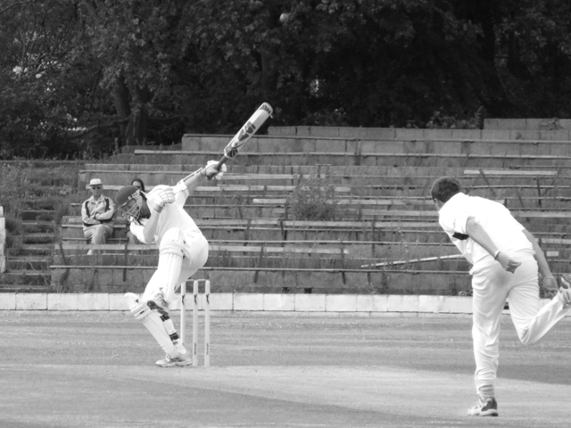

There is clear evidence of the effects of Relative Age and Maturity Status within English cricket. 

Choices/mistakes made at all selection points along the pathway create two massive systemic failures:

**Early born players are over selected and then under developed.** 

* 2 out of 3 young English pro cricketers (U20) are early born yet this hefty bias is REMOVED within 5 years and REVERSED within 10. 

**Later born players never enter or are lost too early along the pathway.**

* 1 out of 3 later born players never get selected. Typically only 33% of all players are Q3/Q4 for most of the player pathway.

So why not address [Relative Age Effect](https://onemoresummer.co.uk/post/what-is-relative-age-effect/) (RAE) & Maturity Status being baked into the player pathway? Why not select fewer earlies and more later borns? One argument is the [Underdog Effect](https://onemoresummer.co.uk/post/what-is-the-underdog-effect/).

In cricket as in many sports more elite players are later born than early born. For example, [Q3/Q4 players have longer England ODI careers](https://onemoresummer.co.uk/post/but-weve-just-won-a-world-cup/) (+30%) than Q1/Q2 players, yet more Q1/Q2 players are selected. Tim Wigmore and Mark Williams in their book ‘The Best - How Elite Athletes Are Made’ give the example that more later born players play 50+ Tests for England than early born. This is termed the Underdog Effect where younger, smaller, weaker, players have to work harder to survive than their relatively older counterparts and hence reach higher levels within their sport.

The systemic benefits of the Underdog Effect, it is argued, could be lost as an unintended consequence of addressing the inequality and inefficiencies of RAE & Maturity Status issues. But would this really be the case?

**A Numbers Game**

A later born batter for example will be more likely to be facing an early born bowler than another later born bowler. This is just a mathematical function of the typical 2/3rd to 1/3rd split between early and later born in any pathway squad.  If there was a more natural distribution of players (50:50 for early/late or 25% per Birth Quarter) then an early born batter will STILL be challenged by an older bowler for half of the time. This is even more relevant when looking at Birth Quarter 4 players who are often the most affected by RAE. They will be up against older players 75% of the time. The Underdog Effect maybe slighly diluted but will NOT be lost and would probably be less than the benefits of a more equal age distribution.

**Is the outcome all due to the Underdog Effect in the development pathway?**

Is there a higher concentration of high quality players in the smaller numbers of later borns anyway, from the start?

Because later borns have to reach a similar performance standard at every selection point are they just better because they can do that while being smaller, shorter, lighter, weaker, slower, less fit, less cognitively developed, less confident. Also at later points in the pathway they have probably also had less coaching, fewer game time opportunities and less time on task yet can still perform at an acceptable level or better to be retained.

**Indictment of the System**

If players only become elite through the systemic level of challenge then as Tim Wigmore & Mark Williams say ‘the underdog effect suggests a profound inefficiency in how coaches develop early-born players, especially those who mature early’. The way coaching controls the individual players optimum challenge point is crucial for skill acquisition and therefore to reach elite levels.

**Bio Banding isn’t a dirty word**

Playing up and playing down and also playing within a group of a players own Maturity Status level can offer coaches ways of optimising the individuals challenge level for both early and late born players.

It is just as unquestionable that there is an Underdog Effect as it is unquestionable that there is a Relative Age Effect, but equating the two is a very hard sell. Are we really right in  saying that the benefits of the Underdog Effect are greater than the benefits of addressing the Relative Age Effect?