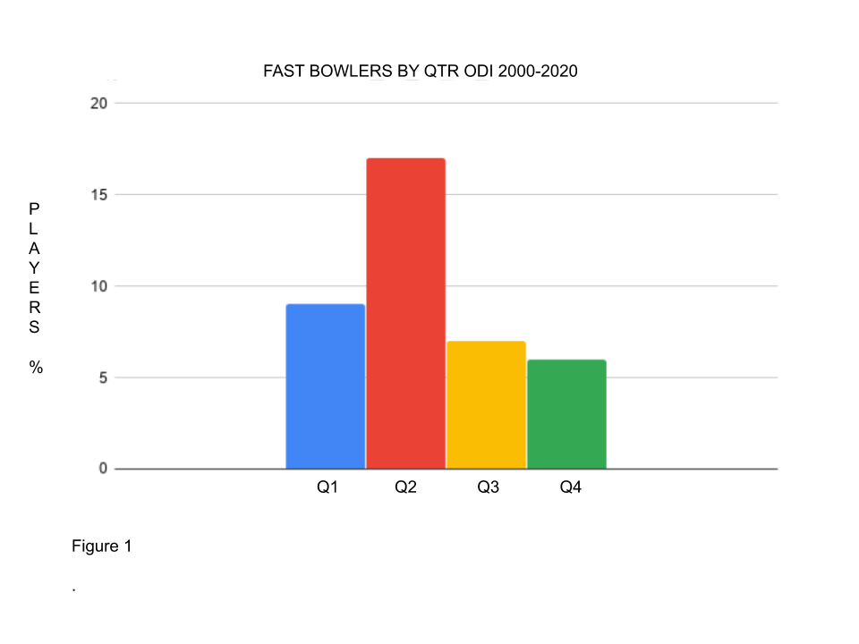
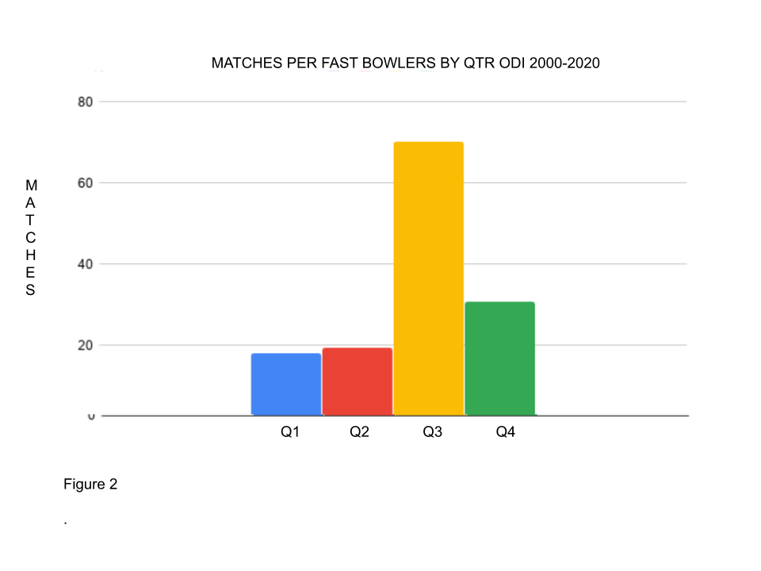
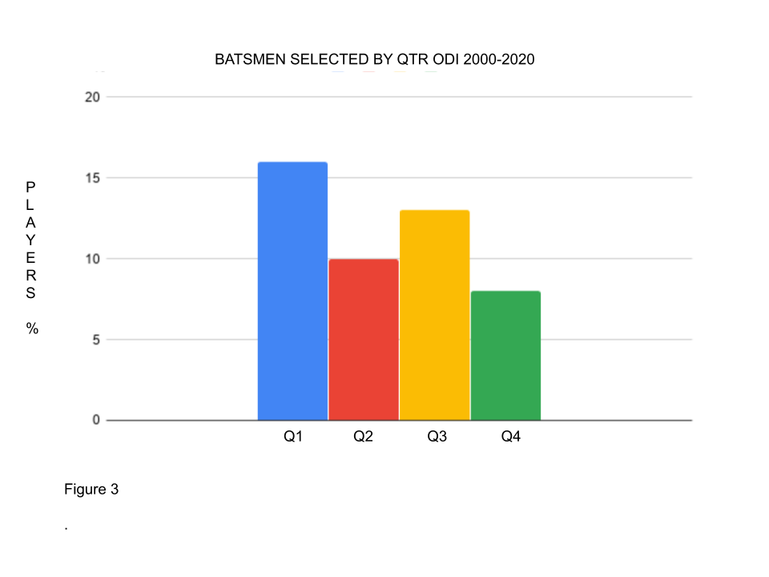
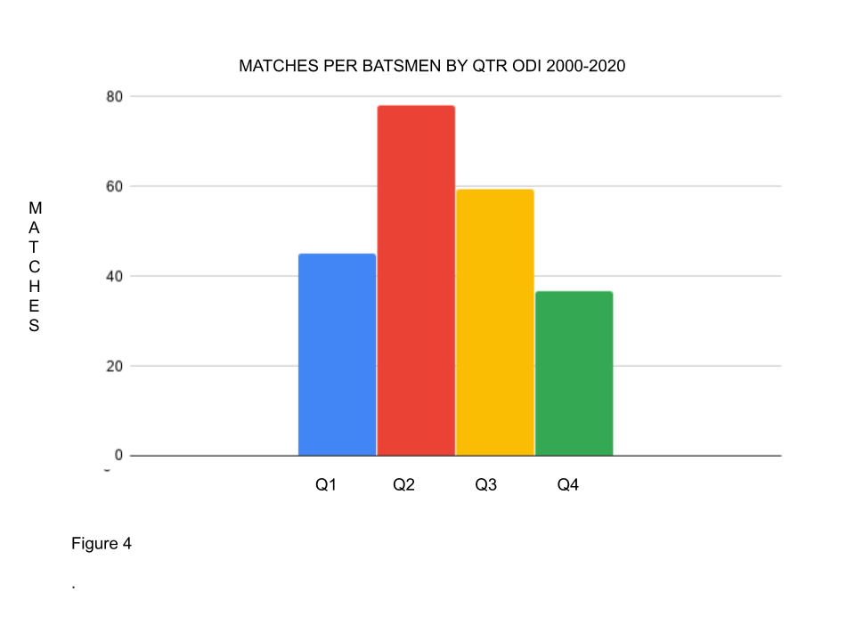

**England One Day International (ODI) Fast Bowlers born between September and February have SHORTER careers than those born between March-August but we pick MORE of the former.**

**ODI Batsmen born between September and October are the most selected Birth Quarter yet play FEWER matches than those born between November and May.**

In [Part I](https://onemoresummer.co.uk/post/but-weve-just-won-a-world-cup/) we looked at how England One Day International (ODI) players born between September and February play fewer matches over a career (36) than those born between March and August (48), but are selected more often (60:40).

In this article we look at how these figures are influenced by discipline. Namely by allocating the 103 players who have played ODI cricket since 2000 into three groups, Batsmen, Spinners and Fast Bowlers. Players were allocated a single role from what is perceived to be their current main role. So for example Ben Stokes is mainly a batsman and Moeen Ali is mainly a spinner.

**What do we find?**

**ODI Fast Bowlers born between September and February have SHORTER careers (19) than those born between March-August (52) but we pick MORE of the former (26:13).**

**ODI Batsmen born between September and October are the most selected Birth Quarter (34%) yet play FEWER matches (45) than those born between November and May (68).**

For batsmen the RAE found in Part I is less clear. There is overselection for Q1 and some under selection for Q2 but negligible performance differences between Q/1Q2 and Q3/Q4 when combined.

Drawing any conclusions from the Spinners group is problematic. Bowlers are often all-rounders and are selected based on what they offer with the bat. One group (Q4) only has two players, Moeen Ali and Ian Blackwell, who both are accomplished batsmen. They have played 136 matches between them. There does appear again to be some overselection of Q1 players however.

Figure 5

Figure 6

**Conclusions**

Fast Bowlers contribute to the disparity found in Part I more than Batsman and Spinners.

There is some evidence of ‘RAE Reversal’ in sports or disciplines within sports that are more reliant on physicality. RAE Reversal is where the Q3 and/or Q4s are found to be significantly selected more. This can be found at senior levels once the immediate physical advantages of earlier development for Q1s and/or Q2s has disappeared. Jones (2019) (1) within his PhD study. In Chapter 2 ‘New evidence of relative age effects in ‘super-elite’ sportsmen: a case for the survival and evolution of the fittest’ discusses how a Q4 bias is found in Rugby Union forwards whereas a Q1 bias is found in the backs. ‘This is demonstrated by the Q4 RAE observed for super-elite rugby union forwards, indicative of the ‘evolution of the fittest’ concept; the overcoming of significant challenges (associated with the disparity in physical size during development) likely fosters resilience, and a mindset for achievement at the highest level.’ 

It could be argued that Fast Bowlers require the highest levels of physicality within cricket and hence why we find, in terms of performance at least, a RAE Reversal within the data.

[Part I](https://onemoresummer.co.uk/post/but-weve-just-won-a-world-cup/)

NOTES

There are 103 players who have made their debut from 2000 onwards. This also includes players recently selected who are at the start of their careers. 9 of the last 12 players are from Q1/Q2. This will have a ‘drag effect’ on the average career matches for Q1/Q2s.

REFERENCES

1. Jones (2019) <https://www.researchgate.net/publication/317666419_New_evidence_of_relative_age_effects_in_super-elite_sportsmen_a_case_for_the_survival_and_evolution_of_the_fittest>