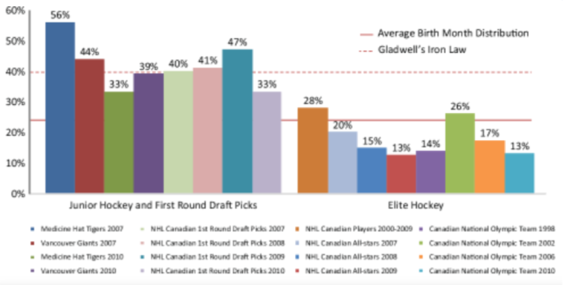

<meta name="twitter:card" content="summary_large_image" />
<meta name="twitter:site" content="@nothirdman" />
<meta name="twitter:title" content="Questioning the Underdog Hypothesis 1" />
<meta name="twitter:description" content="The first in a series of article questioning the Underdog Hypothesis starting with Gibbs et al 2012 investigation into ice hockey." />
<meta name="twitter:image" content="https://onemoresummer.co.uk/post/questioning-the-underdog-hypothesis-1/gibbsfigure1.png" />

[What is the Underdog Hypothesis and why question it?](https://onemoresummer.co.uk/post/questioning-the-underdog-hypothesis-an-introduction/)

\#1 Gibbs, Jarvis & Dufur (2012)

[\#2 Fumarco, Gibbs, Jarvis, & Rossi (2017)](https://onemoresummer.co.uk/post/questioning-the-underdog-hypothesis-2-fumarco-gibbs-jarvis-rossi/)

[\#3 Ford & Williams (2011)](https://onemoresummer.co.uk/post/questioning-the-underdog-hypothesis-3-ford-williams/)

**\#1 Gibbs, Jarvis & Dufur (2012)**

A study of RAE in male Canadian born National (Ice) Hockey League (NHL) professionals and those (the best) that played for the annual All Stars team and Olympic squads.

Main findings:

1. a lower level of Q1 (28%) in professional ice hockey than the levels in junior ice hockey (40%).
2. a lower level of Q1 (17%) in the very highest level teams, All Stars & Olympic squads, than in both junior ice hockey (40%) and (probably) compared to Q2, Q3 & Q4 in the professional league.
3. Higher career length for later born.

Let’s look further:

1. No other BQ percentages are stated other than for Q1. Q2 could have been 28% too? Q4 5%? Who knows? However a change from 40% to 28% is likely to be evidence for the continuing slow decline in RAE that occurs from midway through junior sport into the start of senior sport and beyond. The figure of 28% is the average for the entire professional cohort, rookies, players in their prime and veterans. From what we know of ‘fading effects’ of RAE it is likely that rookie RAE is higher than prime RAE so an overall % of 28 is perhaps not surprising. A rookie Q1% of 30+% is possible (likely?).
2. Again no other BQ%s are stated. All we are comparing is Q1 with the rest. Are Q2 later born?? Average career length in the NHL according to Gibbs is 7.4 years but some players play into their 40s. So a lot of players are released before 7 years and a gradual number of players retire after 7 years. We know RAE declines slowly. Players selected for the All Stars and Olympic teams that Gibbs looked at were probably selected from players in their prime. It is likely that the RAE profile for this age group is different (lower?) than that for the entire professional cohort. 17% Q1 for All Stars & Olympic teams is then less of a surprise when compared to this source population (prime). 
3. Career lengths in years were Q1 6.9 (-7%), Q2 7.6 (+3%), Q3 7.4 (0) & Q4 7.8 (+5%). Q2 is similar to Q4. Arguably it’s Q1 that is a weak standout. Gibbs et al state their findings were in contrast to findings from Wattie et al (2007). 

Fall of the Top Dog rather than Rise of the Underdog?

[Full Paper (Open Access)](https://www.researchgate.net/publication/257333561_The_Rise_of_the_Underdog_The_Relative_Age_Effect_Reversal_Among_Canadian-born_NHL_Hockey_Players_A_Reply_to_Nolan_and_Howell)

[\#2 Fumarco, Gibbs, Jarvis & Rossi (2017)](https://onemoresummer.co.uk/post/questioning-the-underdog-hypothesis-2-fumarco-gibbs-jarvis-rossi/)