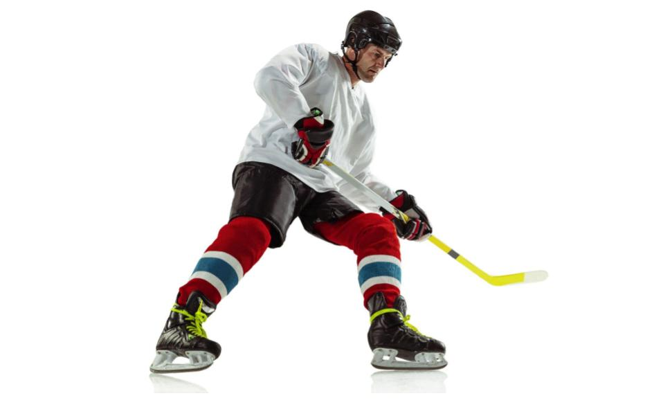

<meta name="twitter:card" content="summary_large_image" />
<meta name="twitter:site" content="@nothirdman" />
<meta name="twitter:title" content="Questioning the Underdog Hypothesis 2" />
<meta name="twitter:description" content="The second in a series of article questioning the Underdog Hypothesis starting with Fumarco et al 2017 investigation into ice hockey." />
<meta name="twitter:image" content="https://onemoresummer.co.uk/post/questioning-the-underdog-hypothesis-2-fumarco-gibbs-jarvis-rossi/ice-hockey.jpg" />

[What is the Underdog Hypothesis and why question it?](https://onemoresummer.co.uk/post/questioning-the-underdog-hypothesis-an-introduction/)

\#1 Gibbs, Jarvis & Dufur (2012)

**Fumarco, Gibbs, Jarvis, & Rossi (2017)**

A study, by birth quarter, of scores and salaries of National (Ice) Hockey League (NHL) professionals, from the 2008–2009 season to the 2015–2016 season.

[(Hockey player photo created by master1305 - www.freepik.com)](https://www.freepik.com/photos/hockey-player)

Main findings:

1. Q4 score more and command higher salaries than Q1.
2. This difference is more pronounced within the 90% percentile. +9* points/season and +51% of salary.

Let’s look further:

1. Only differences in Scores & Salaries between Q4 and Q1 were found. No differences significant between Q4 and Q2/Q3 were found and for scores Q3 was the highest.

Scores:

BQ Avg: Q1 16.7 (-15%), Q2 19.2 (-3%), Q3 21.8 (+10%), Q4 21.3 (+8%). So much lower Q1, average Q2 and a higher but similar Q3 and Q4. (nb. % of Player-season observations: Q1 30, Q2 28, Q3 22, Q4 20)

Salaries (Log values, OLS):

BQ Avg: Q1 13.9 (-1%), Q2 14 (0%), Q3 14.1 (+1%), Q4 14.1 (+1%). So very little difference with Q1 being the lowest. Even when looking at the 90th percentile: Q1 15.5, Q2 15.7, Q3 15.8, Q4 15.7.

\* the difference in average season scores between Q1 and Q4 at the 90th percentile appears to be +6 and not +9.

So what they really found was over-selected Q1 and to a lesser extent over-selected Q2 were not as good as the other under-selected Birth Quarters. Perhaps the Fall of the Top Dog rather than Rise of the Underdog?

[Full Paper (Open Access)](https://journals.plos.org/plosone/article?id=10.1371/journal.pone.0182827)

