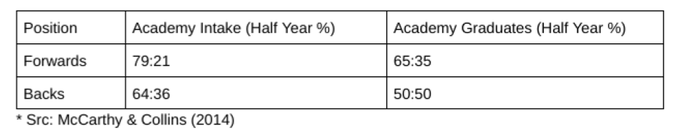

**Summary**

In most sports, the RAE declines from around mid adolescence as its causes become less relevant. During this decline, over selected early born are deselected at a higher rate than under selected late born. This typically results in reduced RAE or no RAE in senior sport.

In the literature, researchers have suggested several mechanisms to explain RAE’s decline, such as peer effects on skill acquisition and the development of psychological factors through greater challenges experienced by later born. There is, however, an additional explanation.

Regression to the mean (RTM) is a statistical phenomenon that describes how variables with values that are higher or lower than the mean (due to a combination of contributing factors or random chance) tend to move closer to the mean when measured a second time (due to changes in those factors and/or randomness evening out).

For RAE, on entry into the academy system, early and late born athletes are generally over and underrepresented in comparison to the mean, with consequential effects on the ‘average quality’ of each group. Over time however, the proportions of early and late born athletes tend to move to the mean, as contributing factors dissipate and inherent differences in ‘average quality’ play out, resulting in higher conversion and lower conversion rates for late and early born athletes respectively.

In support of the regression towards the mean argument, this article calls into question some of the evidence that has been presented in support of one of the other explanations, ‘The Reversal of RAE Advantage’, a version of the Underdog Hypothesis with a single ‘psychological’ mechanism attached. Consequently a re-appraisal of this paper and subsequent research that it supports is suggested.

**Background**

The term ‘Reversal of RAE Advantage’ comes from a 2014 paper by McCarthy & Collins that looked at RAE levels for initial selection and subsequent transition out of a single male English Rugby Union (RU) Academy. A follow up paper in 2016 compared initial selection RAE with selection to senior international level in both male English RU and Cricket. Compared to high initial levels of RAE at initial selection, the authors found lower levels of RAE (no significant RAE) both at the junior to senior transition point in RU (2014 study) and later in senior international careers in RU & Cricket (2016 study).

Higher ‘Conversion Rates’ for later born were used to argue that later born benefit in some way during junior sport development by being in the minority. Specifically, it is argued that there is a reversal in advantage for later born, i.e. it is better to be later born than early born during these ‘transitions’.

Skill and/or physicality as possible mechanisms for these findings were discounted and it was  proposed that the development of superior psychological skills through experiencing higher levels of challenge through development was the only mechanism at play. References from business and education are also used to support the hypothesis.

For context, these papers followed on from Gibbs et al 2012 who proposed the ‘Underdog Hypothesis’ when it was found that Canadian ice hockey players at the highest levels (e.g. Olympic teams) had lower levels of early born, specifically Birth Quarter 1 (Jan-Mar) than in junior hockey and the senior professional cohort (NHL). Gibbs proposed that this was due to ‘peer effects’ from the higher level of challenge experienced by ‘later born’ during development.

These papers are important because a lot of other research is based on them. McCarthy, Collins, Court (2016) ‘Start hard, finish better: further evidence for the reversal of RAE advantage is cited in 161 papers and Gibbs et al (2012) ‘The rise of the underdog? The relative age effect reversal among Canadian-born NHL hockey players: A reply to Nolan and Howell’ in 241 papers, as at 23/6/2024.

Some of this subsequent research has led to the recommendation that either RAE should not be addressed for fear of ‘unintended consequences’. These being that by intervening to address RAE bias we may jeopardise the supposed benefits of the Reversal of RAE Advantage, such as relatively more late born junior to senior transitions and the development of the very best late born players at international level. In short, the Reversal of RAE Advantage is seen as a ‘benefit’ of RAE and its continuation is advocated as having utility in player development.

But what if these papers and this concept are wrong? What if the magnitude of proposed mechanisms are wildly overestimated? What if higher junior to senior transition rates are NOT caused by one predominant mechanism? What if a number of mechanisms are present and they are outweighed by a natural population regression effect due to the slow decline in temporal advantage? What if National Governing Bodies are wrongly being advised to ‘do nothing’ on RAE bias?

The answer is that thousands of kids are unfairly discriminated against each and every year that this continues. It results in a restricted potential player pool and genuinely world class potential may be being missed.

This article looks at the data of the 2016 paper, explains ‘conversion rates’, questions the conclusions and offers an additional hypothesis.

**The Data**

1. *Does this paper identify true ‘Underdogs’?*

Using the single factor of RAE, it’s true that late born are almost always in the minority in RU & Cricket development environments. But we know many other factors can provide selection advantages such as maturation, experience & genetics. Within the literature there is evidence that late born have a relatively higher % of early maturers, for example. Therefore, players from under-selected birth quarters may have more success due to ‘other’ contextual, ‘balancing’ factors, or a combination of them. These factors are unknown in the 2016 paper. Not all late born are necessarily true ‘Underdogs’.

2. *The two data points used*

Using one data point at initial selection at around age 16 and a second at international selection, on average around age 24 in cricket, the paper arguably compares the highest point of RAE with one of the lowest, i.e. it is not a single data point of a junior (Academy) to senior (Professional) transition as in the 2014 paper. It is two data points around, on average, 8 years apart for cricket. Importantly, RAE can naturally decline significantly over this extended period.

3. *Unusual subset of international cricketers*

Only 24 international cricketers, born between 1982 & 1999, are identified. So far 80 players have played for England who were born in this period, debuting before 2020. The paper was published in 2016 so data was probably collected much before that date which would explain the difference.

Between James Anderson making his Test (5 day format) debut on 15th Dec 2002 and Scott Borthwick debuting in a One Day International (50 over format) on 25th Aug 2011, 24 players born between 1982 & 1999 were selected for England.

The RAE profile of these cohorts:

The 2016 Paper Q1 25%, Q2 17%, Q3 29%, Q4 29% (HY 42:58%)

The 24 identified (2002-2011) Q1 17%, Q2 25%, Q3 33%, Q4 25% (HY 42:58%)*

The 80 identified (2000-2020) Q1 19%, Q2 31%, Q3 26%, Q4 24% (HY 50:50%)

So the particular subset of 24 used in the paper have a far more late born bias, 42:58% by Half Year, than the larger set of 80 (2000-2020) with 50:50%. Importantly, this obviously impacts on the relative strength of ‘Conversion Rates’.

*\* Some differences may be due to country specifics. 5 of the 24 identified were born and grew up elsewhere (e.g. South Africa or Australia that have a 31st Dec junior sport cut off date as opposed to 31st August in England).*

4. *Conversion Rate Error*

The paper states the conversion rates for both Q1 & Q2 cricketers as 2%. But this should be rounded to 3% in both instances. Q1 is 2.5% and Q2 is 2.55%. (The Q2 Cricket Academy cohort is correctly rounded from 23.5.% to 24% earlier in the paper.). Again this is important considering the scale used in the graphs presented.

**Conversion Rates**

When looking at uneven groups the value of a ‘conversion’ from each group has a different value or scale. Consequently, the [use of conversion rates (CR) can be very misleading](https://onemoresummer.co.uk/post/why-its-important-to-consider-a-maximum-conversion-rate/) and a bit like comparing apples with pears. For example in the 2016 paper the maximum CR for Q1 cricketers is only 10% (24 from 240) but if all 24 cricketers came from the Q4 cohort (n=105) then the maximum CR is almost 23%. But as the 2014 & 2016 papers use CRs, for the purpose of this article, let’s assume it's a valid analysis tool.

Using data from the 2016 paper (n=24) the cricket CRs are Q1 2.5%, Q2 2.55%, Q3 4.22% & Q4 6.77%.

Using a larger dataset of the 80 players identified, over twice as long a period and including the subset of 24 players from the 2016 paper, the cricket CRs are Q1 2.5%, Q2 4.46%, Q3 3.61% & Q4 4.76%.

These results would seem to suggest something different from those of the 2016 paper. Q2 for example has a higher CR than Q3. All birth quarters, apart from Q1 perhaps, have similar CRs. See Figure 2 (CR %s) below which is adapted from the 2016 paper to include this wider dataset. 

Much research simply compares the CRs of Q4 with the CR for Q1. Often a difference is found as in this paper. However, by accounting for Q2 & Q3 we can see a different pattern, as here, where all BQs have higher CRs than Q1. Is this enough evidence to support the Reversal of RAE Advantage? Or is it evidence that the most over-selected BQ (Q1), having diluted average quality, is likely to have a much lower CR? Q1 cricketers made up 36% of the initial cohort with the other BQs at 24,25 and 16%.

Perhaps ‘% of Max CR’ is a more valid way of comparing CRs, i.e. how far along the scale that rates reach, appropriate for each group (BQ). For the n=80 dataset these figures are Q1 25%, Q2 29%, Q3 25%, Q4 21%. 

**The Conclusions**

Firstly, the regression towards the mean (no mechanism) is not discussed or discounted. There is also no consideration of how over-selecting a particular birth quarter can affect the average quality of that group compared to other under-selected groups and the longer term retention effects of this.

Instead, a single mechanism of improved psychological skills in later born, is proposed. How do the authors get to this point? …

Two mechanisms from the literature to explain the Underdog Hypothesis are discussed and discounted, namely skill and physicality.

*‘Mechanisms such as skill (Schorer, Baker, Busch, Wilhelm, & Pabst, 2009) and physiology (anthropometric and fitness measures) (Carling et al., 2009; Till et al., 2014) have been suggested as biasing/influencing selection and reversal effects.’*

The paper suggests that there are no RAE differences based on role/position within rugby union and cricket and so discounts the possibility of skill and/or physicality as mechanisms. No actual positional data is given within the 2016 paper with regard to cricket but the 2014 paper contains the following rugby union data:

RAE is stronger in Forwards than Backs. RAE persists after Academy graduation for forwards but doesn’t for backs where no RAE is found. However, both forwards and backs experience around a 14% reduction in RAE by Half Year%. Could this same rate of (natural) decline be due to something else? A non mechanistic change, i.e. a natural regression towards the mean?

A number of studies in positional/role differences in RAE in sport have been done. Although there are some mixed findings, [especially in RU](https://onemoresummer.co.uk/post/how-does-the-rae-profile-of-english-rugby-union-internationals-compare-with-the-source-cohort-in-the-english-premiership/), a general conclusion would be that RAE is mediated by position/role. Differences in the RAE profiles and timelines of batters and bowlers in cricket have also been identified.

Is the evidence from the 2014 & 2016 papers enough to totally discount skill and/or physicality mechanisms? Does it discount regression towards the mean? Does it account for initial selection effects on quality?

References from business and education are also used to support the hypothesis. There is an addendum that covers this for further reading if required.

**An Additional Hypothesis**

The concept of the ‘average quality’ of uneven birth quarters having a long term effect was discussed by Bryson, Gomez & Zhang (2017). Its long term implications result in a regression towards the mean from when the temporal advantage begins to fade. It could be argued that this ‘no mechanism’ effect is more likely at play than any other mechanistic factor.

If we assume that potential high quality players are evenly distributed across the entire population by birthdate, then when over selections of early born are made, it is likely that more players towards the lower potential/ability tail are selected in early born groups than later born. See Figure below from Bryson, Gomez & Zhang (2017). This example comes from Canadian ice hockey where the cut off date is 31st December. Therefore January born are over selected far more than December born who are under selected. Using a normal distribution curve the diagram shows how those selected for January (early born) have a large number from the left of the curve (ie. of low potential/ability). For December (late born) those who are lucky enough to be selected are likely from the right of the curve (i.e. of high potential/ability).

Therefore the average quality of later born players is greater than early born. Hence later born are more likely to be retained as further selections and reductions in cohort numbers occur.

Bryson, Gomez & Zhang (2017), who found performance advantages (points scored & matches played) in ice hockey for those born May-Dec over those born Jan-Apr, state *‘We therefore expect that owing to this selection pressure, any later born entrant into the NHL will be of better than average quality than early born counterparts.’*

Fumarco, Gibbs, Jarvis & Rossi (2017), who also found evidence of higher performance (points scored) in ice hockey for all those born later than Q1, as well as salary advantages, offer two mechanisms for their findings, ‘psychological/resilience’ and ‘selection of talent’. With regard to the latter they state *‘… younger players are likely positively selected (i.e. selected from the right tail of the ability distribution). ’* and *‘In the NHL, the proportion of relatively young players with superior ability is potentially larger than that of relatively older players because more of the relatively older player’s success has been artificially enhanced by the RAE.’*

Additionally, by further analysing the data of this paper and an extended dataset can we say that there is a Reversal of RAE Advantage in cricket? At what point does being born later become an advantage? There is no RAE in the extended dataset (Q1 19%, Q2 31%, Q3 26%, Q4 24%, HY 50:50%, n=80).

Arguably what we are seeing is a slow decline in RAE from its highest point (entering an Academy) to a lower point (selection to international level). As RAE declines relatively more early born are deselected than late born and this is (partially) reflected in a difference in relative Conversion Rates. How does this happen?

The 2016 paper states *‘there appears to be a process or processes that influence a change in the status quo from the initial identification bias that leads to a significant change in status at the confirmation stage of the development process.’* While process(es) may be at play, each at an unknown magnitude, what is also likely at play is ‘no process/mechanism’, namely the natural regression to the mean, as the temporary advantage of being older becomes less and less relevant. Those early born, low potential players, over selected at the initial stage, are deselected at a higher rate than the relatively under selected late born, low potential players. 

McCarthy et al (2016) state *‘However, evidence now suggests this \[initial RAE selection] advantage may in fact reduce when transitioning into senior level sports (Cobley, Baker, Wattie, & McKenna, 2009).’* This is true. This is a reduction in RAE Advantage which is not a reversal of RAE Advantage. Early born are still more likely to be selected than later born until we get to a stage when either there is no significant RAE or a true RAE reversal. It is only a reversal in the sense that the magnitude of RAE Advantage is no longer increasing but decreasing, often very slowly.

**\
Conclusion**

We are all influenced by our desired narratives, such as to see appropriate interventions for selection bias in sport, especially RAEs in cricket. For others with a catalogue of work that is based on the ‘benefits’ of psychological disruptions (e.g. Talent needs Trauma and Rocky Road analogies) there is a different narrative:

*‘Whilst the physiological impact on RAE has been extensively reviewed over a significant period of time, much less reported in the sporting literature is the effect of psychological disruptions and the impact not only on the identification process but more importantly the negotiation of the development journey.’* McCarthy, Collins, Court (2016).

This article advocates for the regression towards the mean explanation of RAE decline as a result of uneven Birth Quarters containing inherent differences in ‘average quality’. Other possible mechanisms being in play to various (currently unknown) degrees is still entirely possible and even likely, but to what degree and are they minor compared to a natural regression towards the mean?

The 2016 paper argues that the Reversal of RAE Advantage is the same as the Underdog Hypothesis within the RAE domain but with an ‘only’ psychological mechanism attached. Subsequent research based on the Reversal of RAE Advantage often advocates the avoidance of ‘blanket approaches’ to addressing RAE bias. However, interventions such as Age Ordered Shirt Numbering (Mann & Ginneken, 2017) can provide additional context, allowing evidence informed selections.

For context, the 2016 paper is 8 years old and its precursor 2014 paper 10 years old. A lot of conceptual knowledge has advanced during this time. Notably an understanding that maturation selection bias and RAE are two separate concepts. Further, maturation selection bias is seen as a mainly physical (strength, speed, endurance) issue whereas RAE, partly because it is found in other domains such as chess, is seen as a cognitive, motor control, social & emotional issue. The 2016 paper discusses the physicality advantages of RAE… *‘An abundance of literature highlights the obvious physical advantages associated with being relatively old; further, it is a robust concept that this advantage manifests in identification processes.’*

However this paper is continuing to be referenced in new research, including the authors promoting that the concept is robust: ‘This finding \[RAE Reversal of Advantage] appears robust across a wide range of sporting contexts’ (McCarthy, Taylor, Cruickshank, Collins, 2022). One of these contexts quoted is cricket. The paper referenced says almost the exact opposite. Perhaps it’s time for a re-appraisal?

[Paper (2016)](https://www.researchgate.net/publication/286968503_Start_hard_finish_better_further_evidence_for_the_reversal_of_the_RAE_advantage)

[Paper (2014)](https://www.researchgate.net/publication/262682269_Initial_identification_selection_bias_versus_the_eventual_confirmation_of_talent_evidence_for_the_benefits_of_a_rocky_road)

Series:

[\#1 Gibbs, Jarvis & Dufur (2012)](https://onemoresummer.co.uk/post/questioning-the-underdog-hypothesis-1/)

[\#2 Fumarco, Gibbs, Jarvis, & Rossi (2017)](https://onemoresummer.co.uk/post/questioning-the-underdog-hypothesis-2-fumarco-gibbs-jarvis-rossi/)

[\#3 Ford & Williams (2011)](https://onemoresummer.co.uk/post/questioning-the-underdog-hypothesis-3-ford-williams/)

[\#4 McCarthy, Collins & Court (2016)](https://onemoresummer.co.uk/post/questioning-the-underdog-hypothesis-4-mccarthy-collins-court-2016-what-is-the-reversal-of-rae-advantage-should-it-continue-to-be-widely-referenced/)

- - -

*\* Addendum covering the 3 papers referenced from RAE studies in business and education that are used to support the 2016 paper hypothesis:*

*This is the final paragraph in the conclusion of ‘Dhuey, E., & Lipscomb, S. (2008). What makes a leader? Relative age and high school leadership. Economics of Education Review, 27, 173–183… ‘Based on the current state of the research, we believe the most appropriate policy recommendation is to better inform parents of the effects associated with being relatively young. In addition, to the extent possible, educators should pay closer attention to the difference between perceived ability and maturity when placing children in ability specific groupings. Both may help attenuate the negative effects related to being relatively young.’ The word ‘reversal’ is not used in the paper.*

*The 2016 paper references RAE research in the business domain, Du, Q., Gao, H., & Levi, M. D. (2008). Born leaders: The relative age effect and managerial success (AFA 2011 Denver Meetings Paper). It finds that of 321 CEOs of S&P 500 companies the ROI between 1992 and 2006 is around double for those born in ‘Summer’ (Jul-Sep) than those born in the rest of the year. The educational year in the USA begins at the start of September, so this is confusing. One third of the ‘Summer’ cohort are early born. What perhaps it does show is that under-selected groups within a cohort are likely to have a higher average quality. The Summer cohort is 21% (Jan-Mar/Winter 29%, Apr-Jun/Spring 25%, Oct-Dec/Autumn 25%).*

*Roberts & Stott (2015) studied the outcomes from two courses at a single English university. Apart from the combined female cohort, all (sig) differences discussed in the results are Q1 v Q4 comparisons only. No discernable difference is found between Q4 and Q2 or Q3. Like many studies that only compare Q4 with Q1 perhaps the difference is with Q1 rather than just Q4, or both? Also a significant difference between females (n=173) and males (n=287) is found but there is no RAE profile breakdown by gender to further investigate this factor. Based on the papers this paper is cited in, I couldn’t find any subsequent body of evidence that suggests a RAE Reversal in post secondary education. In fact around half of the papers were sports related.*