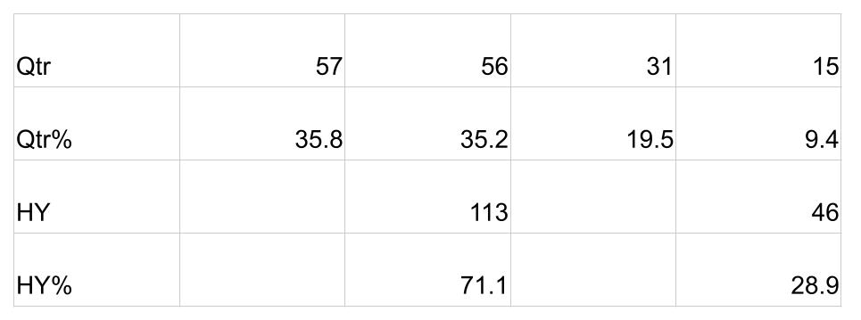
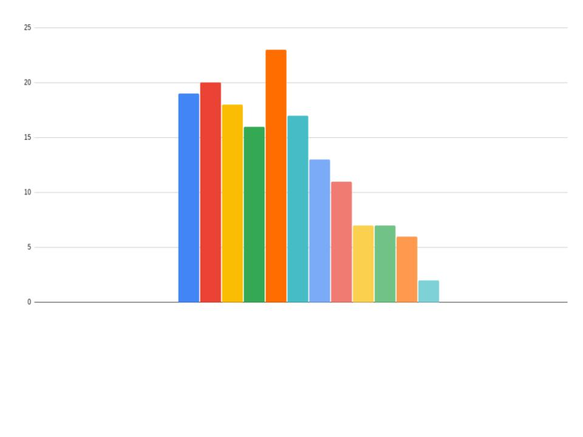

Bunbury is an annual event, held at a private school, for the four regions at the U15 age group, and has run for over 30 years. The South & West, London & East, the North and the Midlands compete in 3 50 over matches and 2 T20 matches each. It is the first part of the national performance pathway.

As we can see there is a significant [Relative Age Effect](https://onemoresummer.co.uk/post/what-is-relative-age-effect/) with Q1 & Q2 outnumbering Q3 & Q4.

This matches what is found at the [Super 4s (Regional U17s)](https://onemoresummer.co.uk/post/rae-at-super-4s-regional-u17s/) and in the last [4 England U19 (Young Lions) World Cup squads](https://onemoresummer.co.uk/post/rae-increasing-in-england-u19-world-cup-squads/).

The chart below illustrates how players are distributed across the 12 months of the academic year (Sept-Aug).

**The Highs & Lows**

47.4% were Q1 from the Midlands while only 8.3% were from Q4 from the South & West, over the last 5 years.

NOTES

Data for all 5 years is included (from cricketarchive.com).

The total number of participants studied was 247 (if a player played more than one year then each occurrence is counted).

No Date of Birth was available for 88 players. These were excluded leaving n=159.