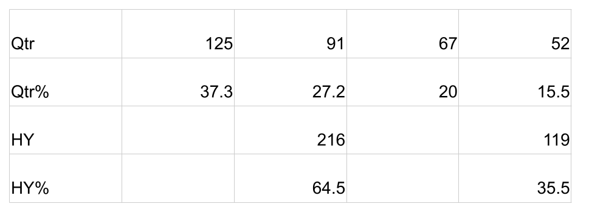
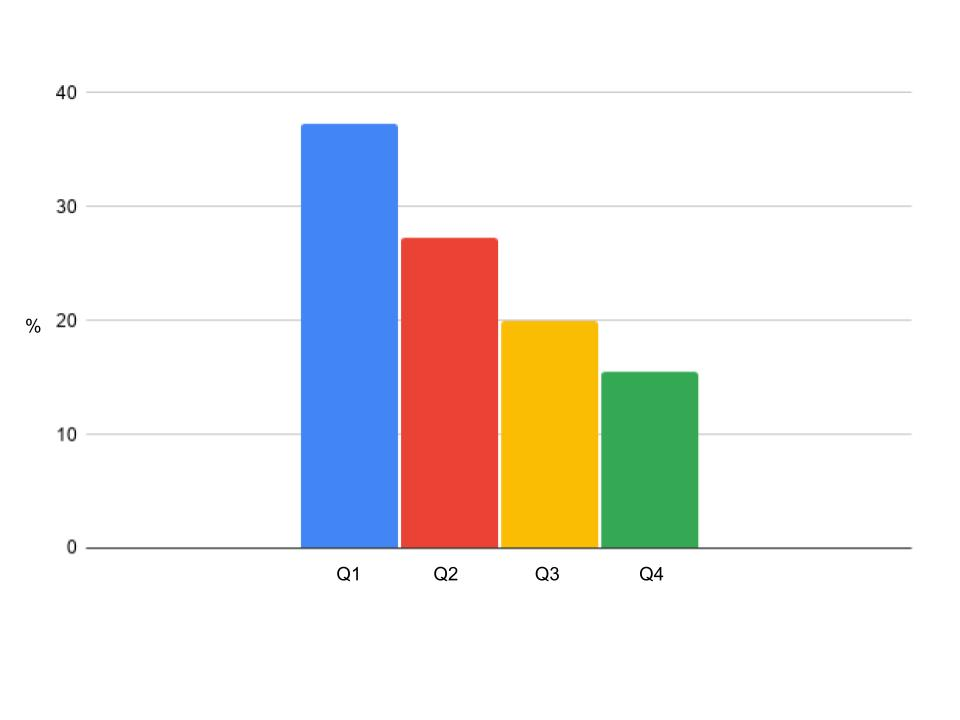
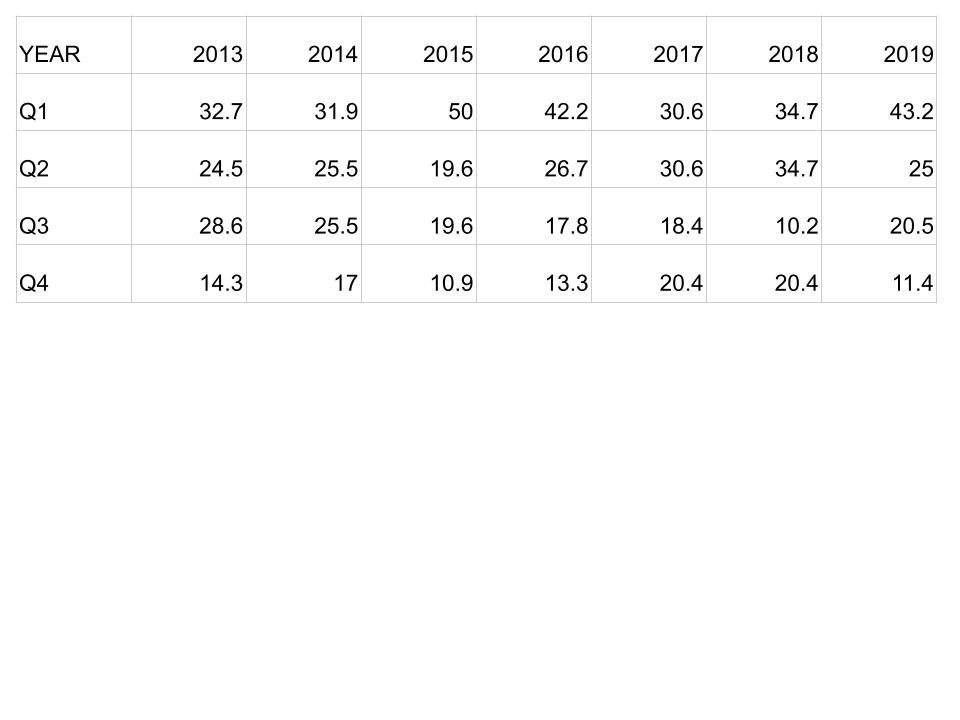

The Super 4s is an annual event, held at Loughborough, for the four regions at the U17 age group. Having run for the last seven years, the South & West, London & East, the North and the Midlands compete in 3 50 over matches and 2 T20 matches. Essentialy it is part of the selection process for the Young Lions, England’s U19 side.

What do we find? Q1 & Q2 percentages are  higher than Q3 & Q4.

The data shows evidence of a [Relative Age Effect](https://onemoresummer.co.uk/post/what-is-relative-age-effect/) at this point of the Performance Pathway. It reflects the same findings found for the next point along the pathway, selection for the [Young Lions (U19s)](https://onemoresummer.co.uk/post/rae-increasing-in-england-u19-world-cup-squads/).

These [Birth Quarters](https://onemoresummer.co.uk/post/what-is-birth-quarter/) (BQs) are fairly similar to those found for U19s World Cup squads where Q3 & Q4 are further reduced and Q1 comes down a little with Q2 going up to match the Q1 level.

Q1 37.3 -> 34.5

Q2 27.2 -> 34.5

Q3 20 -> 17.2

Q4 15.5 -> 13.8

\*Using the BQ%s for U19 World Cup Squads 2014-2020.

**Trends Over Time**

The last 4 years show a difference between Q1/Q2 and Q3/Q4 whereas the first 3 years of the competition had Q2 & Q3 at similar levels with just the differences showing up between Q1 & Q4.

**Regional Differences**

The regions all had various levels of RAE. The Midlands had the least difference between Birth Quarters but still had a 59:41 half year split between Q1/Q2 and Q3/Q4.

**The Highs & Lows**

In 2015 exactly half of all the players were from Q1 alone while in 2018 only 10.4% were from Q3.

NOTES

Data for all 7 years is included (from cricketarchive.com).

The total number of participants studied was 355 (if a player played more than one year then each occurrence is counted).

No Date of Birth was available for 20 players. These were excluded leaving n=335.