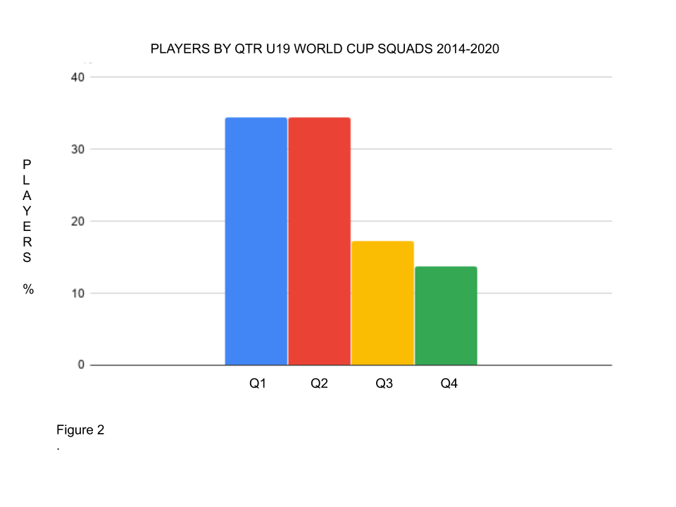

**Young Lions (U19) World Cup squad players born between September and February are twice as likely to be selected than those born between March and August.**

A preference for selecting players born earlier in the academic/sporting year is a well known and researched concept called Relative Age Effect (RAE). Do we have RAE in cricket? Yes.

Figure 1 below shows that for England U19 World Cup squads from 1998-2020 there is significant (p-value<0.05) Relative Age Effect (Q1-Q4: 57(32.6%) , 49(28%), 39(22.3%), 30(17.1%).

Figure 2 below shows that for the last four World Cups the bias towards Q1/Q2 players is larger. For 2014-2020 there is significant (p-value<0.05) Relative Age Effect (Q1-Q4: 20(34.5%), 20(34.5%), 10(17.3%), 8(13.8%).

**So what’s going on here?**

Research has shown that RAE exists in UK and Australian player pathways (1,2,3). This research also suggests that RAE decreases from U17 onwards (-> U19 -> Seniors). This analysis suggests otherwise for U19 World Cup squads and that there is a trend to select more and more Q1/Q2 players relative to Q3/Q4.

NOTES

This analysis only looks at World Cup squads and not the entire U19 player pool. Selection for a marquee event will be different as ‘winning’ is more emphasised.

\
REFERENCES

1. Jones (2019) <https://www.researchgate.net/publication/317666419_New_evidence_of_relative_age_effects_in_super-elite_sportsmen_a_case_for_the_survival_and_evolution_of_the_fittest>
2. Barney (2015)  <https://research.bangor.ac.uk/portal/en/theses/preliminary-stages-in-the-validation-of-a-talent-identification-model-in-cricket(a1e7f8cd-2966-4f33-bcad-a65fede16997).html>
3. O'Connor (2019) <https://www.ncbi.nlm.nih.gov/pmc/articles/PMC6526896/>