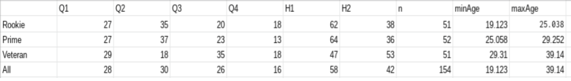

The Relative Age Effect (RAE) profile of professional team sports is often assumed to be even (i.e. all 4 Birth Quarters are more or less level) and that RAE is only found in youth development. But in many sports, especially those with high levels of junior RAE, it ‘knocks on’ into senior level.

\
Yague et al (2018) found significant RAE in 9 of 10 European football (soccer) leagues with only Belgium not significant. The English Premier League (EPL) had a significant RAE (p=0.39) but with a small effect size (V=0.12, n=573), Q1 29%, Q2 21%, Q3 23%, Q4 27%. It is worth noting that this includes all EPL players, not just English players.

In this analysis, it is found that the RAE profile of English players in the EPL is different with far fewer Q4 and more Q2 players, namely, Q1 28%, Q2 30%, Q3 26%, Q4 16% (n=154). Interestingly this accurately matches the England World Cup squad 2022 RAE profile, Q1 27%, Q2 31%, Q3 27%, Q4 15% (n=26).

**\
The Senior RAE Timeline**

The age range of English EPL players in 2022 is 19-39 years. A tertile analysis shows how the RAE profile currently (2022) looks different for Rookie (19-25 yrs), Prime (25-29 yrs) and Veteran (29-39 yrs) English EPL players, with higher levels of RAE at the Rookie & Prime stages with RAE only appearing to ‘even out’ from age 29. Only 8 England World Cup players are in the Veteran group with 9 players in both Rookie and Prime groups.

**\
Positional Effects**

In agreement with Yague et al (2018) higher levels of RAEs were found in Midfielders and lower levels in Forwards. In this analysis however higher levels were found in the Defender group and a RAE Reversal (H1 33%, H2 67%) in Goalkeepers.

**Conclusion**

Perhaps this analysis indicates a. no evidence that later born players reach higher levels (Underdog Hypothesis) and b. The under-representation of Q4 players is maintained right through junior development, professional status and the full England team (Knock-on effects).

There is also evidence of knock-on effects and RAE continuing its slow decline from it’s peak in the junior environment, right through 10 or 11 years of the professional senior environment.

Further evidence is found for positional effects on RAE, with Midfielders and Defenders showing preferences for early born players. Perhaps English players populate the Defensive and Midfielder roles more than non-English players within the EPL?

Data:

As at 29.11.2022.

Using the 25 player squads of all 20 EPL teams.

English players made up approx 30% of the EPL squads.

Jude Bellingham plays in the German Bundesliga.

Reference:

[José M. Yagüe, Alfonso de la Rubia, Joaquín Sánchez-Molina, Sergio Maroto-Izquierdo and Olga Molinero (2018). The Relative Age Effect in the 10 Best Leagues of Male Professional Football of the Union of European Football Associations (UEFA). Journal of Sports Science & Medicine, 17(3):409-416.](<https://www.researchgate.net/publication/327102179_The_Relative_Age_Effect_in_the_10_Best_Leagues_of_Male_Professional_Football_of_the_Union_of_European_Football_Associations_UEFA>)