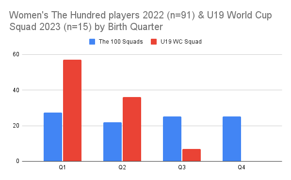
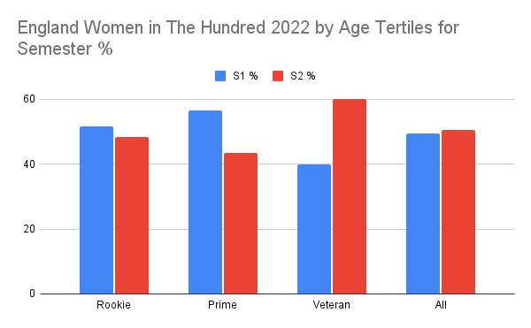

93%* of the English Women’s U19 World Cup squad 2023 (n=15) are born in the first half of the year.

No RAEs are found across the English women players in the eight teams of The Hundred 2022 (n=91). 

The profile of RAEs, in The Hundred, is different as age increases with 60% of players age 29-37 born in the second half of the year.

Only 5% of sport research is for female participants. Research into the developmental pathway and subsequent long term effects of Relative Age within women’s cricket and sport in general is required. 

Potentially the professionalisation of regional EPP & Academy girls programmes could create similar issues around RAEs and Maturation selection bias found in the boys development pathway. 

\* One date of Birth was unavailable.