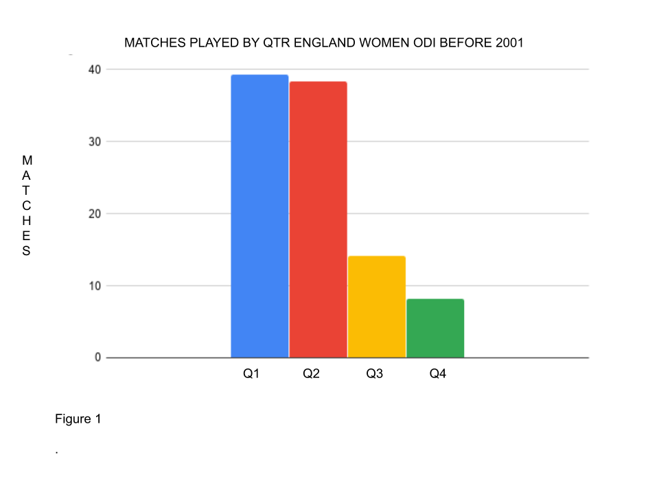
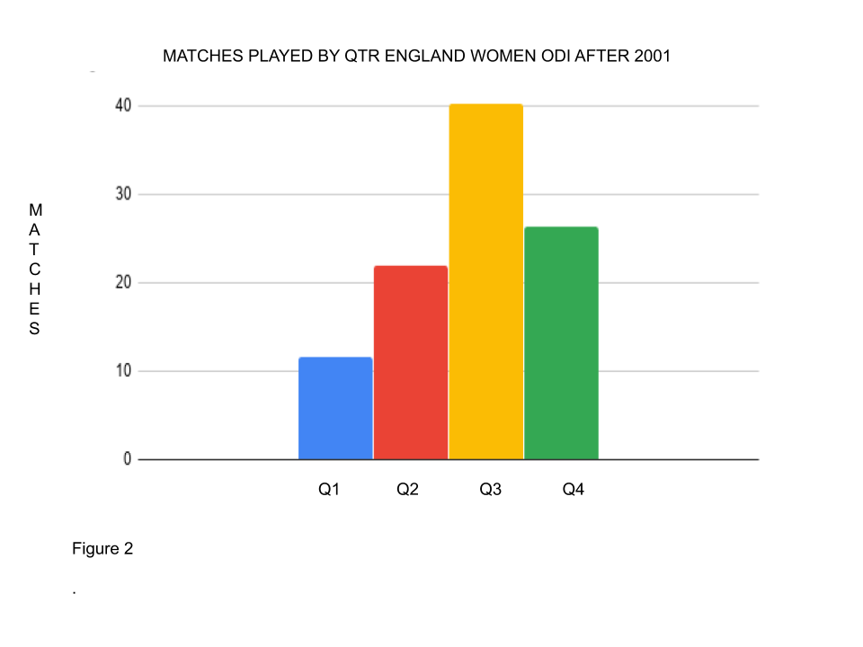

**Since 2001 Q3/Q4 England Women ODI players have played TWICE as many matches as Q1/Q2 players.**

In Women's cricket RAE appears to be reversed. Q3/Q4 players are selected more than Q1/Q2. Why is this?

Maturation in women happens earlier and has less of an effect on physicality than in men. In women maturation causes a change in body composition with fat mass increasing relative to muscle whereas in men it causes an increase in muscle mass. Therefore it is often found that girls that are late maturers and/or are born later in the sporting year are overly selected, in the development pathway, because they are/appear to be more athletic.

**Before and after Isa Guha**

Isa Guha made her ODI debut in 2001. Interestingly, before 2001 Q1/Q2 England Women ODI players played 3.5x MORE matches than Q3/Q4 players. From then on though things were very different.

Before Isa Q1/Q2 players dominated both in terms of numbers of players (57:43) but more so matches played (78:22) (Figure 1). Post 2001 selection has changed radically. Q3/Q4 players now dominate, slightly in terms of numbers of players (46:54) but more so by matches played (34:66) (Figure 2).

**Why?**

English Women’s cricket has become more professional. The administration of Womens’ cricket merged with Men’s cricket in 1998 and womens cricket has benefited from more resources (but not enough incidentally).

Selectors are looking for more athletic fielders reflecting the growth in T20 cricket.

The growth of women and girls participation means there is a larger pool of players to pick from.

**How to fix?**

Players with potential are being missed from Q1/Q2 as Q3/Q4 are being over selected. It would be interesting to see what RAE there is in the pathway ie. England Academy and the new Regional centres. Why are Q1/Q2 being deselected/rejected?

[How we can fix RAE andMaturation issues in English Cricket](https://onemoresummer.co.uk/post/how-we-can-fix-rae-and-maturation-issues-in-english-cricket/).