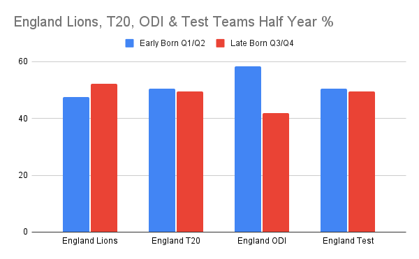

This was a longitudinal study (n=1800) of English male cricketers from Regional U15 thru to International with up to 20 years of data, using the Personal Assets Framework (PAF) to examine immediate, short-term and long term outcomes. 

**Immediate Timescale (PAF):**

Relative Age Effects (RAE) in ALL age groups Regional U15 & U17, Eng U19. No RAE at senior level for any format.

RAE highest at U15 but still high at U19 too. More likely to be Q1 than Q4 by 3.78x at U15, 2.50x at U17 & by 1.83x at U19.

**Short Term Timescale (PAF):**

A higher % within the smaller groups of later born junior cricketers transition to senior levels. 

Q4 U15s more likely to reach international levels than Q1s by **3.9x** for Lions, **3.1x** for T20, **2.5x** for ODI & 3.6x for Test.

**\
Long Term Timescale (PAF)**

The shorter the format the more likely early born players will play more games.

T20 Q1 play most matches, 28% .

ODI Q2 play most matches, 30%.

Test Q1 play least matches, 12%.

Early born batters played more matches whereas later born bowlers played more matches.

T20 batters Q1 play most matches, 36%.

ODI batters Q2 play most matches, 39%.

Test batters Q2 & Q3 play 81% of matches.

T20 bowlers Q3 play most matches.

ODI bowlers Q3 & Q4 play 67% of matches.

Test bowlers Q4 play most matches, 48%.

**Immediate Timescale: How Sport Experiences Are Shaped**

When the three dynamic elements of the PAF (i.e., personal engagement in activities, appropriate settings and organizational structures, and quality social dynamics) interact with one another, an immediate sporting experience is created. This has a subsequent impact on developmental opportunities in youth cricket, and thus can help explain how RAEs occur during the immediate timescale.

**Personal Engagement in Activities**

RAEs are prevalent from early childhood in sport and are amplified in environments that favour practice over play, specialisation over sampling, and early selection based on immediate performance over long-term potential.

It is worthwhile exploring the existing organisational structures in order to create more appropriate settings and equitable opportunities for all BQs, as well as help moderate the RAEs shown in this study.

**\
Appropriate Setting and Organisational Structures**

RAEs are created by social agents through their decisions, actions, and policies. To moderate RAEs organisational structures in cricket can change how young players are recruited, how competition is structured, and how they interact with players, coaches, parents, communities, and the environments.

The ECB lists age as a protected characteristic in their Anti-Discrimination Code.

**\
Quality Social Dynamics**

Parents, coaches, and athletes (i.e., social agents) can amplify or mitigate RAEs in youth sports via the Matthew, Pygmalion & Galatea effects.

**Short-Term Timescale: The 4Cs (Competence, Confidence, Connection & Character)**

Early competence for older borns leads to more opportunities.

Limited opportunities for later born leads to reduced confidence,  dropout & deselection.

Coaches gravitate to more competent/confident older born.

Increased leadership opportunities for older born.

**Long-Term Timescale: The 3Ps (Performance, Participation & Player Development)**

Performance: Relatively older batters outperforming relatively younger batters & relatively younger bowlers outperforming relatively older bowlers.

Participation: More younger players dropout/not selected in junior development. Higher % younger players get to international level from those in the development cohort. 

**\
For all coaches & administrators working in cricket: RAE is a development system error that is discriminatory against thousands of children and young adults each and every year and has immediate, short-term & long-term outcome effects.**

**Full Paper:** [mdpi.com/2075-4663/10/3/39/htm](https://www.mdpi.com/2075-4663/10/3/39/htm) (Free access)