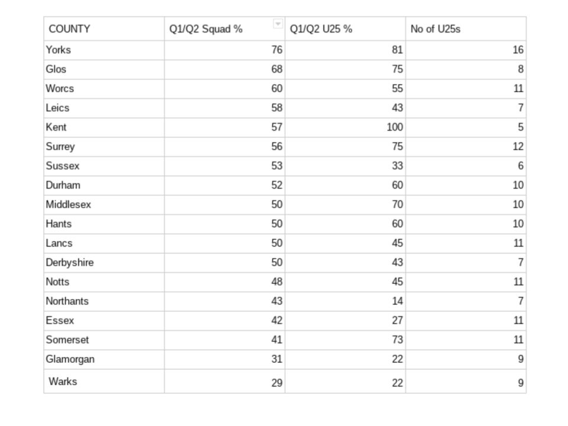

Recent articles have shown significant Relative Age Effect in [England U19s](https://onemoresummer.co.uk/post/rae-increasing-in-england-u19-world-cup-squads/) & [county U20s](https://onemoresummer.co.uk/post/how-rae-affects-a-county-career/) and how the [RAE profile reverses from age 25](https://onemoresummer.co.uk/post/how-rae-affects-a-county-career/) in county squads.

Within these statistics there is quite a lot of variation between counties. RAE in whole squads ranges from Warwickshire at just 29% Q1/Q2 right through to Yorkshire at a whopping 76%.

For U25 players too it varies from Northants at just 14% through to Kent (100%) where all 5 U25 players were born between September and February. Figure 1 shows where all counties currently stand (June 2020).

