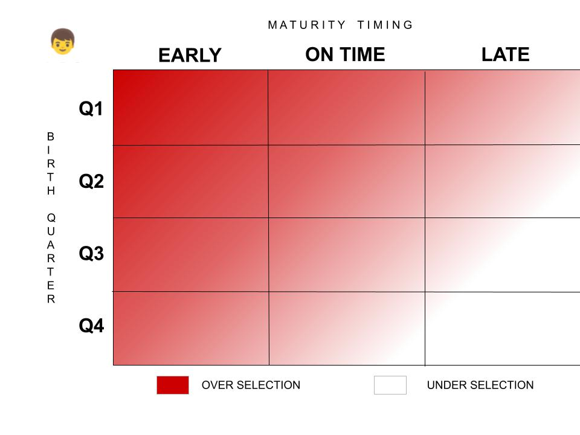
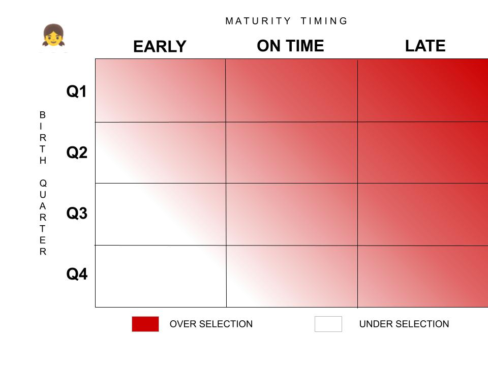

[Relative Age Effects 101](https://onemoresummer.co.uk/post/what-is-relative-age-effect/); [Maturation selection bias 101](https://onemoresummer.co.uk/post/what-is-maturity-status/) 

Who are the most overly selected groups in cricket pathways and who are the most under selected? Does it differ for boys and girls?

\* The gradient shown between over and under selection is a generic estimation to indicate themes only.

Research in football and netball have shown maturation selection bias for late maturers in girls. In boys early maturation increases physical strength through more muscle mass, whereas in girls it can reduce athletic attributes through an increase in fat mass. 

**Training Age Effects**

Another dimension to add to the selection bias matrix above is Training Age.

For both boys and girls players who have independent education (7% of UK population) are likely to have had more training/playing opportunities. If a player is at a top 100 cricketing school* (0.3% of population) then these opportunities and resources are considerably higher still.

Players with any of the following are likely to have a higher training age also: older sibling, parent (professional) coach, good club facilities/resources, family in a higher socioeconomic group & live in a mid-sized town.

**Stage of Pathway Effects**

Pre-adolescence i.e before the growth spurt starts will not have any maturation selection bias and only RAE will be present. The level of RAE will probably be lower at very early ages and slowly accumulate to its highest point around mid teens. Thereafter it will decline very slowly as the bias is ‘baked in’ to the system even though the reasons for it are long over.