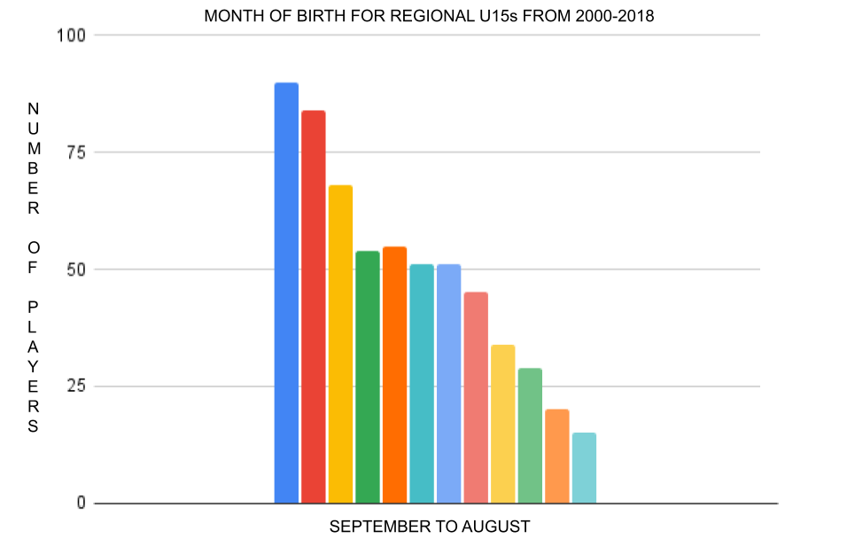
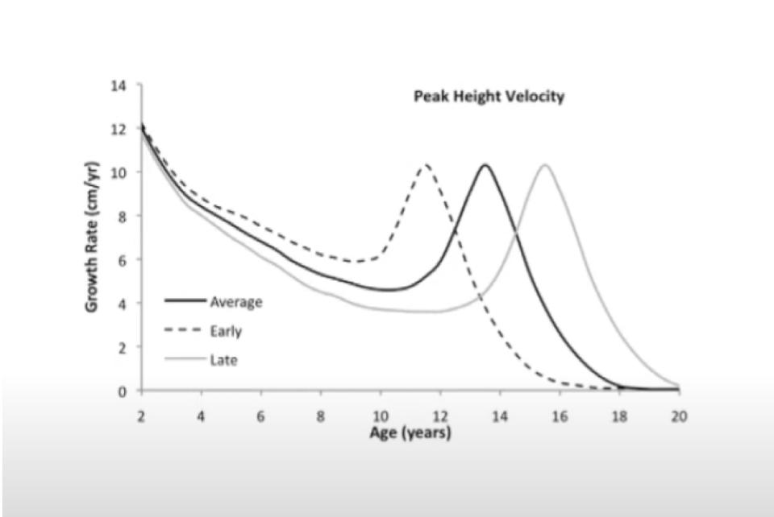
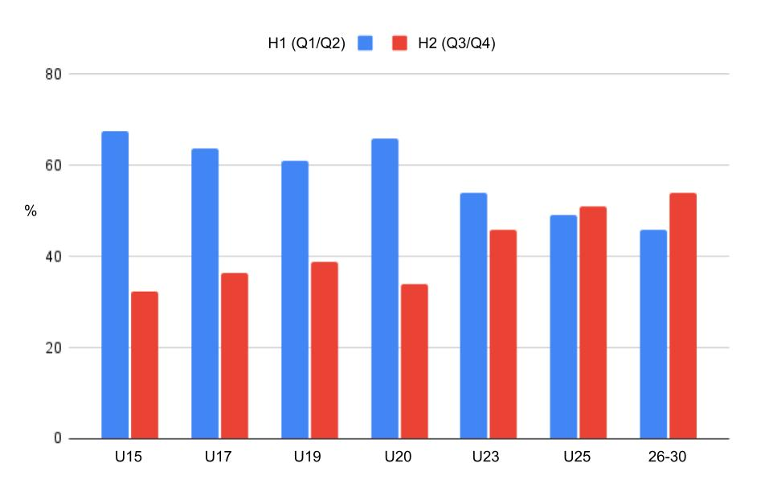

Every young cricketer has a fair chance of becoming a professional, right? Unfortunately, this suggestion does not reflect the reality of everyone’s opportunities in cricket. In fact, as well as recently debated racial and socioeconomic factors, two other things can considerably affect your chances: **the month of your birth (i.e., your birthdate)** and **when you mature (i.e., the age at which a player goes through their growth spurt).**

At the regional level, the annual Bunbury festival brings together the best 56 U15 boys in the country. If you are lucky enough to be born in September (i.e., the start of the selection year), you are six times more likely to be selected than if you were born in August (i.e., the end of the selection year) (Figure 1). This selection bias occurs due to **Relative Age Effects (RAEs)**, whereby those born at the start of the selection year are overrepresented compared to those born at the end.

Figure 1

As well as RAEs, another separate construct will be at play at Bunbury too, namely **maturation bias**. On average, the peak of the growth spurt occurs at age 13.8 years for boys and age 12 years for girls. However, the age at which players enter their growth spurt is extremely variable, with up to five-to-six years difference between peers of the same age (Figure 2). From 11 to 12 years of age, boys who mature early have marked advantages in size and athleticism (e.g., strength, power, speed) over their later maturing peers. We don’t know the extent of these advantages in cricket yet, as it has not been fully investigated, but one county reports 44% of an U14 group were early maturers, almost three times the level found in the general population. Research from the Premier League in football has shown that maturation selection bias can be up to 10 times greater during adolescence when compared to RAEs. 

These two separate constructs – relative age and maturation – work in different ways and at different stages of development. However, both constructs have long-term consequences for player development. RAEs are present from early childhood, peak around early adolescence (depending on context), and slowly decline into adulthood. In English professional cricket, RAEs don’t disappear until mid-adulthood (25 years). Relative age effects are also present in non-physical domains such as academics, business, politics, and chess, suggesting significant psychosocial and behavioural components. Players born earlier in the selection year benefit through more developed cognitive, social and emotional skills when compared with later born equivalents. In contrast, maturation selection biases do not emerge until early adolescence; at approximately age 9 and 11 years in girls and boys, respectively. At this stage, early maturing boys develop significant physical advantages over late maturers, whereas for girls, the reverse may be the case.

As a hypothetical example, meet three young batters, Xavier, Joe, and Zain, who attended a Bunbury trial at U15. Zain was born in September and went through his growth spurt two years ago (early maturer). Joe was born in October, while Xavier was born in July. Both Joe and Xavier are only just beginning to start their growth spurts and are classified as late maturers. Zain is 178cm (5’ 10”) and 61 kg, whereas both Joe and Xavier are much shorter and lighter. All three are in a run chase. Zain is an aggressive opening bat and hits a number of sixes in the white ball 50 over match. Wickets fall and Joe and Xavier, batting at seven and eight, have to score at 10 an over. They don’t have the same power and are both caught and bowled. Who do you select?

Two years later all three players are at trials for Super 4s (Regional U17s) and we chat with their parents. Zain’s parents are 173cm (5’ 8”) whereas Xavier’s dad is 193cm (6’4”) and his mum only 5cm (2”) shorter. Zain is still 178cm (5’10”) whereas Xavier is now 188cm (6’2”), heavier, and stronger than Zain and hitting more sixes. Who do you select now?

At aged 15 years, Zain had the double advantage of being born early and maturing early. In comparison, Xavier had the double disadvantage of being born late and maturing late, whereas Joe had an advantage in being born early but a greater disadvantage in maturing late. Here we can hopefully see how the two constructs – relative age and maturation – can work together positively or negatively, as well as against each other, with maturation often being the dominant force. So, to know what is going on and be able to make informed decisions about players, coaches **must know about both factors**. 

**Some terminology**

Relative age researchers generally divide player’s birthdates into four birth quarters (BQ) conforming with their nations respective selection year. In England and Wales, for instance, we use BQ1 as September-November, BQ2 as December-February, BQ3 as March-May, and BQ4 as June-August. In most other countries, January to December is used for the annual selection year (e.g., Australia), with BQ1 then being January-March, etc. Despite the disparities in the timing of the cut-off date, the same relative age trends persist throughout talent pathways in youth cricket.

Peak Height Velocity (PHV) and percentage of predicted adult height are commonly used as markers for somatic maturation. These indices can be used to predict and identify when an individual is gaining height at their highest rate (i.e., the peak of the growth spurt or how close an individual is to their mature state). Maturation can be calculated from measuring height and weight, but is more accurate when it includes parental height too. The Khamis-Roche method combines this information to calculate the player’s Predicted Adult Height (PAH) and therefore the current percentage attained (%PAHA). The %PAHA indicates the player’s current maturity status. For instance, within male U15 age groups, these values may range from 80%PAHA (pre growth spurt) to 100% (fully grown). PHV occurs between 88-94%PAHA. At age 14 years, most boys – 70% in the general population – will be close to, going through, or have just gone through the growth spurt. These are known as ‘on time’. Boys who have almost finished their growth spurt are ‘early’ (15%) and those who have not started are ‘late’ (15%). This is known as maturity timing. Percentages in age group cricket are likely to be higher for early maturers and lower for on time and late maturers, although more research is certainly required in this area.

**What are the mechanisms of RAEs?**

There are a number of hypotheses as to how RAEs occur. One is the effects of interactions between players and coaches, parents, and/or peers. Early born players performing better are more often selected for county age groups for example, where they will benefit from more coaching and practice. This increases their ‘training age’ and furthers their advantage. 

In a county age group environment, coaches are naturally drawn to the more competent, confident players who are higher in self-esteem and social/emotional skills. These are more likely to be early born. Coaches show faith in these players and encourage them. This often means the player succeeds more than they otherwise would.

Players themselves are more likely to succeed if they believe in themselves. Coaches and/or parents' belief, as well as the belief of peers, in a player can lead to higher levels of self-belief. A ‘I can and I will’ attitude can become a self-fulfilling prophecy for early born players. These three effects are suggested mechanisms for RAEs.

**What are the mechanisms of maturation bias?**

When significant physical advantages also begin to appear in the adolescent years through maturation, performance differences are more obvious. Coaches make selection decisions mainly on performance and thus a bias for early maturers begins. Coaches may also have a ‘type’ of player in mind that has a minimum requirement of height/weight/athleticism. Later maturers often are at a disadvantage in these respects.  

**\
Five Myths of relative age and maturation**

**Myth 1: Relative age and maturation are the same and/or linked**

As discussed, these are two separate constructs that can work together or against each other to (dis)advantage individuals. Maturation doesn’t ‘even out’ RAEs and RAEs are unaffected by the growth spurt. It is entirely possible for a player born in BQ1 to be a late maturer and player born in BQ4 to be an early maturer. Indeed, evidence in football would suggest that players born at the end of the selection year are more likely to be advanced in maturity for their age; potentially offsetting some of the disadvantages associated with being relatively younger. 

**Myth 2: Relative age effects levels out at aged 18 years**

In cricket, RAEs are still statistically significant for England U19 World Cup squads. It has reduced marginally from its peak at around U15. It persists into the early years of professional cricket until, as more early born players are released from the game, it evens out at age 25 years and even reverses (i.e., favouring later born players) during ages 25-30 years (Figure 3). Essentially, this may suggest that over-selected early born players lose their advantage over time and lose professional status at a higher rate than later born players.

Figure 3

**Myth 3: Relative age effects are only caused by selecting the bigger, stronger, and faster players**

Although the exact causes remain to be determined, it is likely that being bigger, stronger, and faster are only small contributing factors towards RAEs. Instead, these are part of a wider variety of interacting factors between the athlete, the environment, and the task. Indeed, the relative impact of physiology is unclear since RAEs can be found in school exam results, chess, and even esports (gaming), none of which require a physical advantage. In comparison, however, stronger RAEs have been shown in physical sports such as basketball and rugby (as well as race horses) when compared to less invasive sports. Once children reach adolescence, differences in performance levels and hence selection preferences for bigger, stronger, and faster players is mainly influenced through maturation biases, which are far more substantial at this stage of development compared to RAEs.

**Myth 4: Relative age effects don’t exist in girls cricket**

Although there is no definitive research in cricket for girls, RAEs are also found in many female sports. It can be smaller in magnitude, perhaps due to less selection pressure because of lower participation numbers. Maturation bias occurs approximately two years earlier with girls when compared with boys, and again there is variation of +/- 3 years with earlier and late maturers. Because maturation starts earlier with girls, it is even more of a factor than RAEs. No research exists in cricket regarding maturational biases for boys or girls and very little appears to be known for girls in other sports. Some evidence suggests that early maturation in girls is a disadvantage rather than the advantage it is for early maturing boys. This may be due to girls’ growth spurt increasing fat mass, which may make them less ‘athletic’ and reduce their speed and stamina.

**Myth 5: Relative age effects create ‘super elite’ later born players (e.g., the Underdog Hypothesis)**

An argument that has been presented is that addressing RAEs may inadvertently be detrimental to the development of so-called later born ‘super-elite’ cricketers (such as Jimmy Anderson or Stuart Broad; both Q4s). However, the evidence for this is anecdotal and questionable. In cricket, for example, the ECBs own funded research shows evidence of Q1 bias in the world’s best batters and spin bowlers. No bias is found for fast bowlers. Q1 bias may also exist in shorter formats and in other countries. In short, forty years of evidence for RAEs exists, whereas significant evidence for an Underdog Hypothesis doesn’t. It remains a hypothesis. It’s also important to note that being required to overcome pitfalls as a relatively younger cricketer only benefits a small proportion, and that the inequities occurring through RAEs are largely tied to the negative outcomes that have been previously outlined throughout this article.

**5 Point Action Plan for RAE and maturation**

**1. Measure**

To know what’s going on, we need to measure the levels of relative age and maturation status in county age groups, emerging player programmes (EPP), academies and England pathway programmes. Birth data is simple and can be collected in clubs and above. Collecting player height and weight (as well as parental heights) is slightly more involved but already done by many county academies.

**2. Procedures**

Introduce age-ordered bibs for all trials, either by age only and/or by maturity status. Research in football at U11 has shown that RAEs are removed during trials if players wear numbered bibs in age order. In comparison, when coaches were given birthdate data in a spreadsheet but players didn’t wear bibs, RAEs remained. Only with a clear, immediate and direct link between the players in action and their relative age were RAEs removed. Many trials use numbered bibs already.

**3. Policy**

Delaying selection in early age groups can help prevent the establishment of RAEs. Selection policies should be based on Johann Fallby’s principle: ‘As many as possible, for as long as possible, in the best environment possible.’ Also, reducing the emphasis on winning can allow everyone to have a chance to develop, not just a small part of the squad who are likely older and/or more mature.

In addition, promote  a ‘flexible chronological approach’ by allowing players to play-up and  play-down. Each person’s optimal challenge point is where most learning takes place. Allowing younger and/or less mature players to play down to experience a different level of challenge is as valuable as playing up older and/or more mature players for the greater challenge.

Lastly, bio-banding, where players are occasionally grouped by maturation rather than age has been trialled in New Zealand cricket and findings suggest that such games can benefit both early and late maturing players. 

**4. Education**

Make an online module available to educate both recreational and performance coaches on RAEs and maturation. This could also be included as a core part of formal coach education at varying levels (i.e., Level 1 to 4). For coaches working in clubs who nominate players and decide on batting and bowling orders, education on RAEs is essential. It is at these younger age groups (i.e., All-Stars through to U13s) that the RAEs are established. All coaches working with players from U9 onwards should also be aware of the true effects of maturation differences.

**5. Research**

We need to know more about RAEs in girls cricket and maturational bias for both girls and boys. We also need to run pilot studies into other fixes for RAEs and maturation, such as corrective adjustments that could use play-cricket.com data to ‘correct’ performance outcomes. This could be achieved through cricket clubs and organisations working alongside universities and academics to design, implement, and evaluate a range of relative age and maturation solutions.

**Conclusion**

Every young cricketer should have a fair chance of becoming a professional. As with other possible discriminatory factors such as ethnicity, socioeconomic status, and gender, the ECB lists age as a protected characteristic in their Anti-Discrimination Code. So, shouldn’t we be doing something about it?

Today’s simple chronological age groupings, which ignore RAEs and maturation biases, can do long-term damage. 

Relative age effects are not inevitable. Maturation effects are measurable. The evidence largely exists. Making the necessary adjustments to compensate for these biases is not only fairer for the individual player in the short-term, but also better for the professional game in the long-term.

By Dr. Adam Kelly, Senior Lecturer and Course Leader for Sports Coaching and Physical Education, Birmingham City University,  Prof. Sean Cumming, Professor in Paediatric Exercise Science, University of Bath and Rob Reed, RAE researcher.

Adam [@AdamKelly07](https://twitter.com/AdamKelly07), Sean [@phd_sean](https://twitter.com/phd_sean), Rob [@nothirdman](https://twitter.com/NoThirdMan)