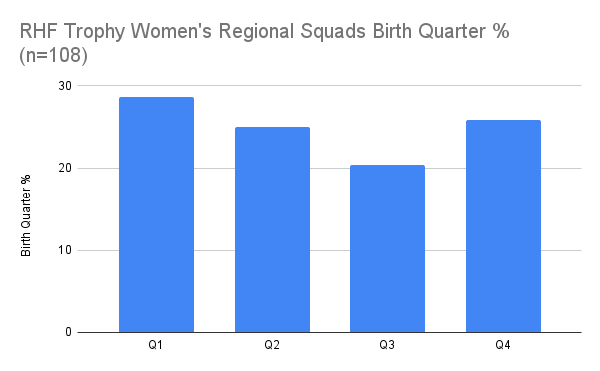
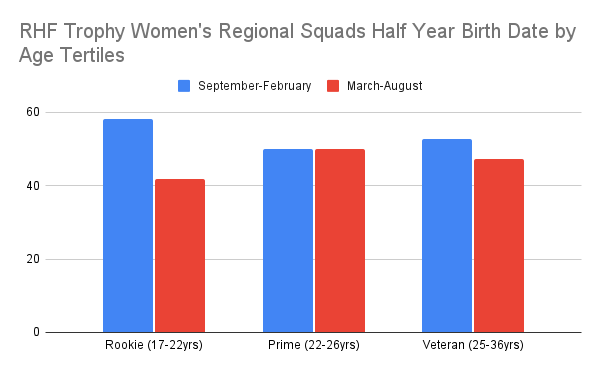
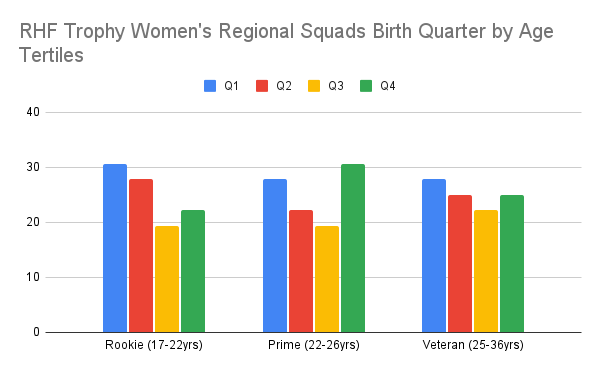

Not significant RAE overall (n=108) BUT...

RAE starts high as young players enter professional cricket and then RAE declines...

Over the first 10 years of a senior career, Q1 & Q2 appear to decrease with an increase in Q4 occurring...

