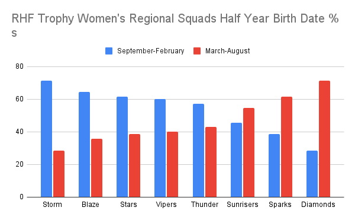
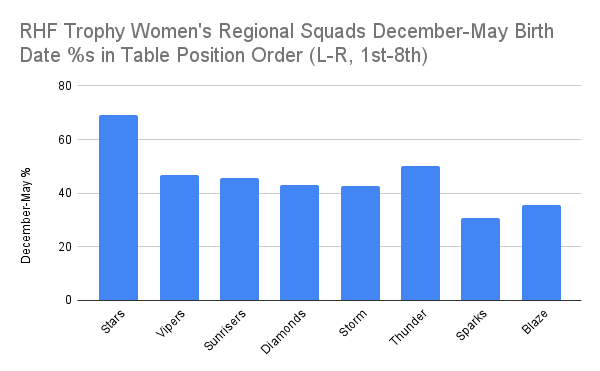

Not significant RAE overall (n=108) BUT...

RAE starts high as young players enter professional cricket and then RAE declines...

Over the first 10 years of a senior career, Q1 & Q2 appear to decrease with an increase in Q4 occurring...

There are RAE differences across the Regional teams...

And just for fun, The Goldilocks Effect, where we compare the squad % of Q2 & Q3 players and current position in the RHF Trophy table (5/5/2024).  Perhaps Q1s have too little development challenge & Q4s have too much?

If researchers spent as much time looking for the Goldilocks Effect as they do the Underdog Effect would they find just as much evidence?