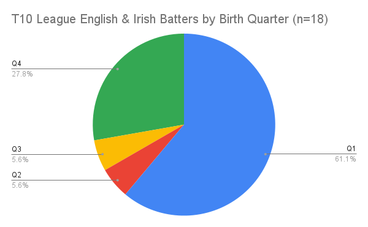
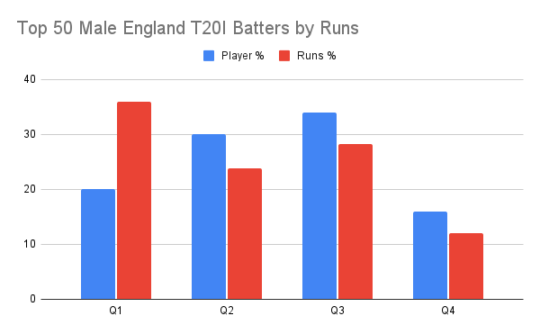
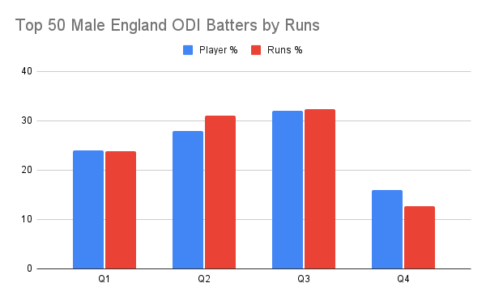
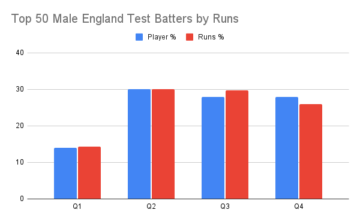

<meta name="twitter:card" content="summary_large_image" />
<meta name="twitter:site" content="@nothirdman" />
<meta name="twitter:title" content="What format do Q1 English male batters excel at? The shorter the better?" />
<meta name="twitter:description" content="Q1 Batters are over-represented in short format cricket and under-represented in longer formats." />
<meta name="twitter:image" content="http://onemoresummer.co.uk/post/what-format-do-q1-english-male-batters-excel-at-the-shorter-the-bette/[t10-league-english-irish-batters-by-birth-quarter-n-18-](https://onemoresummer.co.uk/post/what-format-do-q1-english-male-batters-excel-at-the-shorter-the-better/t10-league-english-irish-batters-by-birth-quarter-n-18-.png).png" />

In the current T10 League in Abu Dhabi there are 18 English & Irish male batters (some are all rounders). An incredible 61% are from Birth Quarter 1 (Sep-Nov).

**Are Q1 batters more suited to shorter formats? What other evidence exists?**

In male England **T20I** cricket **25%** of players (2005-2020) were Q1 but this was the highest Birth Quarter (BQ) for accumulated matches within this cohort at **28%** and Q1s had **the longest careers**.

In male England **ODI** cricket **27%** of players (2000-2020) were Q1 but these players only represented **22%** of all matches played and had **the shortest careers** of all BQs.

In male England **Test** cricket only **22%** of players (2000-2020) were Q1, representing only **12.3%** of all matches played. They also had **the shortest careers**.  

**When looking at the very best batters in each format these distinctions are more clear.** 

The following looks at the top 50 run scorers ever in the 3 formats.

In T20I cricket only **20%** of players selected are Q1 but they make up a massive **36%** of all runs scored. On average every Q1, in this cohort, scores 750 T20I runs whereas the other BQs only score 332, 346 & 313. 

In ODI cricket Q1s represent **24%** of the top 50 batter cohort and score **23.75%** of all runs. So around about average. 

In **Test** cricket only **14%** of the top 50 batter cohort are Q1s and they only contribute a similar number of runs.

**Conclusions**

Q1 batters seem to be more effective at progressively shorter forms of the game and vice versa.

Q1 players are the oldest in an age group and have often dominated junior cricket, both in terms of over-selection, and in terms of performance. Have they had it too easy in training and match play? Has the level of challenge been lower than all other BQs? Are Q1s an example of the opposite of the [Underdog Effect](https://onemoresummer.co.uk/post/what-is-the-underdog-effect/) and this is an Overdog Effect?

Do Q1s succeed early by being more aggressive and does this become 'the cricketer they are' i.e. that is always their game plan? Have they learnt the wrong skills? Are the skills they are good at more appropriate for short form cricket?

Have Q1s not worked as hard at developing the skills required for Test cricket, concentration, tactical play, resilience and 'mental toughness'? 

Is there a Q1 psychological profile that explains these phenomenon? Do the other Birth Quarters have a different profile? Is there a linear relationship between the BQs?