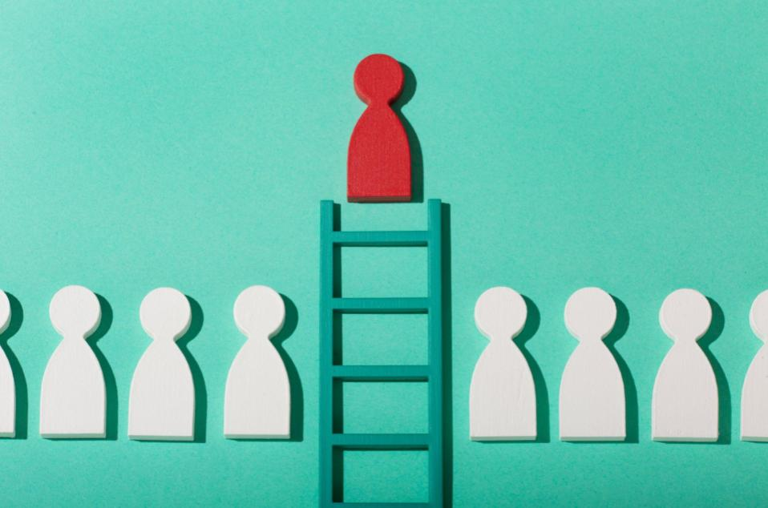

Students from the University of Pennsylvania recently took part in an interesting experiment. In answering a spurious questionnaire about the factors that may have helped them to the Ivy League, the students inadvertently provided the single most important data point at the top of the page. They had to write their date of birth.

Later all is explained and they are amazed that ‘all’ of them are old for their cohort. What happens next is even more revealing. Upon being given an easy way to ‘fix’ this problem, the Relative Age Effect, literally no-one is very keen to support it.

Why? They didn’t want their achievements to be devalued. Perhaps it is just human nature to struggle to come to terms with recognizing a system that has worked in your favour. What begins as arbitrary advantage hardens into privilege and when you’re accustomed to privilege, equality feels like oppression.

[Image by Freepik](https://www.freepik.com/free-photo/still-life-business-roles-with-various-pawns_24749587.htm#query=leader&position=10&from_view=search&track=popular")

**Who is in charge?**

Relative Age Effect is a phenomenon that has been well known for about 40 years and is found in both boys and girls English cricket. Why has nothing been done about it? Perhaps we need to examine who is in charge?

\
Being the oldest in your year at school & in your age group for sport has an effect. From an early age you are likely to have more neural development and be more cognitively, socially and emotionally aware. This affects competence, confidence and your ability to lead. Coaches too perhaps have a bias to give older kids more opportunities for leadership.

The Cricketer magazine recently, quite rightly, highlighted the incredible work done by members of the England Women cricket team from the 2000s, who now in administrative roles, are building a new landscape of opportunity for girls to play cricket for fun as well as being professional players. What was also interesting about the list of 15 leaders was that two thirds of them were born in the first half of the year with many born in September alone.    

Are these leaders less inclined to recognise the issues of RAEs in girls cricket and take action?

The last 3 England Women captains, Knight, Edwards & Connor are all born in the first 4 months of the year. Grace Scrivens who led the inaugural England Women U19 World Cup team is too. In the first 4 men’s U19 World Cups every English captain was born Sept-Nov.

The most influential person on the list is Claire Conner. As MD of English women’s cricket since 2007 she, as Charlotte Edwards puts it, ‘has driven all of what is happening today’. Born on September 1st, where would she be & where would the system be if she had been born just 24 hours earlier?