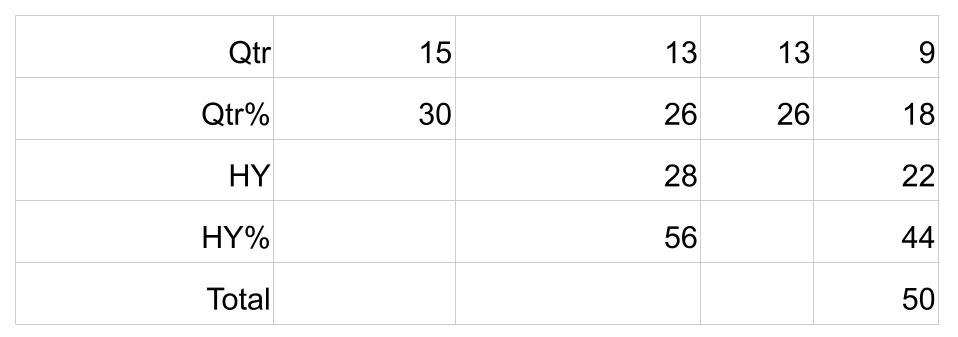
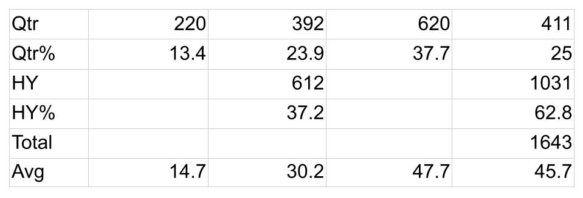

In T20 cricket we select slightly more early born England Women yet late borns have careers almost twice as long. 

In general there is a [Relative Age Effect](https://onemoresummer.co.uk/post/what-is-relative-age-effect/) in women’s sport pathways but it is often less significant than in men’s sport. RAE is found in the England Women’s T20 team (Q1 30%, Q4 18%) over the period 2004-2021*.

\
But when we look at how many [games these players play over a career](https://onemoresummer.co.uk/post/matches-played-by-birth-quarter/) a different picture emerges. On average Q4 players play 45.7 matches whereas Q1 play only 14.7. The return for Q2 players is slightly better at 30.2 but is overshadowed by Q3 at 47.7. So later born (Q3/Q4) play for longer than early born (Q1/Q2). 

In men’s cricket similar effects have been shown where later borns, although selected far less, actually reach higher levels within the game. Collins, McCarthy & Court (2016) described an Underdog Effect in cricket as well as rugby union. It is important to state that it is not clear if the Underdog Effect and indeed how the RAE works in the men’s pathway is the same or similar to the womens.

NOTES

\* as at 8/3/2021