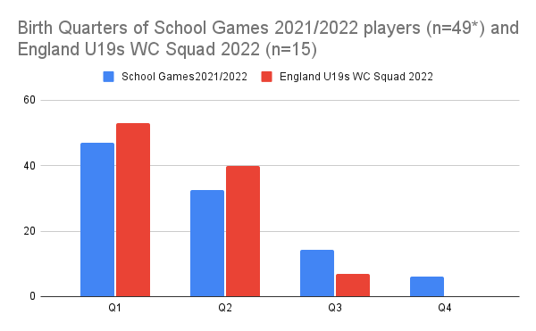

The professionalisation of English Women & Girls cricket is developing fast under the tagline of **cricket - a game for me**. But is it really a game for everyone? Does this welcome expansion come with hidden issues that are also present in the men’s game? 

Relative Age Effects (RAEs) are found at U15, U17 and U19 levels in male English cricket. It appears that higher levels of RAEs are being found within English women & girls cricket with 80% of players at the School Games (2021 & 2022) and 93% of the England U19s World Cup players born in the first half of the year.

**These are quite extraordinary levels of RAEs.**

More professional players have to come from somewhere and the introduction of county and  regional emerging player programmes (EPPs) and academies is the source.

EPPs start at age 13 and purposefully are small in number (5-10) and are another layer of development between County Age Group (CAG) squads and Regional Academies of which there are eight.

From age 15, or so, players are selected for an annual tournament at Loughborough, the School Games which brings together the ‘best versus the best’. Performances here can influence selection for the England Women’s U19 squad as well as the England Women’s Academy.

This structure looks very similar to that of the boys, CAGs, EPPs, Academies, Super 4s (similar to the School Games) and England U19s. However there are some differences which may be relevant with regard to RAEs.

Unlike the boys county pathway whereby squads exist for every year group from U10 to U16, girls have bi-annual groupings, U11, U13 and U15. This alternative structure can increase RAEs.

Also there are only eight regional academies and not eighteen county academies as in the men’s game. We know that increased levels of competition for places/selection can lead to higher levels of RAEs. 

A recent article revealed that there is no RAE for English players across the eight teams of The Hundred. However the 91 players in this cohort range in age from x to 37. Perhaps many of these players were developed before recent cash injections into the development of new professional pathways?

The recently published ECB Talent Development Framework ‘Unleashing Potential’ contains nothing about addressing Relative Age or Maturation bias. Is the women and girls game making the same mistakes as those of the men and boys?